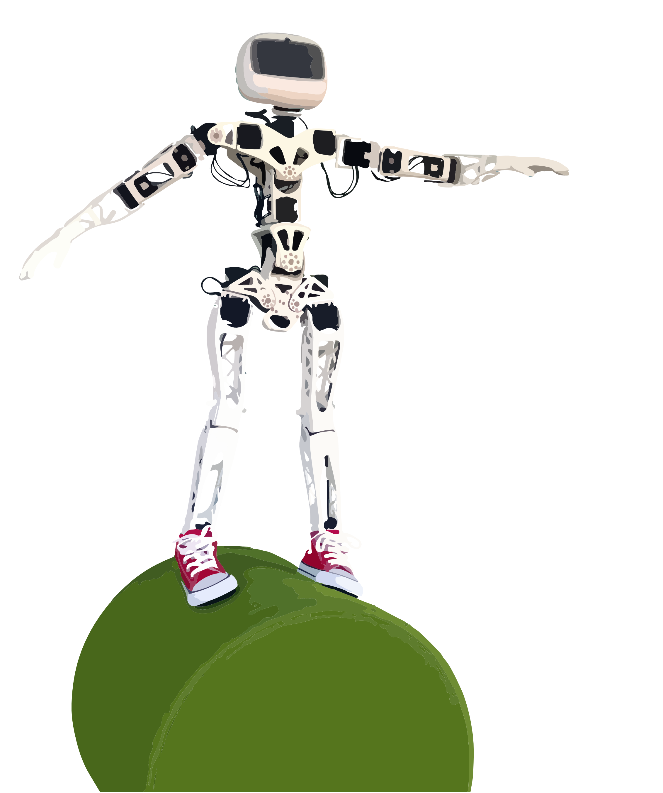
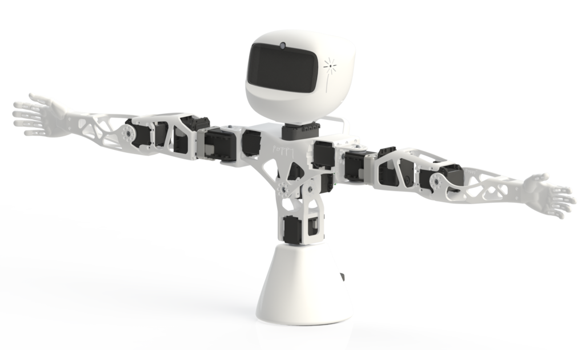

# Getting Started

[Poppy Project](https://www.poppy-project.org/) is an open-source platform for the creation, use and sharing of interactive 3D printed robots. It gathers an interdisciplinary community of beginners and experts, scientists, educators, developers and artists, that all share a vision: robots are powerful tools to learn and be creative.

The [Poppy community](https://forum.poppy-project.org/) develops robotic creations that are easy to build, customize, deploy, and share. We promote open-source by sharing hardware, software, and web tools.

The Poppy project has been originally released by the [INRIA Flowers](http://www.inria.fr/equipes/flowers/).

This project aims at developing a robotic open-source and open-hardware kits, for the conception and programming of robotic creatures. These kits also contain an integrated software environment, easily installable, dedicated to the use of the robot, and associated with a web platform enabling the community to share experiences and to contribute to its improvement.

Recently, Poppy robots have been used as a educational and motivational tool to learn engineering and digital sciences.

The Poppy project also consists of a very active and diverse community. People of different horizons collaborate to improve the project ; they add features to the core libraries, release advanced behaviors, create pedagogical contents, design artistic performances, or even new robots.

To facilitate these exchanges two supports are available:
- [the poppy-project forum](https://forum.poppy-project.org/) for help, dialogue and to share ideas
- [github](https://github.com/poppy-project) to deposit your contributions

All sources of the Poppy Project (software and hardware) are available on our [Github](https://github.com/poppy-project).

## The Poppy Creatures

Poppy creatures are open-source and open-hardware/software robots, available for download and modification (Creative Commons License, BY-SA for the hardware and GPLv3 for software). They were designed with the same principles in mind.

All Poppy Creatures:
- are made from pieces of printable 3D and low cost engines,
- use an embedded board for control (a Raspberry Pi-2 or Odroid for older versions),
- are based on a Python library, [pypot](#TODO), allowing to control Dynamixel servomotors in an easy way,
- have a simulator available (based on vrep),
- can be controlled mainly using a visual programming language ([Snap!](http://snap.berkeley.edu) a variation of Scratch) and a textual language [Python](https://www.python.org). They are also programmable through a REST API, which enables the control with other programming language (connection for Matlab and Processing already exists) - see Chapter #TODO for details.

They can be used as it is, or hacked to explore the shape of novel legs, arms, hands...

You can get a full Poppy Creature robot from one of Poppy's official resellers:
-   [Génération Robots](http://www.generationrobots.com/en/279-poppy-opensource-robotics-platform)

But you can also get all the parts yourself by following the Bill of Materials.

### Poppy Ergo Jr

The Poppy Ergo Jr robot is a small and low cost 6-degrees-of-freedom robot arm. It is made of 6 cheap motors (XL-320 Dynamixel servos) with 3D-printed parts simple to design. At the end of his arm, you can choose among several tools: a lamp, a gripper hand, a pen holder... You can change them easily with easy to use rivets.

The 3D parts were made so they can be easily printed on a basic 3D printer and the motors are only 20$ each. Unlike others Poppy creatures, the electronic card is easily accessible to make it easy to connect extra sensors and for pedagogical purposes.

<!-- TODO: ajouter une photo des différents outils -->

This robot is the ‘little brother’ of the robots used in [the Ergo-robot experiment](https://www.poppy-project.org/project/mathematics-a-beautiful-elsewhere).

The Ergo Poppy Jr is ideal for start manipulating robots and for learning robotic without difficulties.

The BOM can be found in [the github](https://github.com/poppy-project/poppy-ergo-jr/blob/master/hardware/parts/BOM.md/) and the 3D files [here](https://github.com/poppy-project/poppy-ergo-jr/releases/).

### Poppy Humanoid

It is a 25-degrees of freedom humanoid robot with a fully actuated torso. Used for education, research (walk, human-robot interaction) or art (dance, performances). From a single arm to the complete humanoid, this platform is actively used in labs, engineering schools, FabLabs, and artistic projects.

You can get all the parts yourself following the [BOM](http://poppy-project.github.io/poppy-docs/poppy-humanoid/assembly_doc/BOM.html). The 3D models for the parts can be found [in the github](https://github.com/poppy-project/poppy-humanoid/releases/tag/hardware_1.0.1/).

### Poppy Torso

It is an upper part of Poppy Humanoid (13 degrees of freedom). Poppy Torso is more affordable than the full kit (Poppy Humanoid), which makes it especially suitable for uses in an educational, associative and makers context. Poppy Torso is an ideal medium to learn science, technology, engineering and mathematics (STEM).

You can get all the parts yourself following the [Bill of Material](http://poppy-project.github.io/poppy-docs/poppy-torso/BOM.html). The 3D models for the parts can be found [in the github](https://github.com/poppy-project/poppy-humanoid/releases/tag/hardware_1.0.1/). They are the same as Poppy Humanoid, simply remove the legs and add the [support](https://github.com/poppy-project/robot-support-toolbox/)).

### Other interesting Poppy Creatures

#### Poppy right arm (work in progress)

Poppy right arm is a Poppy creature based on a right arm of Poppy Humanoid, with 3 additional XL-320 motors at the end to improve the reach and agility of the arm. It used the same gripper tool used in the Ergo Jr, designed to grab simple objects.

<!-- TODO: belle photo de Poppy Right Arm -->

There is also a inverse kinematics algorithm allowing you to manipulate the arm in cartesian coordinate. Find more info and the sources in [the dedicated github repository](https://github.com/poppy-project/poppy-6dof-right-arm).

The project was realized during an internship at INRIA Flowers by Joel Ortiz Sosa.

### Simulated Poppy Creatures

All three main Poppy robots (Humanoid, Torso, and Ergo Jr) are also available in the [V-REP simulator](http://www.coppeliarobotics.com). This can be particularly useful if one is interested in designing complex and time consuming experiments or to discover the programming possibilities before having a real robot.

<!-- TODO: photo des robots dans V-REP -->

We try to make the switch from a simulated poppy robot to the real one as transparent as possible and most of the documentation is valid for both simulated and real robots.

Yet, some differences are inevitable. In particular:

* the [Build the robot](#build-the-robot) section can be skipped as it details the robot assembly. It is still worth reading if you are planning to have a real robot in the future.
* in the [Connect to the robot](#connect-to-the-robot) section, you will have to follow the advanced approach and install the required software on your machine.

After that, the way you control the robot will not differ from a simulated to a real robot, so it is easy to switch from one to the other (in a classroom context for instance).

You can refer to the [Visualize the robot in a simulator](#visualize-the-robot-in-a-simulator) for more information.
