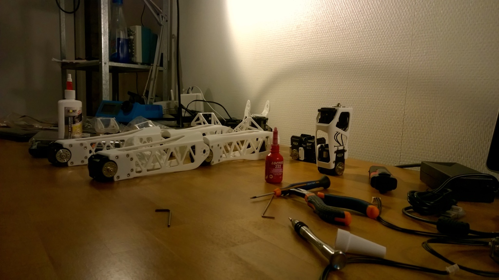
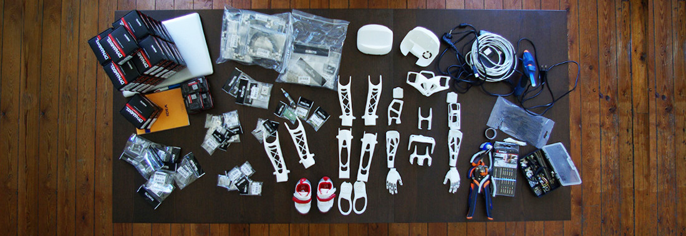
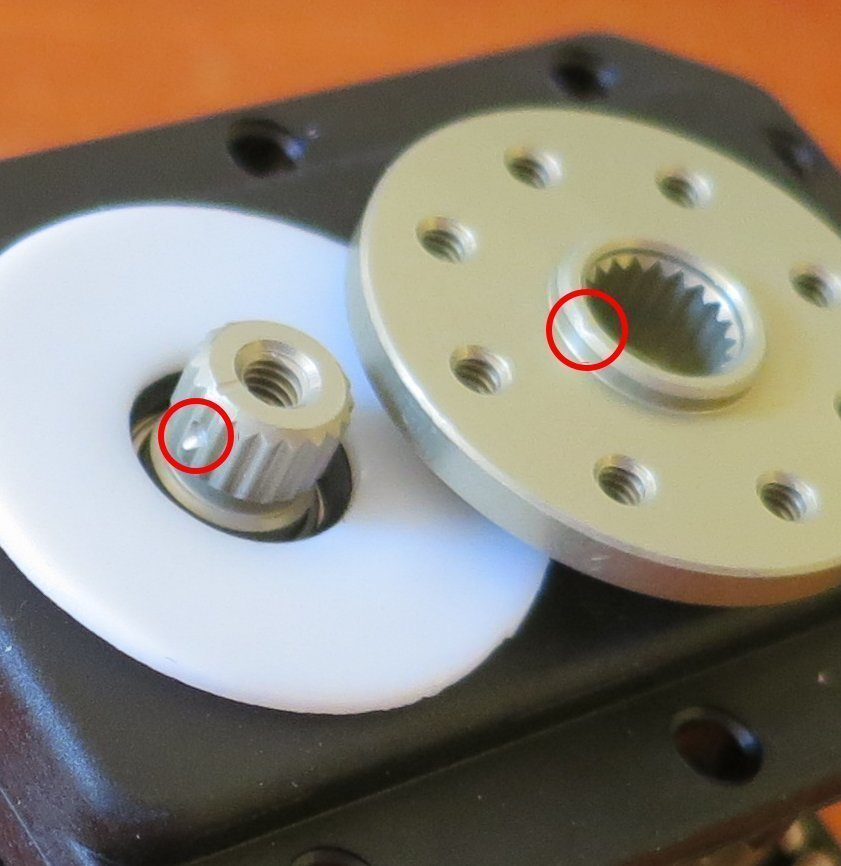
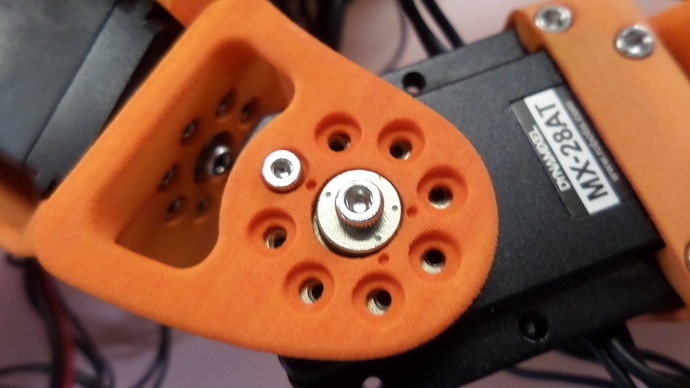

## Build the robot

This chapter will describe what you will need, in terms of tools, skills and time, to build your Poppy robot. Depending on the creatures, the complexity may really vary. Building an Ergo Jr should not take more one hour and no specific tool is needed while assembling an entire Poppy Humanoid may take a few days and quite a lot of screws!

We will also stress the critical points so you aware of of them before digging into the construction. Each section will point to the dedicated chapter where you will find the step by step assembly procedure.

### Assembling an Ergo Jr

<!-- TODO: refaire une belle photo avec la vraie BOM -->

The Poppy Ergo Jr robot was designed to be a simple little robot, cheap and easy to use. The 3D parts were made so they can be easily printed on a basic 3D printer and the motors (6 XL-320 Dynamixel servos) are only 20$ each. You can find the complete list in the [assembly section](#TODO).

It is very easy to build and its end effector can be easily changed - you can choose among several tools: a lamp, a gripper, a pen holder...

<!-- TODO: image des differents outils -->

Thanks to OLLO rivets the robot is very simple to assemble. These rivets can be removed and added very quickly with the OLLO tool. It should not take more than one hour to entirely built it, which allows great design freedom.

<!-- TODO: image des rivets et du tool en action -->

Except from checking the motor orientation, there is not really any pitfall. If you can build using Lego bricks you should be able to assemble an Ergo Jr! In any cases, the rivets are made to be as easy to assemble than to disassemble, so in case of problem you can just start over!

**Be sure, to [configure your motors](#TODO) before assembling the robot as you can not do it when they are connected to the same bus!**

### Assembling a Torso or a Humanoid

Building a Poppy Torso is more complex than a Ergor Jr but it is not really more complicated than building a Meccano or some Swedish furnitures. It mainly consists on those few steps:

* assemble the horn on each motors: **you will have to be really cautious about the motor zero position!**
* configure the motors so they match the *poppy configuration*
* use a lot of screws to connect all 3D printed parts to the motors
* do a bit of electronic for the embedded board inside the head: this can be a bit tricky if you are not familiar with electronics.

Patience and precision are your allies, but in case of errors do not panic: Poppy is a robot intended to be assembled and disassembled and even modify. Just follow the few **warnings** belows:

*Warning 1:
The Poppy humanoid and torso robots are built using mainly MX-28 and MX-64 Dynamixel servomotors, which are pretty powerful and may be harmful to your fingers or materials.
So be very careful and put the robot in a free space while testing them.*

*Warning 2: put the dot on the horn at the same point than the dot on the servo axis*

*Warning 3: adjusts the three dots of the motors with three dots of structural parts.*

*Warning 4: use thread locker to prevent vibrations from untying the screws but just a drop is enough otherwise disassembling your robot can be very hard!*

**The assembly can be divided into seven major steps:**

* Trunk [(Text instruction)](https://github.com/poppy-project/Poppy-multiarticulated-torso/blob/master/doc/fr/5_DoFs_humanoid_spine.md)  [(Video demonstration)](http://youtu.be/LEHLdoBEr4Q)
* Chest [(Text instruction)](https://github.com/poppy-project/Poppy-multiarticulated-torso/blob/master/doc/fr/subassembly/chest_assembly_instructions.md) [(Video demonstration)](http://youtu.be/qwrgV6tKTO8)
* Right Arm [(Text instruction)](https://github.com/poppy-project/Poppy-basic-arms/blob/master/doc/right_arm_assembly_instructions.md) [(Video demonstration)](http://youtu.be/Oe5v21sTst8)
* Left Arm [(Text instruction)](https://github.com/poppy-project/Poppy-basic-arms/blob/master/doc/left_arm_assembly_instructions.md) [(Video demonstration)](http://youtu.be/TZb6_hVlmcA)
* Legs (only for Humanoid version) [(Text instruction)](https://github.com/poppy-project/Poppy-lightweight-biped-legs/blob/master/doc/legs_assembly_instructions.md)[(Video demonstration)](http://youtu.be/Am1XBYv134Y)
* Legs + Trunk (only for Humanoid version) [(Text instruction)](https://github.com/poppy-project/poppy-humanoid/blob/master/hardware/doc/Poppy_Humanoid_assembly_instructions.md#3--legstorso-asembly) [(Video demonstration)](http://youtu.be/5i0xVlrJc-8)
* Head [(Text instruction)](https://github.com/poppy-project/poppy-docs/blob/master/poppy-humanoid/assembly_doc/head_assembly.md)
