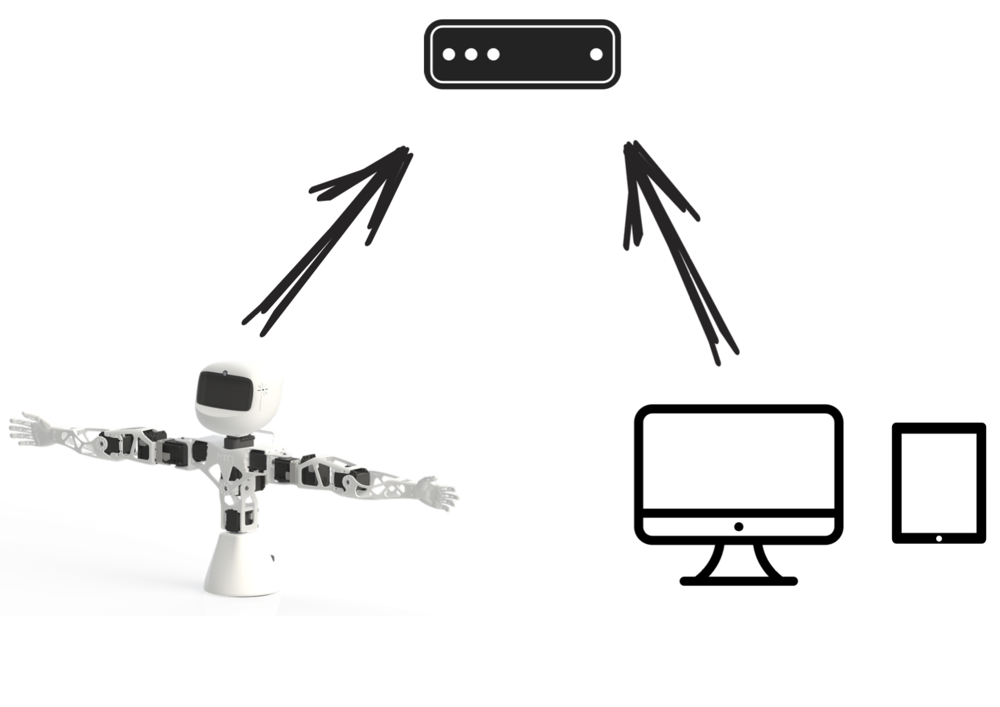
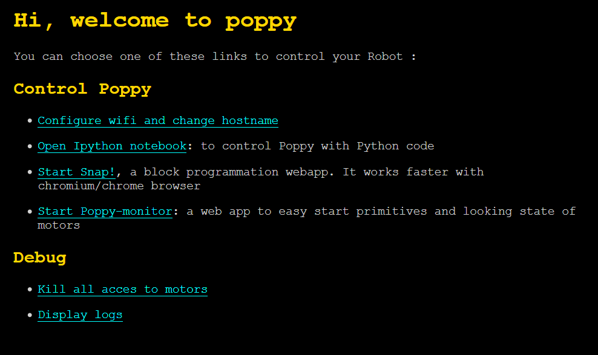
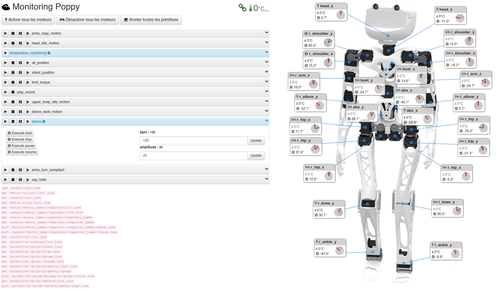

## Start and connect the robot

In this section, we will describe how to start your robot and the possibilities to connect to it. We will focus here on real robots but we will also point to the advanced sections to follow if you are using a simulated robot.

### Setup the software

Poppy creatures come with an embedded board which job is to control motors and access the sensors. This computer also serves a web interface which makes it easy to control the robot from your own computer or a tablet without having to install anything specific.

There are two ways to setup the board for your Poppy:
* **the easy way**: use a pre-made iso for the SD-card
* **the advanced users way**: install everything from scratch

*Note: If you are using a simulated robot, you  must install the software locally. Thus, you can not use a pre made SD-card. You will have to follow the advanced way.*

#### Easy way: use the Poppy SD-card

The easiest and quickest way - by far - is to use an already made image for a SD-card. The images come with everything pre-installed for your poppy robot. It is also a good way to ensure that you are using exactly the same software as we are and thus avoid most problems.

The images can be found in the [github of the project](#TODO):

* [for the ErgoJr](#TODO)
* [for the Humanoid](#TODO)
* [for the Torso](#TODO)

They can be copied to a SD-card (at least 8Go) by following the same procedure as [described by Raspberry-Pi](https://www.raspberrypi.org/documentation/installation/installing-images/README.md).

One the SD-card is ready, just insert it into the board and when you plug your robot it should automatically start and you should be able to connect to the web interface.

#### DIY: install everything from scratch

The other way is basically to follow the same procedure as we are using to generate the image for SD-card. This can be useful if:

* you are **working with a simulated robot** and thus have to manually install all the required softwares on your computer,
* you want to customize the environment,
* or simply if you like to understand how it works.

**Warning:** *We try to keep this installation procedure as generic as possible. Yet, some details may vary depending on your OS, or your computer. Moreover, the installation from scratch required some good knowledges of how to install and setup a python environment.*

The entire procedure is detailed in the [chapter TODO](#TODO). Depending on what you want to do all steps are not necessary required. In particular, you may just want to install the python libraries for poppy, or setup entirely a Linux environment to match the Poppy ones. The entire installation process used to make the SD-card image can be sum up with those steps:
* Customize a [Raspbian](https://www.raspbian.org) install for Poppy (setup a user/hostname...).
* Setup the Poppy utility tools (for install/update)
* Install the [Python Anaconda distribution](https://www.continuum.io/why-anaconda).
* Install the python libraries for Poppy (pypot/poppy-creature/poppy-\*).
* Setup the sensors for your creature.
* Install the web server for the control and monitoring interface.

### Setup the network

Once your Poppy is built and its software ready, the next step is to connect it to a network so you can start controlling it.

Indeed, except if you plug a keyboard and a screen to the embedded board you can not directly use it. You have to connect to it through a network. This section will describe the main steps to follow in order to do that.

Poppy robots can use either ethernet or wifi network. Yet, you first need to use an ethernet network so you can configure the robot so it then automatically uses your specific wifi.

Once you have plugged the robot and your computer on the same ethernet network, you only need to get one of those two things:

*  Use the [Zeroconf protocol](https://fr.wikipedia.org/wiki/Zeroconf) to connect to the robot using its hostname: *"poppy.local"* - This should works directly under MacOS and Linux but required to install [this software](https://support.apple.com/kb/DL999) on Windows. This is the simplest way and should be preferred except if you do not have the administrator right on your Windows machine for instance.
* Know the IP address of the robot assigned by the router of your network.

**Note: If you are not familiar with network configuration or have no idea what the previous paragraph tried to say, you should see with the IT network engineer, how you can do that.**

### Use the control and monitoring interface

One you managed to have either Zeroconf working or the IP address of you robot, you can directly access its control and monitoring interface. This web interface can be used to:

* setup your wifi and change the name of the robot - the one you will use to connect to it,
* to launch demo primitives,
* and monitor the state of your robot (if motors are too hot for instance)

To access this interface, you simply have to go to this url using your favorite web browser:

* http://poppy.local (if you changed the name of your robot, simply replace *poppy* by its new name)
* or using directly its IP, something as http://192.168.0.42

You should see something like:

And then if you click on the **Start Poppy-monitor** link:

