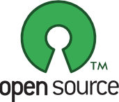
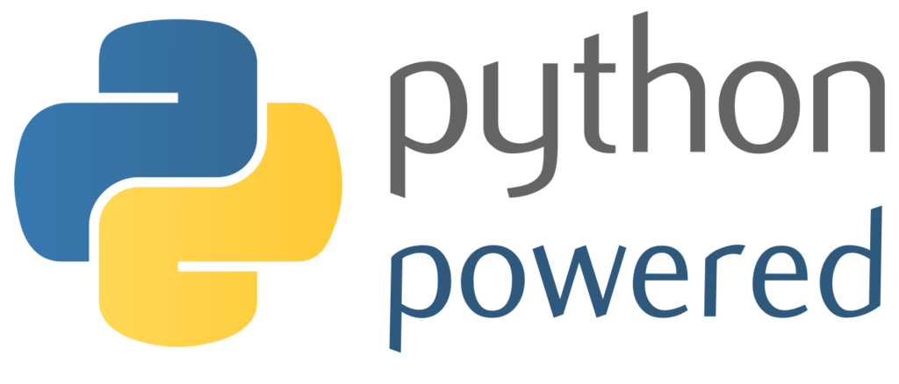
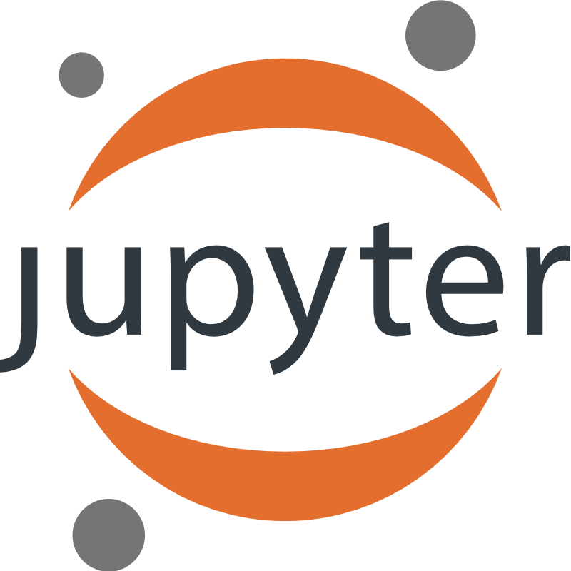

## Program the robot

In this section we will present the different options to program your robot ranging from the possibility to trigger high level behaviors using [Snap!](#using-snap), the visual programming language, to the low-level API written in [Python](#using-python).

We will also say a few words on how you can interface Poppy robots with other devices or any programming language using [Poppy's REST API](#through-the-rest-api).

**Note: As for the rest of the project, all our libraries are open source and available on the [github of the project](https://github.com/poppy-project).**





### Using Snap!


### Using Python



Poppy libraries have been written in Python, to allow for fast development and extensibility and to benefit from all scientific libraries existing. Python is also a well-known language and widely used in education or artistic fields. By programming Poppy in Python, you will have access from the very low-level API to the higher levels.

The API has been designed to allow for very fast prototyping. In particular, creating a robot and starting to move motors should not take more than a few lines:

```python
from poppy.creatures import PoppyErgoJr

jr = PoppyErgoJr()
jr.m3.goal_position = 30
```

We are also big fan of the [Jupyter Project](http://jupyter.org) and the Notebooks. We really think that this is an extremely powerful tool permitting the creation and sharing of live code, results vizualizations and explanatory text combined in a single document.



Most of the tutorials, experiments or pedagogical activities that we and the community develop are available as [Notebooks](#TODO-lien-notebook-de-notebook).


### Through the REST API

On top of the Snap! and Python options, it was really important to us to provide another way of accessing and controlling your robot accessible from any device or language. Thus, all our Poppy robots are providing a REST API, meaning the most important features of the robot can be access through HTTP request.

From a more practical point of view, this allows to:
* **write bridges to control Poppy robot in any language** (awsome contributors have already written [matlab](#TODO) and [ruby](#TODO) wrappers).
* easily **design web apps** connected to your robot (such as the [monitor interface](#TODO))
* make your **robot interact with other connected device** such as a smartphone, intelligent sensors, or even your twitter account...
