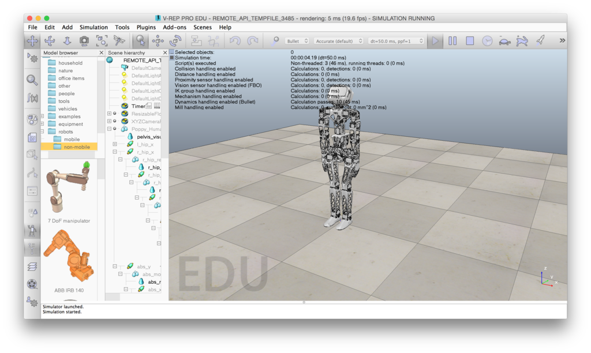
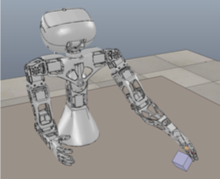
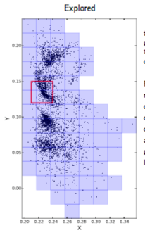

## Visualize the robot in a simulator

A simulated version of all Poppy robots is also available. It was designed so you can switch from a simulated to a real robot in a very transparent and easy manner.

This allows the development and test of programs without having a real robot. This is particularly useful in a context where multiple groups share a robot: for instance in a classroom where each group can work using the simulator and validate their program on the real robot. This is also a good way to discover the project and start playing with robots without having to spend any money.

**Note: If you want to use Poppy robots using a simulator you will have to install some of the poppy libraries locally on your computer.** Indeed, while those libraries are already installed within the physical robots, they are not integrated in the simulator. More detailed of what you will have to do is given in the section below.

At the moment, only one simulator can be used. In further versions, we will also develop a web visualization hopefully simpler and lighter than the existing solutions.

### Using V-REP

[V-REP](http://www.coppeliarobotics.com) is a well known and powerful robot simulator. It is widely used for research and educational purposes. Moreover, it is available under a free educational license.

*It is important to note that as V-REP is simulating the whole physics and rendering of the robot it may be slow if you do not have a recent computer (especially the GPU card).*

All main Poppy robots are available in V-REP:
* Poppy Humanoid
* Poppy Torso
* Poppy ErgoJr

To start using V-REP for controlling Poppy robots, you will need:
* to install V-REP (work under Mac, Win, Linux)
* to have a working Python (version >=2.6 or >=3.), we strongly recommend to use the [Anaconda Python distribution](https://www.continuum.io/why-anaconda).
* to install the Poppy libraries: pypot and the library corresponding to your creature (e.g. poppy-ergo-jr)

**Details about all those steps can be found in section *[Install everything locally for using a simulator](#TODO)*.**

V-REP can be used to learn how to control motors, get information from sensors but also to interact with the simulated environment. It can be used using Python, Snap or through the REST API. Here, are some examples of what the community has already been doing using it:

* In a pedagogical activity to discover the different motor of your robot and how they can be controlled.

* In a scientific experiment, where a Poppy Torso is learning how to push a cube on a table in front of it

*Note: Even if we try, to reproduce the robot behavior and functioning, some differences remain. In particular, if you make a robot walk in simulation that does not necessarily mean that it will walk in the real world.*
