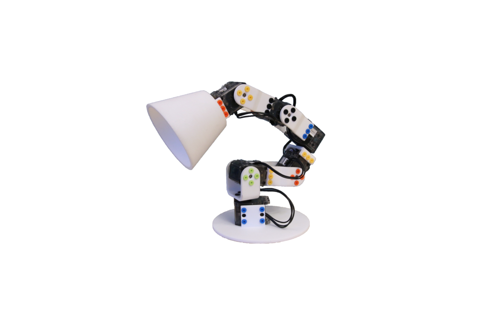
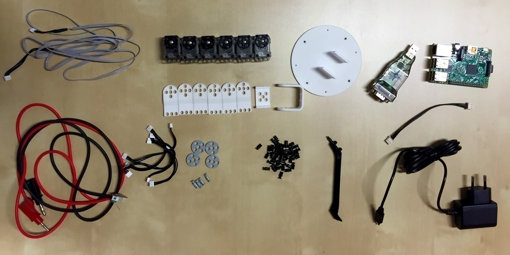

# Assembly guide for the Ergo Jr

The Poppy Ergo Jr robot is a small and low cost 6-degree-of-freedom robot arm.
It consists of very simple shapes which can be easily 3D printed. They are assembled via OLLO rivets which can be removed and added very quickly with the OLLO tool.

<!-- TODO: image ollo rivet -->

Its end effector can be easily changed. You can choose among several tools:
* a lampshade,
* a gripper,
* or a pen holder.

Thanks to the rivets, they can be very quickly and easily swapped. This allows the adaptation of the tooltip to the different applications you plan for your robot.

The engines have the same functionality as other Poppy  creatures but are slightly less powerful and less precise. The advantage being that they are also less expensive.

The electronic card is visible next to the robot, which is very advantageous to understand, manipulate, and plug extra sensors. No soldering is needed, you just need to add the shield for XL-320 motors on top of the Raspberry-Pi pins.

This chapter will guide you through all steps required to entirely assemble an Ergo Jr. It will cover:

* motors configuration
* electronic assembly
* hardware construction

**The entire assembly should take about one or two hours** for the first time you build one. With more practice, half an hour should be more than enough.

At the end of the process, you should have a working Poppy Ergo Jr, ready to move!

We recommend you to follow carefully the instructions. Even if the Ergo Jr can be easily disassembled, it is always disappointing to need to start from scratch again because you forget to configure the motors, a wire is missing, or a motor is reversed.

## Bill of materials

To have a ready-to-go Ergo-Jr, you will need:

* 6x robotis motors [XL-320](http://www.generationrobots.com/en/401692-dynamixel-xl-320-servo-motor.html?search_query=OLLO&results=23)
* 6x [XL cable](http://www.generationrobots.com/en/401875-3p-160-mm-cables-for-xl-servos-x5.html) (if possible 1 longer for the base)
* 1 [external power supply](#TODO) able to output 7.5V at least 2A
* the 3D printed parts: [[STL]](#TODO) [[BOM]](#TODO)
* lots of [OLLO rivets](http://www.generationrobots.com/en/401870-ollo-rivet-set-ors-10.html) (between 4 and 12 per motor)
* 1x [OLLO Tool](http://www.generationrobots.com/en/401872-ollo-tool.html)
* 1x [Raspberry-Pi 2](https://www.raspberrypi.org/raspberry-pi-2-on-sale/)
* 1x [Raspberry-Pi camera module](https://www.raspberrypi.org/products/camera-module/)
<!-- TODO: cable plus long ? -->
* 1x [Raspberry-Pi shield for XL-320](#TODO)

*Most links to products above are from our local distributor but feel free to choose your own.*

## Assembly web interface

Directly, from the web interface (see Chapter [Setup your Raspberry-Pi](#TODO) if you have not seen how to access it) you have access to a notebook presenting the assembly steps. It also allows the configuration of motors at the indicated steps.

<!-- TODO ajouter une image -->

It is the best way to easily assemble your robot as it will integrate all steps described in the following sections and moreover allows you to directly configure your motor so they are ready to use.
