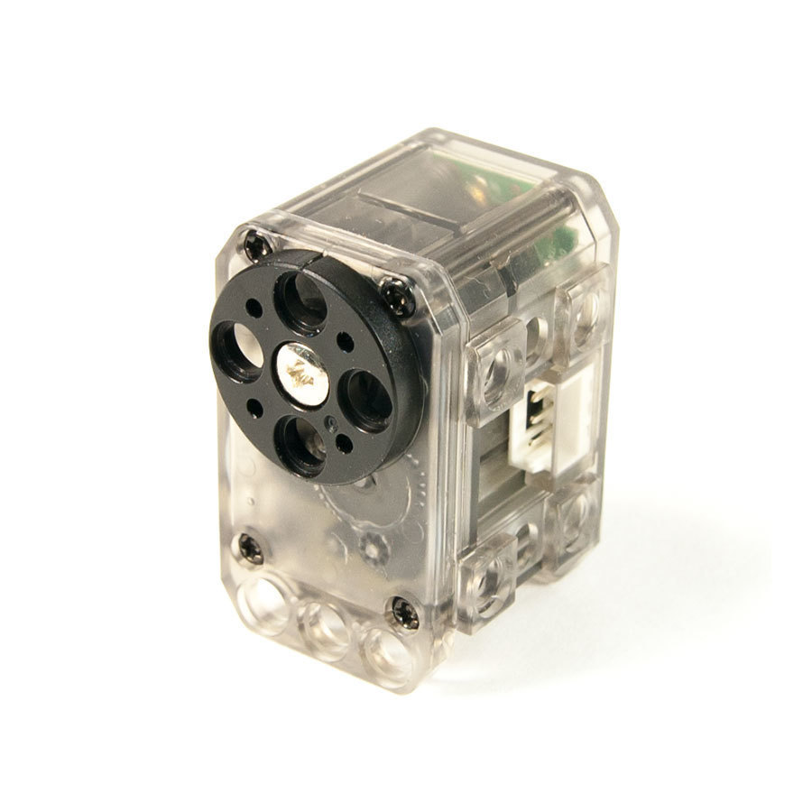
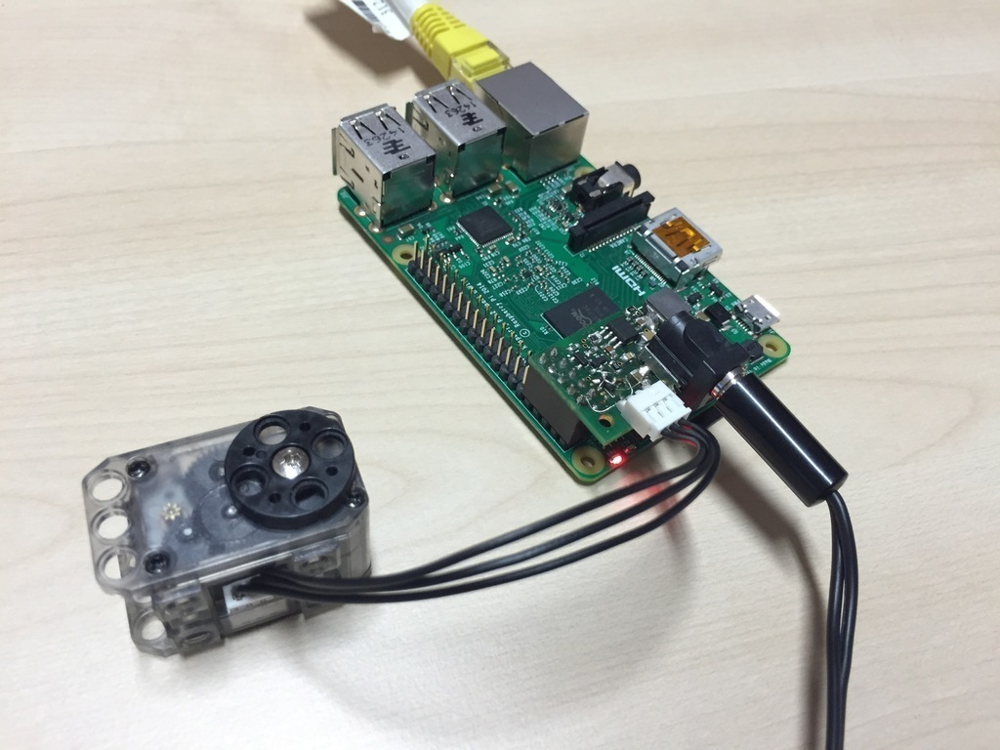

## Motor configuration

The Ergo Jr is made of 6 XL-320 motors from robotis. Each of this servomotor embeds an electronic board allowing it to receive different kind of orders (about position, speed, torque...) and to communicate with other servos. Therefore, you can chain up several of this servomotors and command them all from one end of the chain: each servomotor will pass the orders to the next one.



Yet, in order for the motors to be connected and identified on the same bus (same line), they must have a unique ID. Out of the factory they all set to the same ID: 1. In this section, we will give you details on how you can set a new and unique ID to each of your motors.

We recommend to configure motors in parallel of the hardware assembly. Meaning, that before assembling a new motor, you first configure it, then assemble to the rest of your robot. This will prevent you to swap motors. In the step-by-step assembly procedure, we will point out each time you need to configure a new motor. Furthermore, you will also be able to directly configure the motor from the assembly notebook interface.

<!-- TODO: image notebook d'assembly -->

### Configuring motors one at a time

As explained above, all motors have the same ID by default. Thus, it is important to **connect one motor at a time when configuring them.** Otherwise, it will not work as all motors connected will think that the order sent on the line is intended for them, they will all try to answer resulting in a big mess :-)

Your electronic setup when configuring a motor should look like this:

* the Raspberry-Pi
* the shield on top and the AC plugged
* a wire from the shield to the motor you want to configure



Pre-installed on your Raspberry-Pi also comes a [utility tool](https://gist.github.com/pierre-rouanet/ab79debfffd12cdb0095) that we developed to configure motors. The easiest way to use it, is through the notebook interface which will show you at which step of the assembly you have to configure a new motor.

<!-- TODO: image du notebook  -->

*Note: advanced users may directly use it from the command line terminal. For instance, to configure the motor "m3":*

```bash
$ poppy-ergo-jr motorconfig m3

Starting to configure the motor...
Changing angle limit...
Adjusting return delay time...
Your motor is now configured as:
Id: 7
Angle Limit: [-90.0, 90.0]
Going to Zero Position so it is ready to assemble...
Done!
```

Once configured - either from the notebook or the command line - and that you see the message indicating that everything went well, you can unplug the motor. Its configuration will be stored in the motor internal memory.
