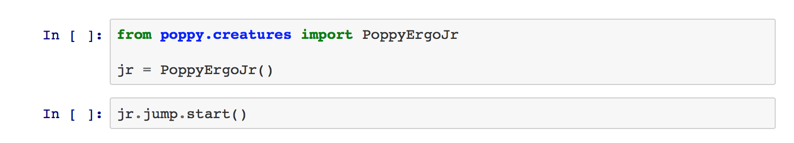
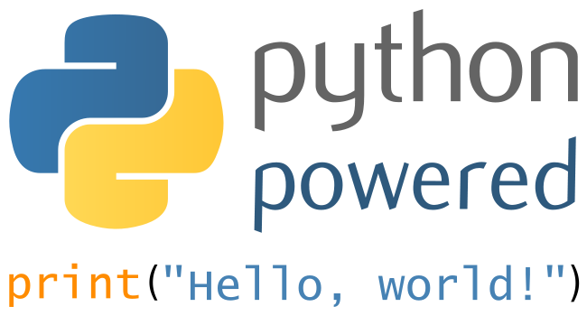
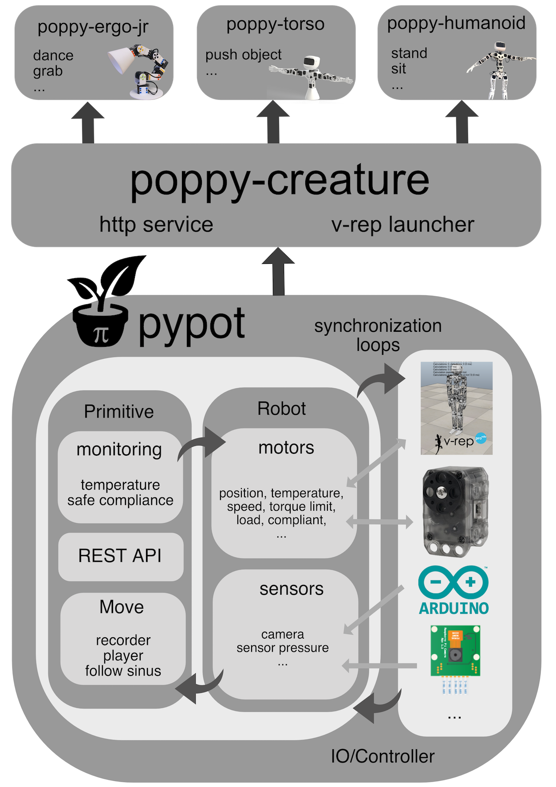

# Programming Poppy robots in Python

This chapter will guide you through how to control Poppy robots in Python. As it is actually the language used for writing Poppy core libraries, we will show you how to access all the different levels of control, from the lower to the higher.

We will detail everything you need to know to directly program you robot using its embedded Python or to install everything locally.

We will try to provide as many examples as possible (as a collection of [Jupyter notebooks](#TODO-BELOW)) and point to the complete API so you can find and use the least famous features.

All Poppy libraries are open source and are released under the [GPL v3](http://www.gnu.org/licenses/gpl.html) license. So you can freely access the source code on [github](https://github.com/poppy-project). Do not hesitate to fork them, send pull request and contribute!

## Why Python and Anaconda?

The libraries developed for the Poppy project were designed with the aim to make it easy and fast to write code for controlling various robots based on - originally - robotis dynamixel motors. The idea was to provide access from the lower level - raw serial communication with a specific motor for instance - to higher levels such as starting and stoping primitives/behaviors (e.g. face tracking, postures, ...) or directly recording motions through learning by demonstration.

We decided to write most of them in Python as its flexibility allows for fast and modular development. It was also meant to be accessible by a large audience, from developers and roboticists in general, to hobbyists, researchers, artists... Python was also chosen for the tremendous pools of existing libraries (scientific, computer vision, IO, web...) so if one is interested in adding a new feature, such as support for a new motor/sensor, it should be as easy and fast as possible.

Finally, support for multi-platforms and ease of installation were also key aspects.

We also strongly advise to use the [Anaconda Python distribution](https://www.continuum.io/why-anaconda) as it already includes most of the libraries needed by the Poppy libraries. We also provide all poppy libraries as conda recipes so they can be easily install using Anaconda (see the [install section](#TODO)).

## Overview of the different libraries

Before jumping into the code, we will briefly introduce the different existing Poppy libraries and how they interact with each other.

They are three main library levels:

* [pypot:](https://github.com/poppy-project/pypot) This is the core of the Poppy software architecture. Pypot handles all the low level communication with the hardware (both sensors and motors), defines synchronization loops so your command are always up to date. It also provides the primitives mechanism which allows the definition of simple behavior that can be - more of less - automatically combined.

* [poppy-creature:](https://github.com/poppy-project/poppy-creature) This library defines the common tools shared by all Poppy robots, for instance how to automatically launch the simulator or start the HTTP API attached to any robot.

* [poppy-ergo-jr](https://github.com/poppy-project/poppy-ergo-jr), [poppy-torso](https://github.com/poppy-project/poppy-torso), and [poppy-humanoid:](https://github.com/poppy-project/poppy-humanoid) Those libraries are specific to their respective Poppy robot. They define the particular configuration of the robot, the sensors it uses, which motors are connected to which buses... This is also were behaviors specific to a creature are defined (the stand primitive for the humanoid for instance).

This is summarized in the diagram below:

## Installation

**First, note that if you only planning to use real robots, they already come with Python and all Poppy libraries installed. You can directly connect to the Jupyter notebook server via the [web interface](#TODO) and have nothing to install on your machine!**

Yet, if you are planning to either

* use a simulator (e.g. V-REP),
* or want to directly plug the robot to your computer

you will have to install Poppy libraries locally. They work on Windows, Mac OS, Linux, and have been tested on:

* Python >= 2.6
* Python >= 3.4

Also note that if you are planning to directly plug your robot to your USB port, specific drivers should be installed.

All steps are detailed in the chapter [Manual installation](#TODO).

## Jupyter Notebooks gallery

## Services
### HTTP/REST API

## Advanced use case: extending poppy softwares
### Adding support for a new sensor/motor
### Defining a new creature

<!-- ## pypot library? (appendix ?) -->
