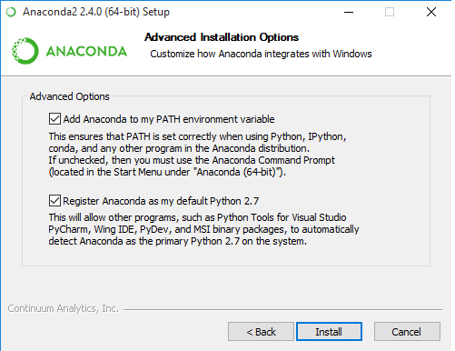

# Installation for advanced users

You may want to install Poppy softwares only if you are in one of these situation:
1. You want to control a simulated robot
2. [special case for advanced users] You want to install yourself the operating system of your robot instead of using a [pre-made ISO image](../installing-images/README.md)
3. [special case for advanced users] You want to control a Poppy creature from your computer WITHOUT using the Raspberry Pi board.

**Note: The first situation is a "normal case" but the second and third are special usages affordable only by advanced users who have a good comprehension of the global system.**

## Install the Python Interpreter and Poppy softwares

Poppy is run by Python computer code. Depending on your Operating System you will have to install Python and in any case you'll have to install the required software libraries.

Whatever your Operating System if you are getting started with Python and want to install a full Python environment for scientific computing, we suggest you to use [Anaconda Python distribution](https://www.continuum.io/why-anaconda).

### Install Python and Poppy softwares on Windows
<!-- TODO ajouter Schéma installation Thibault -->
If you want a step by step screencast of the installation of Anaconda and V-REP on Windows, you can see [these videos](lientodo). 
#### Install Python
We suggest you to use Anaconda Python distribution, but if you already have a Python distribution like Canopy with scientific packages (Numpy and Scipy) you can directly [install Poppy softwares](#install-poppy-softwares).
##### Anaconda
Download Anaconda Python distribution (400Mo) [here for 64-bit](https://repo.continuum.io/archive/Anaconda3-2.4.0-Windows-x86_64.exe) computer or [here for 32-bit](https://repo.continuum.io/archive/Anaconda3-2.4.0-Windows-x86_64.exe).

Install it and be sure that the two check-boxes of the PATH and the default Python are checked.



##### Miniconda (alternative to Anaconda)
Miniconda is a "light" version of Anaconda which contain only Python and the conda package manager. You can install it **instead of Anaconda** and save a lot of disk space (25 Mo vs 400 Mo), but you will have to do another step in the install process.
Download miniconda [here for 64-bit](https://repo.continuum.io/miniconda/Miniconda-latest-Windows-x86_64.exe) computer or [here for 32-bit](https://repo.continuum.io/miniconda/Miniconda-latest-Windows-x86.exe) computer.

Install it and be sure that the two check-boxes of the PATH and the default Python are checked.

Open the Command Prompt (press the windows key and type "Command Prompt"), type and press Enter to execute the command below:

`conda install numpy scipy ipython-notebook matplotlib`

Now you have a Python distribution ready to install Poppy softwares. 
#### Install Poppy softwares
Open the terminal prompt of your Python Distribution (called *Anaconda Prompt* for Anaconda), type and press Enter to execute the command below:

`pip install poppy-humanoid --user -U`

This will install everything necessary to control a Poppy Humanoid.
Substitute 'poppy-humanoid' with 'poppy-torso' or 'poppy-ergojr' to install respectively a Poppy Torso or a Poppy Ergo Jr.
 
### Install Python and Poppy softwares on Mac OSX
Mac OSX has a Python distribution installed by default. Before installing Poppy softwares, you need to install the Python package manager pip.
Open a terminal and execute the command below:
`curl --silent --show-error --retry 5 https://bootstrap.pypa.io/get-pip.py | sudo python`

You can now install Poppy softwares for the creature of your choice:
`pip install poppy-humanoid --user -U`

Substitute 'poppy-humanoid' with 'poppy-torso' or 'poppy-ergojr' to install respectively a Poppy Torso or a Poppy Ergo Jr.

### Install Python and Poppy softwares on GNU/Linux
Most of GNU/Linux distributions, have already a Python distribution installed by default.

#### Using the default Python distribution
Pypot, the main library of the robot is depending (amongst some other) on two big scientific libraries *Numpy* and *Scipy* which are themselves depending on C and Fortran code. These libraries may be installed with the Python package system (pip), but because of the huge number and differences between GNU/Linux distributions pip is not able to distribute binaries for Linux so all dependencies must be compiled... The solution to avoid the compilation of numpy and scipy is to install them with your distribution package manager.

On Ubuntu & Debian:
```bash
curl --silent --show-error --retry 5 https://bootstrap.pypa.io/get-pip.py | sudo python
sudo apt-get install python-numpy python-scipy python-matplotlib python-dev
```

On Fedora:
```bash
curl --silent --show-error --retry 5 https://bootstrap.pypa.io/get-pip.py | sudo python
sudo yum install numpy scipy python-matplotlib
```

On Arch Linux:
```bash
curl --silent --show-error --retry 5 https://bootstrap.pypa.io/get-pip.py | sudo python
sudo pacman -S python2-scipy python2-numpy python2-matplotlib
```
You can now [install Poppy softwares](#install-poppy-softwares).

**Note: The downside is the Python libraries from you distribution system are very often out of date.**

#### Using Anaconda (or miniconda)
If you want to have up to date numpy, scipy and ipython without having to compile them, we suggest you to install Anaconda or at least the conda package manager distributed with miniconda.
Download miniconda (64-bit) with these command below in your terminal:
`curl -o miniconda.sh http://repo.continuum.io/miniconda/Miniconda-latest-Linux-x86_64.sh `
If you have a 32-bit computer
` curl -o miniconda.sh http://repo.continuum.io/miniconda/Miniconda-latest-Linux-x86.sh`

Execute commands below and follow the instructions to install miniconda:
```
chmod +x miniconda.sh
./miniconda.sh
```

You can now install some required and other useful dependencies for Poppy softwares with conda:
`conda install numpy scipy ipython-notebook matplotlib`

You can now [install Poppy softwares](#install-poppy-softwares).

## Install the robotic simulator V-REP

## Install drivers
**Note: this chapter is only for people who want to control a tangible robot without an embedded board (Raspberry Pi or Odroid). It is a special case for advanced users**

If you intend to control tangible robots from your computer **without** a Raspberry Pi or a Ordoid, and you use a computer with Windows (vs GNU/Linux or MAC OSX), you may need to install manually drivers for the USB2AX or the USB2Dynamixel.

### If you use a [USB2AX](http://www.xevelabs.com/doku.php?id=product:usb2ax:usb2ax)
If the USB2AX is not recognized out of the box (its LED become green after having bee plugged) on windows, you probably need to install manually its drivers.
The installation process and the files to download can be found on the [USB2AX documentation](http://www.xevelabs.com/doku.php?id=product:usb2ax:quickstart).
You don't need drivers for GNU/Linux or MAC OSX, but note that it doesn't works well with MAC OSX.

### If you use a [USB2Dynamixel](http://support.robotis.com/en/product/auxdevice/interface/usb2dxl_manual.htm)

You need to install FTDI drivers on your computer. To reduce timeout, you have to low the "Latency Timer Value" from 16ms to 1ms (minumum allowed value) as explained in the [FTDI documentation](http://www.ftdichip.com/Support/Knowledgebase/index.html?settingacustomdefaultlaten.htm)  

