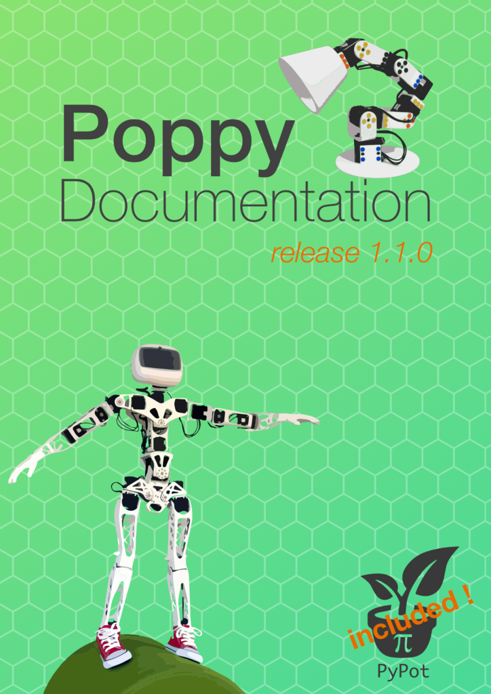

[](https://travis-ci.org/poppy-project/poppy-docs)
# Poppy docs
This doc is automatically built with [GitBooks](https://www.gitbook.com/book/poppy-project/poppy-docs/details).

You edit this documentation with the [GitBooks web editor](https://www.gitbook.com/book/poppy-project/poppy-docs/edit)(preferred version), edit it directly with the GitHub interface or with your favourite text editor and git command line.

## Edit this documentation
### If you are in the [poppy-project](https://github.com/poppy-project) team
* Create an account on [gitbook.com](https://www.gitbook.com), an ping any admin of the team to add you 
 
### If you are an external contributor
Welcome ! Sadly it is not able to use gitbook web editor if you have no write acces to the GitHub repository. The easier way is to edit directly the doc with the GitHub web interface and click to the button "commit" (you'll have to add a description of your modification), and create a pull request.
If you intend to work harder on the documentation, we could add you in the contributor of poppy-project to be able to edit it on the [GitBook web editor](https://www.gitbook.com/book/poppy-project/poppy-docs/edit).

## Build the doc offline
GitBook is used as a continuous integration service, but you can also build the doc in your computer locally. 
* install npm (method depends on your OS)
* Install gitbook and build :

  ```
  npm install gitbook-cli -g
  gitbook install
  gitbook build ./
  ```

[](http://poppy-project.GitHub.io/poppy-docs/)

