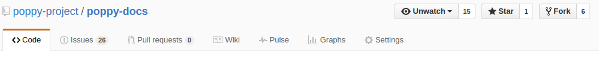
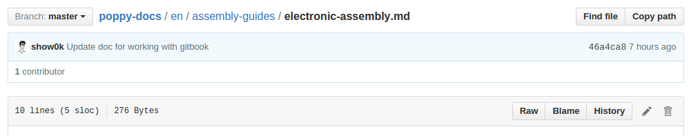
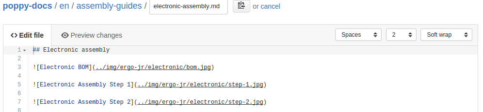
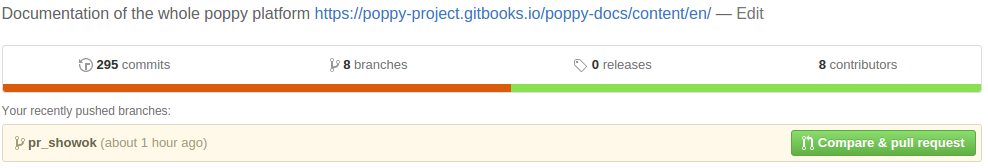

# Poppy documentation

This is the source code repository for the documentation of the [Poppy Project](http://poppy-project.org). The documentation is visible on [docs.poppy-project.org](https://poppy-project.gitbooks.io/poppy-docs/content/en/) so if you want to read it, please go there. If you want to contribute please do go further with this file.

Documentation is also available to download as [PDF](https://www.gitbook.com/download/pdf/book/poppy-project/poppy-docs).

# How to contribute

The Poppy Documentation is licensed under a [Creative Commons Attribution-ShareAlike 4.0 license](http://creativecommons.org/licenses/by-sa/4.0/). Everyone is free to add, edit and correct the documentation.

## Where to start

There are some of places where you can find something to contribute to:

* The issues in the [issue tracker](https://github.com/poppy-project/poppy-docs/issues).
* The [TODO links or comments](https://github.com/poppy-project/poppy-docs/search?utf8=%E2%9C%93&q=TODO) in the markdown files.
* The broken links in the travis-ci logs (the ci build will fail if there are broken links) [](https://travis-ci.org/poppy-project/poppy-docs).

## Editing basics

The source code of the documentation is [hosted on GitHub](http://github.com/poppy-project/poppy-docs). The GitHub [Fork & Pull workflow](https://help.github.com/articles/using-pull-requests) is used to accept and review changes.

The documentation is written in the [Markdown markup language](https://help.github.com/articles/markdown-basics) and uses the [GitBook](https://www.gitbook.com/book/poppy-project/poppy-docs/details) service for publishing the rendered website. [See more information about how GitBook works](http://help.gitbook.com/).

You can find discussions about the contents of the documentation on the [issue tracker](https://github.com/poppy-project/poppy-docs/issues).

## Getting started and prerequisites

Contributing to the documentation requires the following:

* A [GitHub account](https://github.com).
* In the case of complex edits familiarity with [Git command line basics](https://help.github.com/articles/set-up-git) or familiarity with an application ([Windows](https://windows.github.com/), [Mac](https://mac.github.com/)) to push your edits made on your computer to GitHub.

## Fork the repository

First fork the [poppy-project/poppy-docs](https://github.com/poppy-project/poppy-docs) repository to your personal GitHub account:



## Editing chapter content

### Simple changes

For simple changes like typo corrections you can use the GitHub online editor:

1. Open your local fork page on GitHub,
1. Go to *README.md* file in any chapter,
1. Press the *Edit* icon (pen).

and you can edit the chapter directly on github.com.



Markdown syntax is used to edit the individual pages of the documentation.



Click on "Commit changes" to save your changes and create a pull request as [explained below](#making-a-pull-request).

### New content and complex changes

To add new chapters, write longer snippets of text or add images, you first need to fetch a copy of the documentation on your local computer.

Either use the GitHub app for your operating system (mentioned above) or `git` command line to get the repository locally. The repository address is located on your own GitHub repository fork front page:

```bash
git clone git@github.com:yourgithubusername/poppy-docs.git
```

Then, create a branch for your new changes to sit in. Naming the branch in relation to the changes you will make can help.

```bash
git checkout -b contributing
```

Download the [GitBook Editor](https://www.gitbook.com/editor/) application to your computer.

Then you can open the documentation in GitBook Editor (*File* > *Open book*).

Make any changes in the documentation using GitBook and then save changes (*Book* > *Save all*).
<!-- TODO push or not-->

If you don't want to download the GitBook Editor app you can also go to the [GitBook website](http://gitbook.com), sign up for free with your GitHub account, then work directly in your browser.

## Making a pull request

After you are done editing, you have to create [a pull request](https://help.github.com/articles/using-pull-requests)  on GitHub. PoppyGirls will get notified about the pull request, review your changes, suggest any corrections if needed and then *pull* your changes to the master version.

In your own repository on GitHub press do *Compare & pull request*



Fill in the information *why* this change is being made. The reviewer can see the details of the actual change, so you don't need repeat the content of the change.

Then press *Create pull request*.

GitHub emails will notify you for the follow up process.

# Building the documentation (advanced users)

If you want to build the HTML version on your computer, without installing the desktop application of the [GitBook Editor](https://www.gitbook.com/editor/), you can also build the book with a command line tool.

You have to install npm and [calibre](https://calibre-ebook.com/download) (the way depends on your OS).

```bash
git clone https://github.com/poppy-project/poppy-docs.git
cd poppy-docs/

npm install gitbook-cli -g
gitbook install
gitbook build ./
gitbook pdf ./
```

# Further information and help

GitHub has an excellent [documentation](https://help.github.com/). Check it out if you need help!
For further questions feel free to post thread in the [Poppy Project forum](https://forum.poppy-project.org).
