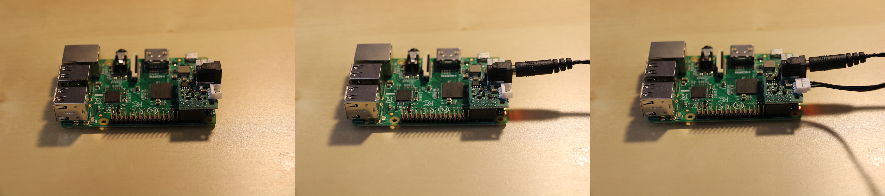

# 2. Electronics assembly

Before building any part of the robot, we will first plug electronics and connect the robot to the computer. The reason for this early connection is that you will need the robot software during the assembly: it allows to configure the motors.

## 2.1. Insert the microSD card in the Raspberry Pi

If you bought a kit, Poppy software is preloaded on your SD card. If it not the case, you have to "burn" your micro-SD card with the ergo-jr ISO image, this is described in [this section](../../installation/burn-an-image-file.md).

Then insert the micro-SD card inside the Raspberry Pi: push the micro-SD in the connector slot.

## 2.2. Mount the Pixl board

The [Pixl board](http://www.generationrobots.com/en/402420-carte-pixl.html) has 2 roles:
* Power the whole robot from the AC adapter (or from a battery but no battery holder is included in the kit)
* Communicate with XL-320 motors via the Raspberry Pi computer

Carefully insert the pixl at the end of Raspberry Pi headers:

Use the standoff and the provided screw to fasten the Pixl board strongly to the Raspberry Pi. If it remains loose, it may cause your robot to reboot with bad timing.

Before going further, double-check that the Pixl board:
* Is connected to all the very last 10 pins of the Raspberry Pi (make sure you do not connect only 5 pins)
* Is directed at the interior of the Raspberry Pi board
* Is mounted **exactly** as in the image below

## 2.3. Warnings

Please read them carefully to protect your equipment from damages.

> **Caution**  **Disconnect power supply before (un)monting the Pixl** this board is not meant to be hot-plugged, there is a risk of damaging it. 

> **Never use multiple power supplies at the same time**: when the AC power is connected, do not try to power the Raspberry Pi from other sources such as via a micro-USB cable or a battery pack, you would damage it!

> **Your Pixl must be strongly fastened**: At first use, you may think inserting the Pixl into the 10 pins of the Raspberry Pi is enough to fix it ; however in the long run a loose Pixl will cause your robot to reboot during its manipulation: make sure to use the standoff and the screw to attach it harder.  

## 2.4. First power up!

Then, plug a motor cable (one of those provided in the motor's bag) by leaving the other side of this cable empty for now. And ultimately, connect the AC adapter to the wall socket.

Then pay attention to the 2 LEDs of the Raspberry Pi:
- the **red LED (PWR = power)** must stays on ; which means the board receives power. If it doesn't, check all connections, especially the way you mounted the Pixl board
- the **green LED (ACT = activity)** must flicker for about 45 seconds, it means that the board is booting. if it isn't, check that the SD card is properly loaded with a valid image, or retry another [burn](../../installation/burn-an-image-file.md)

If you could see the green ACT led flickering for about 45 sec when plugging the robot, go on with your motor configuration...

[**>> Next step: configure your motors**](motor-configuration.md)