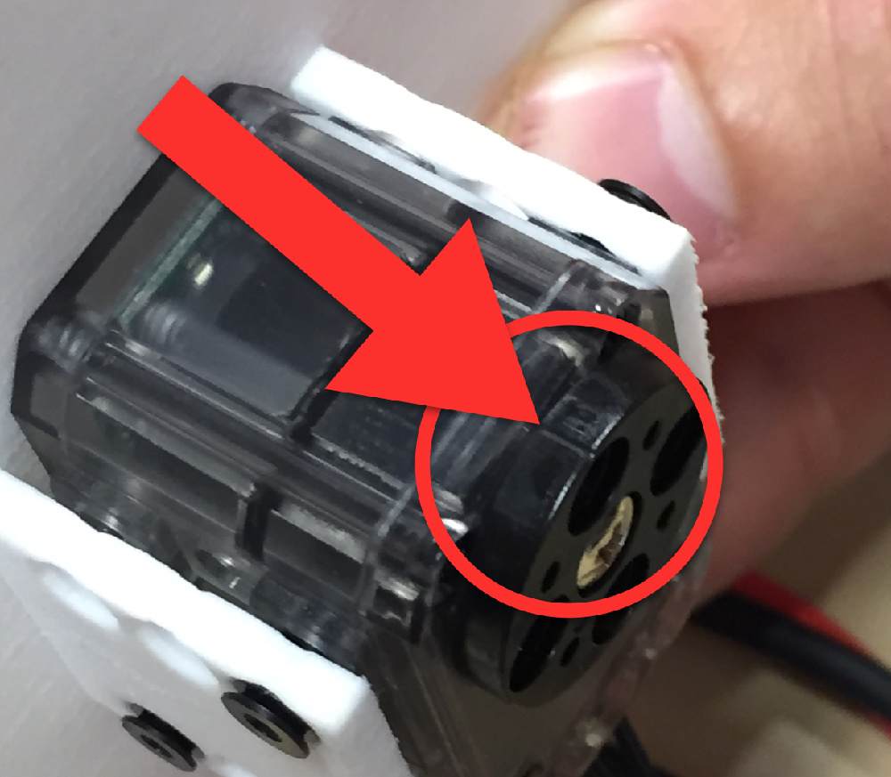
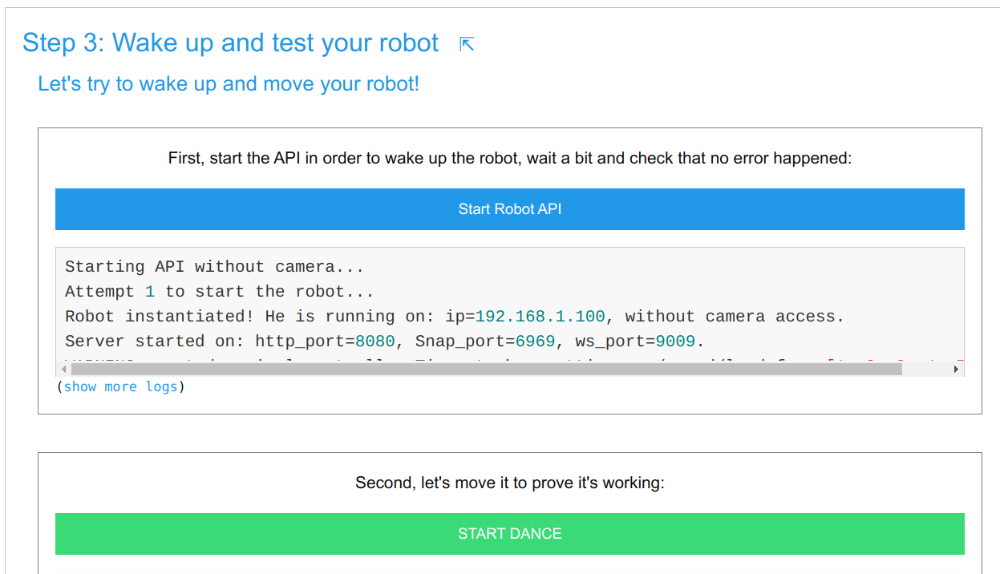

# 4. Mechanical Assembly

## 4.1. General advices and warnings

* **All orientations of all parts are very important**. Observe the pictures very carefully in order to reproduce the exact same assembly with the parts in the same orientation. If you make a mistake, you will realize it because your robot will perform motions different from what you'll ask. In that case do not worry, you will be able to unmount an remount your robot.

* You can pre-assembly all riverts you need before building your robot. Rivets are composed of 2 elements inserted into each other this way:

* There are two kinds of rivets. The grey ones and the others. Grey rivets are longer to be able to be inserted in the motor axis, at the opposite side of the horn (black revolving circle).

* Use the OLLO Tool for putting and removing rivets easily.

* Do not forget to put wires between motors while building the robot! Each motor, except the last, must have two wires; one connected to the previous motor and the other to the next (there is no importance on the connector choice).

* **Always make sure the zero angle mark is facing the top of the motor before assembling it**! Otherwise your Poppy Ergo Jr will look all weird.

* Every motor horns (motor wheels) are **facing the left side of the robot**:

## 4.2. Step-By-Step guide
### Step 1 - motor 1
First, [configure one XL-320](motor-configuration.md) motor as "m1".

Mount the motor on the 3D printed base.

To do so, prepare 8 small rivets. put the first part in the second part without putting them in the motor. Then, place the motor in the base, with the horn facing up and near the more open side.
Use the Ollo to grab a rivet between the first and the second part, then put the rivet in one the assembly holes. Once the rivet is in place, lock it by pushing the part 1 of the rivet in part 2.

### Step 2 - motor 2
Configure the second motor, its name is "m2".

Mount the *long_U* part. Be careful with the orientation of the U, the horn must be oriented in the left.
Mount the motor "m2" on top of the construction.

### Step 3 - motor 3
Configure a third motor: "m3".

Mount *horn2horn* and *horn2side* parts on motor "m2", and mount "m3" on top of the construction.

### Step 4 - motor 4

Configure the fourth motor: "m4".

Mount the *short_U* on it.

Mount motor "m4" and the assembled *short_U* on top of the previous assembly. The nose of the motor should be on the other side of the base.

### Step 5 - motor 5

Configure the fifth motor: "m5".

Mount *horn2horn* and *horn2side* parts on motor "m4", and mount "m5" on top of the construction.

### Step 6 - the tool of your choice
Configure the sixth motor: "m6".

To finish your Ergo Jr, you need to add a tool at its end. Choose which tool you prefer among the lampshade, the pen holder or the gripper and follow the appropriate instructions below.

> **Note** Tools they can be easily and quickly changed, so you can adapt it to the different activities.

#### Step 6 Option 1: Lampshade or pen holder
Mount *horn2horn* and *horn2side* parts on motor "m5", and mount "m6" on top of the construction.

You can mount the pen holder or the lampshade on the motor "m6".

In the same way you mount the lampshade, you can also mount the pen holder.

#### Step 6 Option 2: Gripper
Mount the [*gripper-fixation*](https://github.com/poppy-project/poppy-ergo-jr/blob/master/hardware/STL/tools/gripper-fixation.stl) between motors "m5" and "m6".

Mount *gripper-fixed_part* and *gripper-rotative_part* on motor "m6".

There is two way to mount the gripper, vertically

Or Horizontally

### Step 7 - electronics
Mount the **support_camera** part on the base. Fix the Raspberry Pi camera on it and move the camera flex cable between motor "m1" and the base.

**Camera flex wire**

To fix the flex cable of the camera on the Raspberry Pi:
* open the camera connector by pulling on the tab to the top
* make sure that connectors on the flex cable are facing away of the Ethernet port
* push the flex on the port, and push the plastic tab down to close it

**Motors wires:**

You can now plug every motor wire by chaining them together from a motor to the next one. Every motor has two connectors, and it does not matter which of the 2 connectors you use.

Check that:
* the first motor **m1** is linked to both the Pixl and the second motor **m2**;
* the last motor **m6** is linked only to the previous motor **m5**, 
* all other motors are linked to both the previous motor and the next motor.

### Step 8 - fix you Ergo Jr to the wooden disk support
Mount your Ergo Jr to the wood *disk-support*.

Mount the Raspberry Pi to the disk support, and use 4 x M2.5x6mm screw to fix it.
<!-- TODO: picture of disk fixation -->

### Step 9 - wake up and test your robot!
Congratulations, you achieved the robot assembly! Now, we can go on with the software assistant at **step 3 : Wake up and test your robot**.

It is first needed to Start Robot API: The API (Application Programming Interface) allows various software (e.g. some Python program, some Snap script, the Poppy monitor user interface... or any other software) to talk with the robot. Just click the blue button to start it and check in the log below that no error happens. 

Click on the **START DANCE** button. If your robot is dancing congratulations, you're done with the assembly!

Feel free to discover the whole robot software on your own. In particular, have a look at these important elements:
* **The logs**: they record all events happening on your robot. If something goes wrong the logs will be very useful to understand what the issue is
* **The monitor**: it tells you the current state of your robot (angles of motors, their temperature, ...)
* **The recorder**: it allows to record and replay motions with no programming
* **The settings**: you might want to change som setting there
* **The programming area**: several programming languages are available to go further with your robot...

[>> Next: Programming](../../programming)
