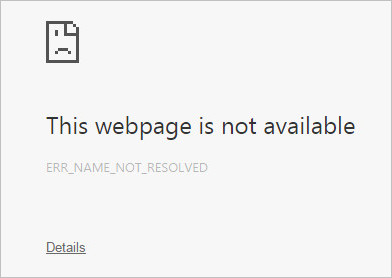
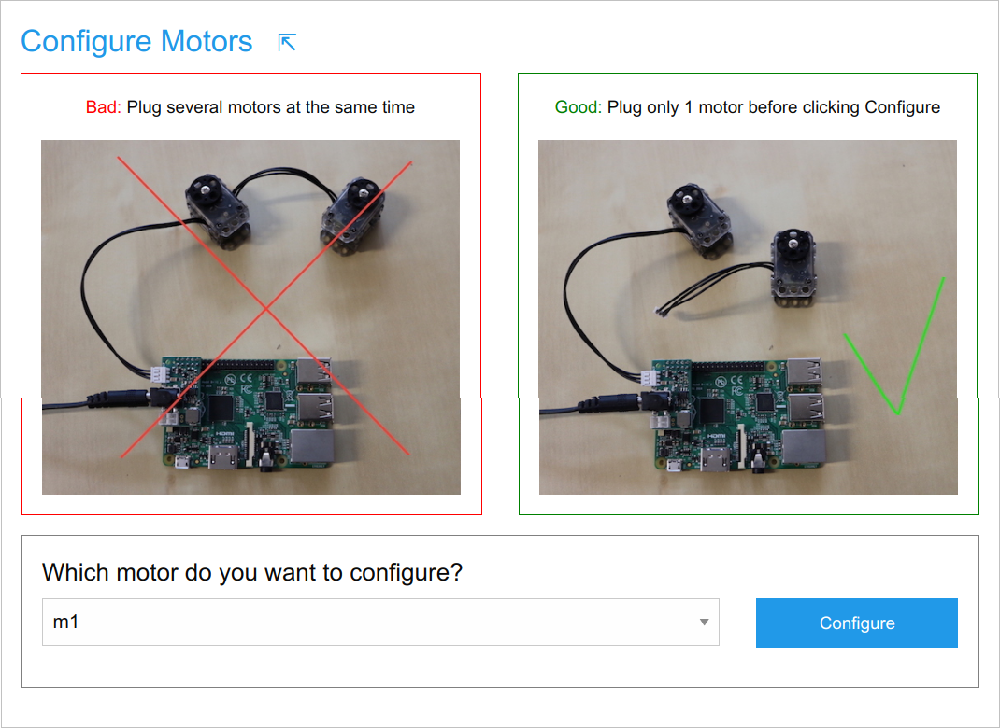
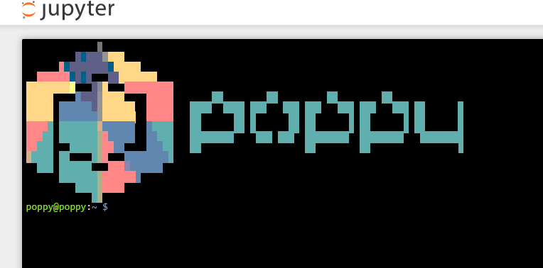

# 3. Motor configuration

Ergo Jr is made of 6 XL-320 motors from [Robotis](http://www.robotis.us/dynamixel-xl-320/). Each of this servomotor embeds an electronic board allowing it to receive different kind of commands (position, speed or torque) and to communicate with other servos. Therefore, you can chain up several of these servomotors and command them all from one end of the chain: each servomotor will pass the orders to the next one.

Yet, in order for the motors to be connected and identified on the same bus, they must have an unique identifier (i.e. an unique name). Out of the factory they all set to the same identifier. In this section, we will give you details on how you can set a new and unique ID to each of your motors.

We recommend to configure motors in parallel of the mechanical assembly. Meaning that you shouldn't configure all motors right now: just read this page carefully and make some configuration attempts to get your hand in configuring motors, but you will actually configure all motors during the next step (the mechanical assembly). Note that a motor can be reconfigured as many times as necessary.

## 3.1. Prepare the configuration

If you use Windows (not needed on GNU/Linux or Mac OSX) you first **need to install Bonjour/Zeroconf ([download link for Windows](https://support.apple.com/kb/DL999))** or **avahi** to be able to connect to the robot.
Look at [Bonjour/Zeroconf protocol](../../installation/install-zeroconf.md) dedicated page for more details.

**Turn on the robot**, with or without connected motors:

- plug the Ethernet cable (RJ45) from the robot **to your Internet router** 
- plug the DC power on the pixl board

**Note:** Although it is possible to connect the Ethernet cable directly from the robot to your computer, this method requires additional network configuration with [Zeroconf](../../installation/install-zeroconf.md) so we do not recommend it 

Your robot boots up... check that the green LED **ACT** of the Raspberry Pi flickers during about 45 seconds. If it doesn't, then your SD card might be missing or faulty.

## 3.2. Configuring motors one at a time (nominal case for robots acquired after October 2020)

From your computer, you can now open a web browser (Mozilla Firefox, Chrome, Edge, ...) and load the following URL in the address bar: [http://poppy.local](http://poppy.local).

The robot's first page should load. If it does not and shows an error like below, check that you did not miss the **http://** prefix, and check that [Bonjour](../../installation/install-zeroconf.md) is installed if you are running Windows. With GNU/Linux, it might be necessary to enable the "local link only" mode in your Ethernet settings. Otherwise your network might be misconfigured: try with another router or try a direct connection of the robot to your computer.

Motor configuration is **an individual process**, it means that during the configuration of a motor, **only this motor must be connected to the Pixl board**. By configuring a motor, you will name it **m1, m2, m3, m4, m5 or m6** by following this naming convention:

In order to configure a motor, you will have to connect **only** the following elements:
* the Raspberry Pi
* the Pixl board with its DC power supply
* Only 1 motor cable coming from the Pixl board to the unique motor to be configured
* the Ethernet cable connecting your Raspberry Pi to the network

At first boot, an assistant guides you for the initial configuration of the robot. Follow the proposed steps until you reach **step 2: motor configuration**:

**Note:** If your robot does not show the initial configuration steps but brings you directly to the robot homepage, you might be using a former robot software version. In that case the assistant is not available, use the **3.2.bis.** section below instead to configure your motors.

Let's try to configure a motor now: Connect a single motor to the Pixl board, pick up some motor name in the list (say **m5**) and click the **Configure** button. You will see a log telling what's going on. If no error happened, the last log line must be **Done!**. Otherwise, the error explanation might help you find the issue.

Every time a motor is correctly configured, it is moved to its zero angle position, so if you see it moving it's generally a good news ; but if it does not move, it might be already in its zero position. You will need to disconnect the motor cable if you want to move again the motor wheel by hand.

Recall that you shouldn't proceed with the configuration of all motors right now. But if you did, no worries, motors can be configured an unlimited number of times so you will be able to overwrite the configuration during the mechanical construction...

[**>> Next step: mechanical construction**](mechanical-construction.md)

## 3.2.bis. Configuring motors one at a time (for robots acquired before October 2020)

Before October, 2020, the Ergo Jr had no assistant at first boot but the robot directly showed the welcome page. In that case the motor configuration needs to be achieved with Poppy Configure:

**Open a terminal**

First, open the welcome page at **http://poppy.local**, select **Python, terminal** or **Programming, Python** and then click on **New, terminal** as shown below:

The terminal is the black area that you see, in which you can type commands and visualize their output:

**Configure a motor**

To configure a motor with Poppy Configure, type the command `poppy-configure ergo-jr <motor-name>` in which you replace the motor name by the corresponding one from **m1** to **m6**. Check that no error happens when the command is over and that the last line is **Done!**.

[**>> Next step: mechanical construction**](mechanical-construction.md)
