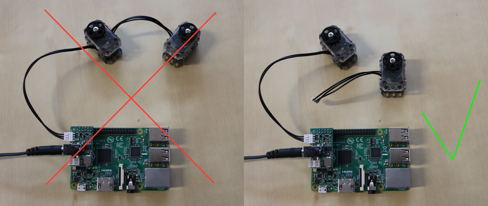

## Motor configuration

The Ergo Jr is made of 6 XL-320 motors from [Robotis](http://support.robotis.com/en/product/dynamixel/xl-series/xl-320.htm). Each of this servomotor embeds an electronic board allowing it to receive different kind of orders (about position, speed, torque...) and to communicate with other servos. Therefore, you can chain up several of this servomotors and command them all from one end of the chain: each servomotor will pass the orders to the next one.


Yet, in order for the motors to be connected and identified on the same bus (same line), they must have a unique ID. Out of the factory they all set to the same ID: 1. In this section, we will give you details on how you can set a new and unique ID to each of your motors.

We recommend to configure motors in parallel of the hardware assembly. Meaning, that before assembling a new motor, you first configure it, then assemble to the rest of your robot. This will prevent you to swap motors. In the step-by-step assembly procedure, we will point out each time you need to configure a new motor. Furthermore, you will also be able to directly configure the motor from the assembly notebook interface.


### Configuring motors one at a time

As explained above, all motors have the same ID by default. **Only one motor at a time should be connected to the data bus when you configure them.** Otherwise, it will not work as all motors connected will think that the order sent on the line is intended for them, they will all try to answer resulting in a big mess.

Your electronic setup when configuring a motor should look like this:

* the Raspberry Pi
* the shield on top and the AC plugged
* a wire from the shield to the motor you want to configure
* a ethernet cable going from the Raspberry Pi to your computer or your router




#### Web interface (user friendly)
<!-- TODO: image du notebook  -->
<!-- The easiest way to use it, is through the notebook interface which will show you at which step of the assembly you have to configure a new motor.
 -->
 <!-- *Note: advanced users may directly use it from the command line terminal. For instance, to configure the motor "m3":* -->
> **Caution** The web utility for configuring motors is still in the TODO stack.

#### Command-line utility
Robots come with a command line utility `poppy-configure` ; to use it you need to open a terminal on your Raspberry Pi.

You can access to the Raspberry Pi directly from your computer. To do so, open the page http://poppy.local in a web browser.
> **Caution** if when you open the page http://poppy.local, you have this message:


it's probably because you don't have Zeroconf on your Computer. To install Zeroconf, go to the corresponding chapter of the Doc: [Install Zeroconf](https://docs.poppy-project.org/en/installation/install-zeroconf.html)

You see the Poppy home page. Click on the "Jupyter — Python, Terminal" link and select "New Terminal".


Once the terminal is open, copy and press enter to execute the commande bellow.

```bash
poppy-configure ergo-jr m1
```

You have now configured the m1 motor of your robot.
Once configured and that you see the message indicating that everything went well, you can unplug the motor (you don't need to turn off the card). The configuration of the motor is stored in the motor internal memory.

> **Info** Poppy Ergo Jr motors are named m1, m2, m3, m4, m5, m6. To configure the others motors, you have to change m1 by the name of the motor you want to configure in the command above.


