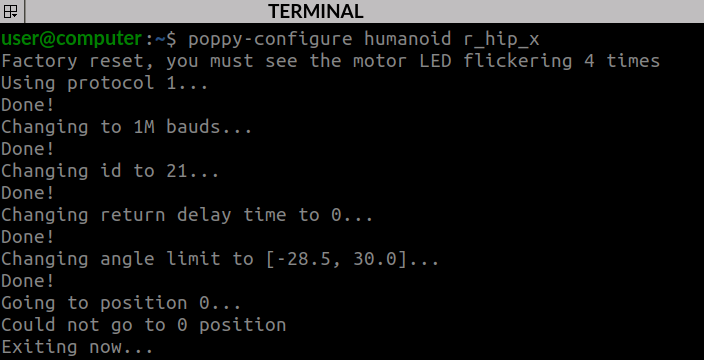

# 4. Configuring the Dynamixel motors

Every Dynamixel motor has its own configuration including:
* its digital identifier (e.g. id=21, this is the right hip motor)
* its baudrate: the speed of communication
* its return delay time:

By default all brand new motors have an id = 1 with default communication parameters, so all motors need to be configured one-by-one in order to be attributed their right parameters.

## Naming convention
To simplify the configuration, all Poppy motors are named (e.g. `right_hip_x`) as shown on the naming convention below. It means that given a motor name, software can deduce the right configuration parameters.


## Connect a single motor to configure it
Configuring a single motor requires 1x SMPS2Dynamixel (SMPS) adapter, 1x USB2AX adapter, 1x 12V power supply, and 2x Dynamixel cables.

The USB2AX USB adapter allows some computer (the Raspberry Pi or another computer) to communicate with the motors. The SMPS adapter injects power from the wall socket to the data bus, because such powerful motors cannot be powered from USB only.

They must be connected this way:


Then plug the USB to your computer and the 12V power adapter to the wall socket.

> **Note** Removing the central wire of the cable connected to the USB2AX (and only this one) is optional. It is something advised to do it in case of interferences on the data bus

## Install the driver for the USB2AX adapter
### On Linux/MacOS
On Linux/MacOS, no installation is needed, but you must add yourself in the group which own the USB serial ports. It is "dialout" or "uucp" depending on your distribution:

    sudo addgroup $USER dialout
    sudo addgroup $USER uucp

Then you need to logout from your session and login again.

### On Windows
Instructions for Windows ar available [here](http://www.xevelabs.com/doku.php?id=product:usb2ax:quickstart).

## Use a software to configure the connected motor

There are 3 different software tools to configure your motors one-by-one:
-   Poppy Configure: Command-line tool that only requires to provide the motor name
-   Herborist: Graphical tool used in the videos in place of Poppy Configure
-   [Dynamixel Wizard](http://support.robotis.com/en/software/roboplus/dynamixel_monitor/quickstart/dynamixel_monitor_connection.htm): windows-only tool provided by Robotis.

You can use whichever one as long as you manage to configure your motor, but we advise Poppy Configure:

### Poppy Configure
Poppy Configure is a command-line tool to configure Poppy motors that is handy because it only requires the name of the motor to configure it.
It is pre-installed on the Raspberry Pi image, so you can plug a HDMI monitor and use it in a terminal, but you may also use another computer, as long as you first install [Poppy software](../../installation/poppy-softwares.md).

**Open a terminal**
In order to use Poppy Configure you need a terminal:
* If you installed Poppy software by yourself, you probably know how to locate your system terminal and open it
* If your robot software was preinstalled, open the welcome page at **http://poppy.local**, select **Python, terminal** or **Programming, Python** and then click on **New, terminal** as shown below:


Your terminal is the black area that you see, in which you can type commands and visualize their output:


**Configure a motor**
To configure a motor with Poppy Configure, type the command `poppy-configure humanoid <motor-name>` in which you replace the motor name by the corresponding one. It will only work if either a Pixl board or a USB2AX adapter is connected to a motor (and only one).



Poppy Configure will configure the motor with the right configuration and then move to zero (angle = 0 degree). We strongly advise you to make advantage of that to double-check that the horn is properly aligned with the motor axis: at 0 degree, the single dot must point upwards.


> **Note**If Poppy Configure displays such error message: `poppy-configure: error: argument robot: invalid choice: 'humanoid'`, then you have missed [the installation of the humanoid creature](../../installation/poppy-softwares.md). Use command `pip install poppy-humanoid` to fix it.

### Herborist
Herborist can be installed with pip once you have setup a Python environment in your computer:
```
pip install herborist
```    

Then, type this command to launch it:
```
herborist
```


Connect each motor **one by one** to the USB2AX and use the ’scan’ button in Herborist or Dynamixel Wizard to detect it. If it’s a new motor, it should have ID 1 and baudrate 57600bps, apart from AX-12A servos which already have a 1000000 baudrate.

You have to set:
-   The digital ID corresponding to the naming convention
-   Baudrate to 1 000 000 bps
-   Return delay time to 0 ms instead of 0.5 ms

In Herborist, don’t forget to click on the ’Update EEPROM’ button so the changes are taken in account.

## When should I configure a motor?

Don't make the configuration of all motors now, it is advised to configure a motor each time you mount it into the mechanical structure.

> **Note**You can setup the configuration of a motor as many times as needed. So there is no danger at making confugration attempts now to check that everything is alright

[**Next : 5. Arms assembly >>**](arms_assembly.md)

[**<< Back to menu**](README.md)
