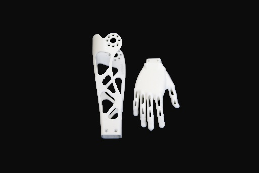
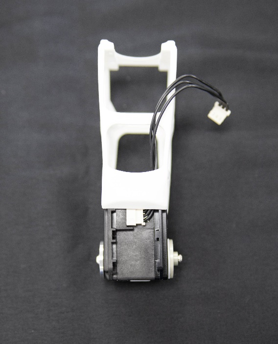
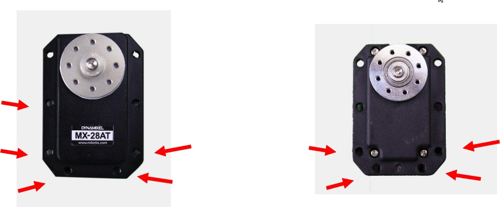
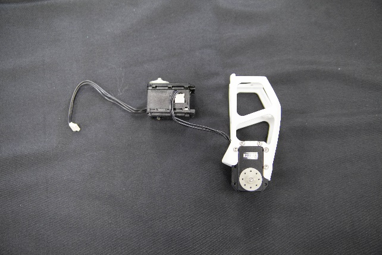
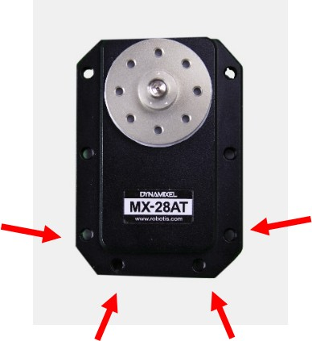

# 5. Poppy humanoid: Arms assembly

## Right arm
### Bill of Material for the right arm

* 1x Upper arm + Right hand

* Right Forearm

* 1x Arm connector

Cables:
* 1x 3P 200mm
* 1x 3P 140mm

Robotis parts:
* 4 nuts M2
* 4 Bolts S1
* 3x HN07-N101
* 2x HN07-I101
* 22x Bolts M2x3
* 26x Bolts M2.5x6
* 13x Nuts M2.5

### Right arm videos
* [Forearm assembly](https://www.youtube.com/watch?v=SUlM_mE3plc&list=PL8wg9_Kkof8wwqgfFu0iCij73C-4gt95x&index=1)
* [Upper arm assembly](https://www.youtube.com/watch?v=cYhGwD6r6NQ&list=PL8wg9_Kkof8wwqgfFu0iCij73C-4gt95x&index=2)
* [Arm/shoulder assembly](https://www.youtube.com/watch?v=BdQcOAwZbMY&list=PL8wg9_Kkof8wwqgfFu0iCij73C-4gt95x&index=3)
* [Final right arm assembly](https://www.youtube.com/watch?v=Oe5v21sTst8&list=PL8wg9_Kkof8wwqgfFu0iCij73C-4gt95x&index=4)

### Motor configuration for the right arm

Prepare and configure these motors, all with active horns (HN07-N101), and also the free horn (HN07-I101) when indicated.

| Sub-assembly name        |   Motor name   |   Type  | ID |  Free horn |
|--------------------------|:--------------:|:-------:|:--:|:----------:|
| Right upper arm/shoulder | r\_shoulder\_x | MX-28AT | 52 |    Yes     |
| Right upper arm          |    r\_arm\_z   | MX-28AT | 53 |    No      |
| Right upper arm          |   r\_elbow\_y  | MX-28AT | 54 |    Yes     |  

## Assembly of the right arm
Take the right hand and the right forearm. Insert 4 nuts in the hand, then link the 2 parts with the 4 Bolts S1.

Insert 5 nuts M2.5 on motor `r_elbow_y` on the bottom, 4 on the other side.

Plug a 140mm cable to r_elbow_y, drag it in the upper-arm and fix it with 18 bolts M2.5.

Drag the motor r_arm_z on the top of the upper arm and fix it. Then connect the motors.

Fix the arm connector at the top, and the forearm at the bottom with 22 bolts M2.

Put 4 nuts M2.5 behind on the bottom of r_shoulder_x.

Fix r_shoulder_x on the arm connector with 8 Bolts M2.5 and thanks to the 200mm cable, connect both motors.

## Left arm
### Bill of Material for the left arm

* 1x Upper arm

* Left hand + Left Forearm

* 1x arm connector

Cables:
* 1x 3P 200mm
* 1x 3P 140mm

Robotis parts :
* 4 nuts M2
* 4 Bolts S1
* 3x HN07-N101
* 2x HN07-I101
* 22x Bolts M2x3
* 26x Bolts M2.5x6
* 13x Nuts M2.5

### Left arm videos
* [Forearm assembly](https://www.youtube.com/watch?v=5FsPgEt4cfA&list=PL8wg9_Kkof8wwqgfFu0iCij73C-4gt95x&index=5)
* [Upper arm assembly](https://www.youtube.com/watch?v=MIjfAXShLJ4&list=PL8wg9_Kkof8wwqgfFu0iCij73C-4gt95x&index=6)
* [Arm/shoulder assembly](https://www.youtube.com/watch?v=qCF_8-M5k1o&list=PL8wg9_Kkof8wwqgfFu0iCij73C-4gt95x&index=7)
* [Final left arm assembly](https://www.youtube.com/watch?v=TZb6_hVlmcA&list=PL8wg9_Kkof8wwqgfFu0iCij73C-4gt95x&index=8)

### Motor configuration for the left arm

Prepare and configure these motors, all with active horns (HN07-N101), and also the free horn (HN07-I101) when indicated.

| Sub-assembly name       	|  Motor name  	|   Type  	| ID 	|  Free horn |
|---------------------------|:------------:	|:-------:	|:--:	|:----------:|
| Left upper arm/shoulder 	| l\_shoulder\_x | MX-28AT 	| 42    | Yes        |
| Left upper arm          	|   l\_arm\_z  	| MX-28AT 	| 43 	| No         |
| Left upper arm          	|  l\_elbow\_y 	| MX-28AT 	| 44 	| Yes        |

### Assembly of the left arm

Insert 5 nuts M2.5 on motor `r_elbow_y` on the bottom, 4 on the other side.

Plug a 140mm cable to l_elbow_y, drag it in the upper-arm and fix it with 18 bolts M2.5.

Drag the motor l_arm_z on the top of the upper arm and fix it. Then connect the motors.

Fix the arm connector at the top, and the forearm at the bottom with 22 bolts M2.

Put 4 nuts M2.5 behind on the bottom of l_shoulder_x.

Fix l_shoulder_x on the arm connector with 8 Bolts M2.5 and thanks to the 200mm cable, connect both motors.

[**Next >> 6. Trunk assembly >>**](trunk_assembly.md)

[**<< Back to menu**](README.md)
