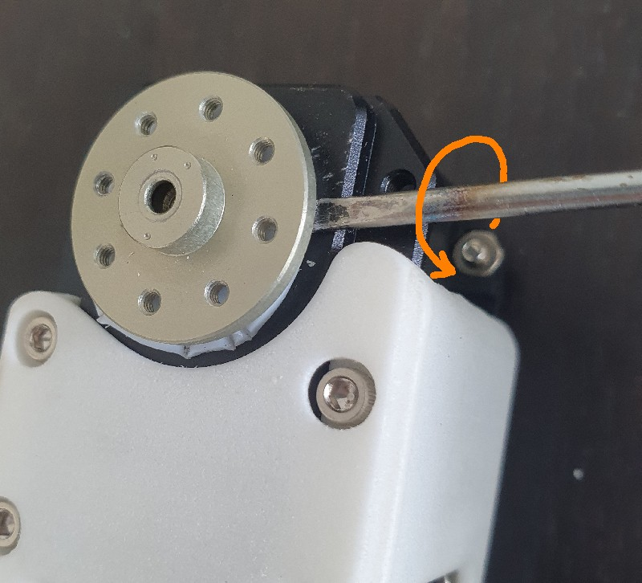

# 3. Mounting Dynamixel horns

The Poppy Humanoid robot is mainly built with [MX-28AT Dynamixel servomotors](http://www.generationrobots.com/en/401858-servomotor-dynamixel-mx-28at.html) (MX-28T are the previous version and can be used without any problem). 

The other servomotors are MX-64T which are bigger and stronger, and AX-12A or AX-18 which are smaller, used only for the head.

Each Dynamixel servomotor embeds an electronic board allowing it to receive different kind of orders (about goal, torque...) and communicate with other Dynamixel servos. Therefore, you can chain up several Dynamixel servomotors (each with a different ID) and command them all from one end of the chain: each servomotor will pass the orders to the next one.

## Parts used along with Dynamixel motors 
Here is a table of the parts needed to mount the horns of the motors.

| Servomotor | main horn | free horn | big horn screw | horn screws | case screws|
|------------| :-----------: | :-----------: | :----------------:| :-------------: | :-------------:|
|AX12-A |      none |       none      |    M3x10mm |           M2      |       M2
|  MX28   |   HN07-N101 |  HN07-I101   |   M2.5x8mm  |       M2x3mm    |    M2.5x6mm
|  MX64    |  HN05-N102  | HN05-I101  |     M3x8mm  |        M2.5x4mm   |    M2.5x6mm |

You will need an allen wrench of size 1.5mm for M2 screws, 2mm for M2.5 screws and 2.5mm for M3 screws. The longer M2 screws need a Phillips screwdriver.

## Mounting and aligning the active horns 

Don't mount the horns now, you should do it all along the assembly when a motor is needed. This is only general information, not all motors need to be mounted the same way: with or without rear wheel, with or without nuts ; this will be indicated in the videos for each specific motor.

When you receive your Dynamixel servomotors, the horns and their washers are not mounted. The latter are included in the same packaging if the servo is packaged alone or they are packaged separately for 6-pieces bulks.

On top of the active motor axis (the axis that is driven by the motor), you will mount the horn and the washer (the white washer for the MX-28). As you already read in the [PRIMORDIAL warnings #1 and #3](warning.md) be very careful about the horn alignement both with the active motor axis and the structural part (3D printed). Here are other views of what you need to achieve:

Then you can force on the horn to insert it and use a screw (the longest model) with very few thread locker to fix it. But, again, **this is definitive**.

### If you are unsure that you have well aligned the active horn

If you are unsure that you have well aligned the horn: Install [Poppy software](../../installation/install-poppy-softwares.md) and invoke [Poppy Configure](../../TODO) with the name of a motor of the same model (MX28/MX-28AT or MX-64) so that it goes to its zero angle.

If, after setting your motor to zero angle, the horn does not point upwards as in the image below, then you made a mistake in horn alignment.

### If you made a mistake in the active horn alignment

If you assembled the horn and forced without aligning it correctly, you have two solutions:
* The offset can be compensated from software [in the configuration file of your creature](https://github.com/poppy-project/poppy-humanoid/blob/d1e5c8d58eac6358ef26870054e4ccffda9b0bab/software/poppy_humanoid/configuration/poppy_humanoid.json#L75), but this is an advanced operation and you first need to know how much the offset is
* You can attempt to remove the horn. You will necessarily damage the motor, so be very cautious in order to minimize damages. Proceed as follows:
  * Use a flat screwdriver with a tip of about 2mm in length
  * Remove the center screw if any and carefully slip the tip under the horn
  * Apply a slight rotative pressure pressure on you screwdriver
  * Rotate the horn of 45° and apply another pressure there as shown on the picture
  * Pursue pressures evert 45° all around the horn by keeping your screwdriver always inserted at the same location in order to minimize damages of the black chassis and the washer
  * When the horn is disengaged of about 2mm from the motor (you screwdriver is too narrow to force again), you should be able to pull the horn by hand by pulling very straight and shaking slightly
  * Re-insert then the active horn properly

### Particular cases of horn alignment according to motor types
Horns of motors **AX-12 and AX-18** are also oriented but motors are shipped with the horn pre-assembled so there is no danger.
Horns of motors **MX-64 and MX-64AT** are also oriented but horns can be removed easily with no damage to the motor.
Thus, the assembly of motors **MX-32 and MX-32AT** are the most at risk.

## Mounting the rear horn (free wheel)
In most cases, on the other side of the active/driven horn with the 3 dots, you will have to mount another horn with ball bearings.

There is no important alignement on this side, this is just a free wheel. Insert a long screw with very few thread locker. However check that this horn rotate very easily by hand, just as a free wheel would rotate when mounted on a ball bearing. A locked free wheel would prevent the motor from moving.

## Inserting the nuts

Some nuts will have to be inserted in the motors in order to receive the screws allowing the 3D printed parts to be fastened. The location needing nuts will be told in the videos for each motor.

In order to place a single nut: Take a nut using thin tweezers and bring it in the sitewith the right orientation. Put the end of the tweezers in the hole to ensure good alignment. Then use flat pincers to adjust the nut. These nuts correspond to diameter 2.5mm screws, Allen wrench 2mm.

Older motor version MX-28 have no thread at all, but newer version MX-28AT are partially threaded in a side. So less nuts will be needed with newest motors.

Later on, when you tighen the screw, make attention not to push the nuts unintentionally. Once motors are inserted in some structural parts, som nut locations can no longer be reached by hands so you will not be along to insert the fallen nuts again. 

[**Next >> 4. Configuring the Dynamixel motors**](addressing_dynamixel.md)

[**<< Back to menu**](README.md)
