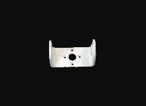
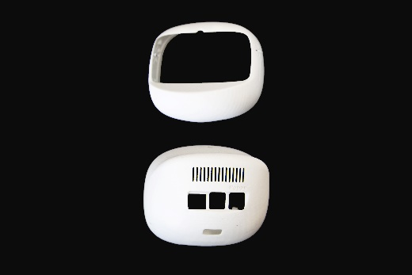
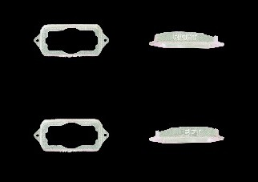
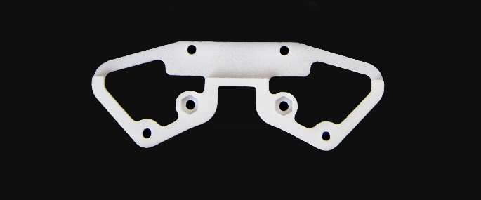
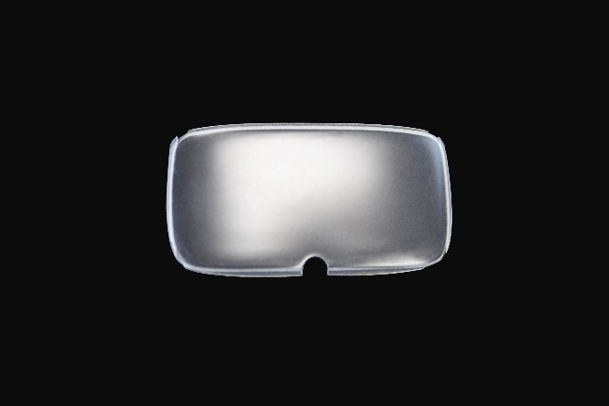
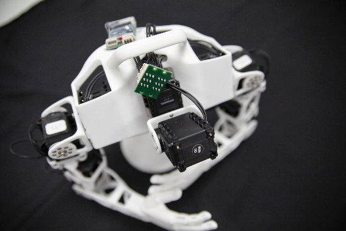
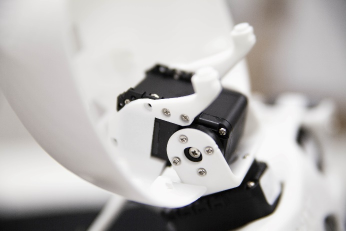
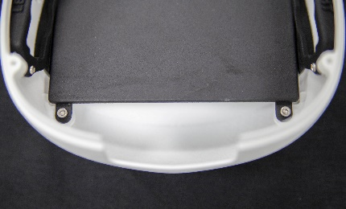
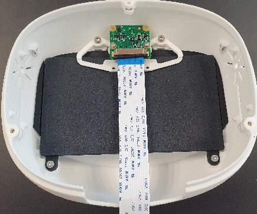
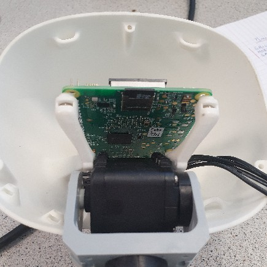

# 8. Poppy Humanoid: Head Assembly

## Warning about Poppy Eve head version with Raspberry Pi 4

If you have a Raspberry Pi 4 based head with a screen, please consult the [documentation of **Poppy Eve** for the assembly and software configuration](https://github.com/poppy-project/Poppy-eve-head-design#poppy-eve-head-design).

## Bill of Material for the regular Raspberry Pi 3 head

The following is the BOM of the original Poppy head version, based on Raspberry Pi 3 with Manga screen v1 that is no longer manufactured and replaced by a blank plastic cover.

3D printed parts:
* Neck (U-shaped part)

* head-face and back

* speaker right and left (if applicable)

* camera_support

* screen_support

* screen

* fake_manga_screen

Actuators :
* 1x Robotis Dynamixel AX12A

Cables:
* 1x 3P 140mm

Robotis parts:
* 13x Nuts M2
* 4x Nuts M2.5
* 18x bolts S1
* 1x bolts S-B
* 4x Bolts M2.5x6
* 3x Bolts S2

## Head assembly instructions

Prepare and configure this motor:

| Sub-assembly name |   Motor name   |   Type  | ID |  Free horn |
|-------------------|:--------------:|:-------:|:--:|:----------:|
| Head              |     head\_y    |  AX-12A | 37 | No         |

Fix the neck on the head_y motor with 4 S1 Bolts.

Fix head_y on the neck with 4 S1 Bolts and a S-B Bolts.
Plug head_y on the 3P PCB HUB with the 100mm cable

Insert the back part of the head on top of head_y. Make sure the axis of head_y is in zero position at this moment: Rely on the marks drawn on the horn and on the motor chassis: they must be aligned.

Fix the motor and the head back with 6 S1 bolts.

Take the head front, and insert the screen.
Insert 4 nuts M2.5 on the top and bottom of the front head.
Insert 2 nuts M2 on each side of the front head.
Insert the screen support and the fake screen, then fix them with 2 M2.5x6 bolts.
Insert the camera support and fix it with 2 M2.5x6 bolts.
Fix the left and right speakers on their side with 2 S1 Bolts each.

Insert the Raspberry Pi 3 with USB/Ethernet ports facing the rear of the head, on top of its 4 pillars of the head_back part. Use bolts and nuts to fix it as well.

## Do not close the head before full startup
As you might expect, the last part is to add the head_face in order to close the head. However, since the first startup may require debugging, we advise you to keep the head open till you are guaranteed your robot is assembled the right way. Go on with the wiring arrangement.

Once you're done with debugging, close the head: Insert a nut M2 on the top, on the bottom left and, on the bottom right of the head front and join the 2 parts of the head and fix them with 3 S2 Bolts.

[**Next: 9. Wiring arrangement >>**](wiring_arrangement.md)

[**<< Back to menu**](README.md)

## Older head versions with Odroid
Former versions of Poppy Humanoid were shipped with Odroid U3 or Odroid U4 boards.
These boards are no longer supported. If you have such boards, please refer to the archieved documentation [for U3](https://github.com/poppy-project/Poppy-minimal-head-design/blob/odroid-xu4-integration/doc/head_back_U3.md#u3-version-assembly) or [for XU4](https://github.com/poppy-project/Poppy-minimal-head-design/blob/odroid-xu4-integration/doc/head_back_xu4.md).
