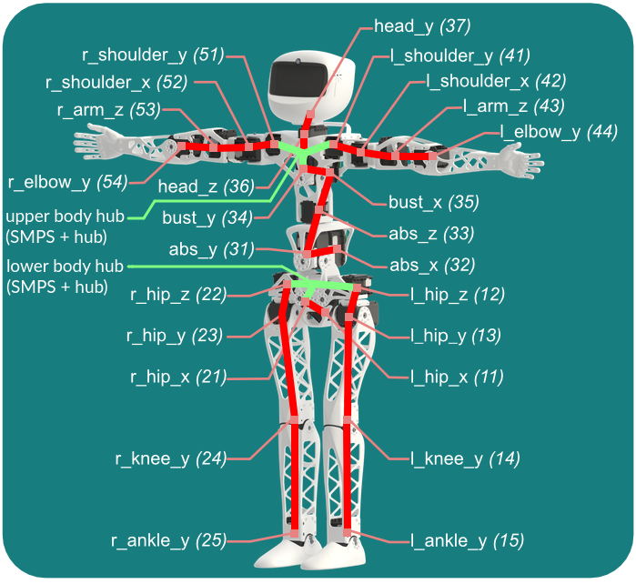

# 9. Poppy humanoid: wiring arrangement

## 9.1. Data and power buses
Before you can startup your robot, let's have a look at the cables. You must connect wires from motors to motors by forming 2 different buses:
* Upper body (from `head_y` to `abs_x`)
* Lower body (from `r_hip_z` and `l_hip_z` to `r_ankle_y` and `l_ankle_y`)

These 2 buses are fully disconnected from each other, they have their own:
* Power supply (SMPS2Dynamixel + wall socket)
* Dynamixel hub to plug up to 6x motors
* USB2AX

The drawing below shows the 2 data and power buses: cables connecting motors are in red, data hubs and SMPS power injection in green. 

Both USB2AX adapters have to be plugged to the USB sockets of the Raspi3 at the bottom of the head. If you mess up with wiring, at first startup, software will report missing motors or too much motors or the same bus.

## 9.2. Power supplies for Poppy Humanoid
The robot requires 3 power supply cables:
* 12V power supply for the SMPS2Dynamixel of the upper body
* 12V power supply for the SMPS2Dynamixel of the lower body
* 5V micro USB power supply for the Raspberry Pi 3

For now you can plug the 3 cables to the robot but wait a bit before connecting them to the wall socket. Indeed, there's a few things we need to setup before we can start the software.

## 9.3. Connect to the robot
Let's getting started with software! Please checkout the dedicated section: [Getting started with Poppy software](../../getting-started/connect.md). Psst, before you leave: don't forget to fasten the last screws to fix your head face after you got it working from software.

[**Next: 10. Getting started with Poppy software >>**](../../getting-started/connect.md)

[**<< Back to the assembly guide**](README.md)