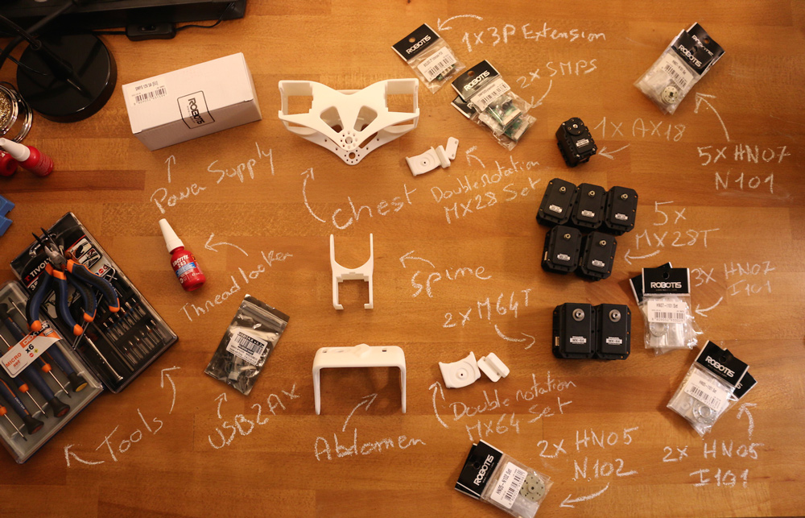

# 2. Poppy Torso Bill of Material

Checkout the list of components you need and have a look at your own kit to check that nothing is missing.
Prepare a clear workbench that you may keep busy for a few days with all of these.

## 1. Multiarticulated torso BOM

**3D Printed parts**:
- Chest
- Spine
- Double rotation MX28 Set (3 parts)

**Actuators:**
- 1x Robotis Dynamixel AX12-A (or AX18-A)
- 5x Robotis Dynamixel MX28-AT (or MX28-T)

**Robotis parts:**
- 5x HN07-N101
- 3x HN07-I101
- 1x Bioloid 3P PCB HUB
- 1x SMPS2Dynamixel
- 1x 12V power supply
- 1x USB2AX

**Other:**
- 1x Circular suction pad + its M6 screw with large head

## 2. Head BOM option A: Raspberry Pi 3 version, no screen

**3D Printed parts**:
- 1x Head face
- 1x Head back
- 1x Fake manga screen (replaces Manga screen that is no longer manufactured)
- 1x Screen support
- 1x Camera support
- 1x Speaker left support
- 1x Speaker right support
- 1x Neck

**Actuators:**
- 1x AX-12 or AX-18

**Electronics:**
- 1x Raspberry Pi 3 + its SD card
- 1x Camera for Raspberry Pi + its flat cable

## 2. Head BOM option B: Raspberry Pi 4 version, including screen (aka **Poppy Eva**)

This head version has its own documentation online, please refer to [the documentation of **Poppy Eva** for the assembly and software configuration](https://github.com/poppy-project/Poppy-eva-head-design#poppy-eva-head-design).

## 3. Tools
Please note that you will also need:
* an external computer running Linux Windows or MacOS
* screwdrivers (crosshead and Torx)
* tweezer
* hot glue

## 4. STL files for poppy Torso 3D printing
If you are in the process of 3D-printing the parts from this BOM by yourselves, download the latest STL files from:
* [Poppy minimal head design STLs](https://github.com/poppy-project/Poppy-minimal-head-design/releases)
* [Poppy torso STLs](https://github.com/poppy-project/poppy-torso/releases)

In order to clone these repositories, please use [git lfs](https://git-lfs.github.com/) to retrieve assets such as 3D parts and images. By cloning the repositories with git only, **the assets would appear to be corrupted/invalid files**.

[**Next >> 3. Dynamixel hardware**](dynamixel_hardware.md)

[**<< Back to menu**](README.md)
