# 6. Poppy Torso: Trunk assembly
## 6.1. Chest
### Bill of Material for the Chest
<!---->

3D printed parts: Chest
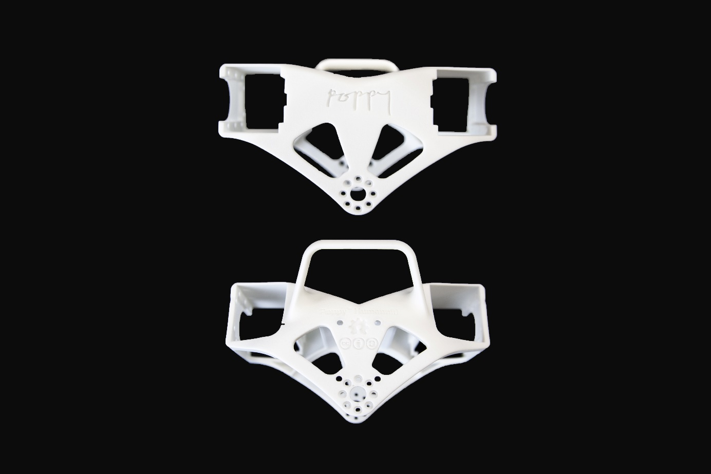

Actuators:
* 1x Robotis Dynamixel AX12-A 

* 2x Robotis Dynamixel MX28-AT

Cables:
* 1x 3P 100mm
* 2x 3P 140mm

Robotis parts :
* 10x Nuts M2
* 10x Bolts M2
* 16x Bolts M2.5
* 2x HN07-N101
* 1x Bioloid 3P PCB HUB

### Chest videos
* [Chest assembly](https://www.youtube.com/watch?v=qwrgV6tKTO8&list=PL8wg9_Kkof8wwqgfFu0iCij73C-4gt95x&index=12)

### Chest assembly instructions

Prepare and configure these motors, all with active horns (HN07-N101 for MX-28AT), without free horns.

| Sub-assembly name |   Motor name   |   Type  | ID |  Free horn |
|-------------------|:--------------:|:-------:|:--:|:----------:|
| Chest             |     head\_z    |  AX-12A | 36 | No         |
| Chest             | l\_shoulder\_y | MX-28AT | 41 | No         |
| Chest             | r\_shoulder\_y | MX-28AT | 51 | No         |

Insert the 10 M2 nuts all around the bottom part of the AX12-A.

Lay the AX12-A on the top of the chest, then screw it with the 10 Bolts M2 and plug the 100m cable on the AX12-A, and fix it by passing it in the gap. 

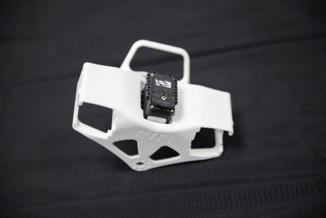
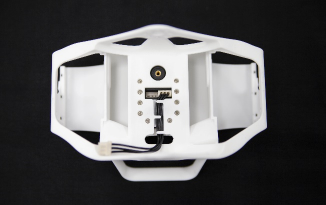

Plug a 140mm cables between r_shoulder_y and l_shoulder_y. Insert them in their slots in the chest and fix them both with 8 Bolts M2.5.

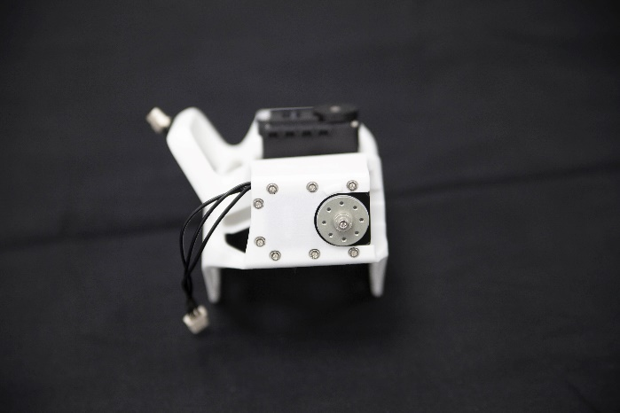

Pass both the 140mm cable in the gap on each side of the chest.

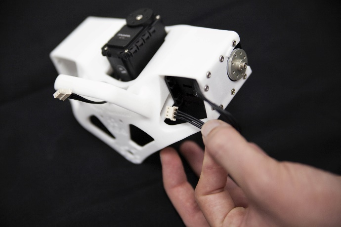

Plug the 3 cables on the 3P Extension PCB, with hot glue, fix it behind the chest on top of the Poppy logo.

## 6.2. Double Dynamixel MX-28 sub-assembly
### Bill of Material for the Double MX-28 sub-assembly

3D printed parts: 
* 1x i101-Set_to_MX28_link
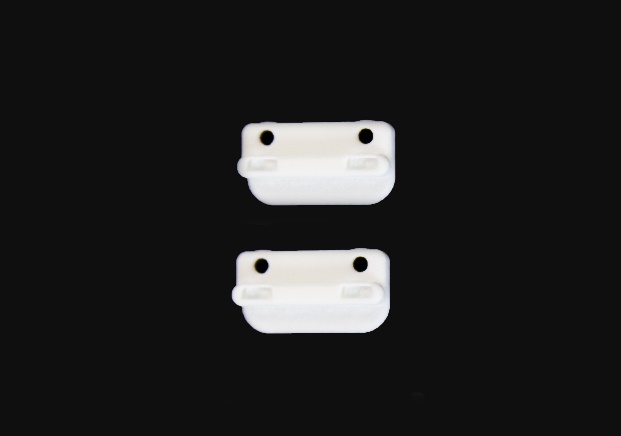
* 2x double_rotation_MX28_link

Actuators:
* -2x Robotis Dynamixel MX28-AT

Cables:
* 1x 3P 60mm

Robotis parts :
* 8x Nuts M2.5
* 8x Bolts M2.5
* 2x HN07-N101
* 2x HN07-I101

### Double MX-28 sub-assembly videos
* [Double MX-28 assembly](https://www.youtube.com/watch?v=9oNGV9ggHaE&list=PL8wg9_Kkof8wwqgfFu0iCij73C-4gt95x&index=10)

### Double MX-28 sub-assembly instructions

Prepare and configure these 2 motors, both with active horns (HN07-N101). Only one requires its free horn (HN07-I101) but an additional free horn is needed during the sub-assembly.

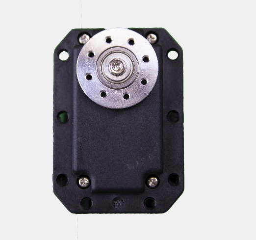

The additional free horn will be mounted to its motor later on.

| Sub-assembly name |   Motor name   |   Type  | ID |  Free horn |
|-------------------|:--------------:|:-------:|:--:|:----------:|
| Double MX28       |     bust\_y    | MX-28AT | 34 | Yes        |
| Double MX28       |     bust\_x    | MX-28AT | 35 | No         |

Insert a 2.5 nut on the back of the i101-Set_to_MX28_link, and install the second free horn HN07-I101 on it with a central screw.

On both double_rotation_MX28_link parts, insert 2 M2.5 nuts.

Install them on the bust_x motor.

Connect both motors together with the short 60mm cable. Insert 2 M2.5 nuts on bust_y on the same side of the cable.

Approach both motors so that their axes form a 90° angle, and fix them by the means of the double_rotation_MX28_link and 4 M2.5 bolts.

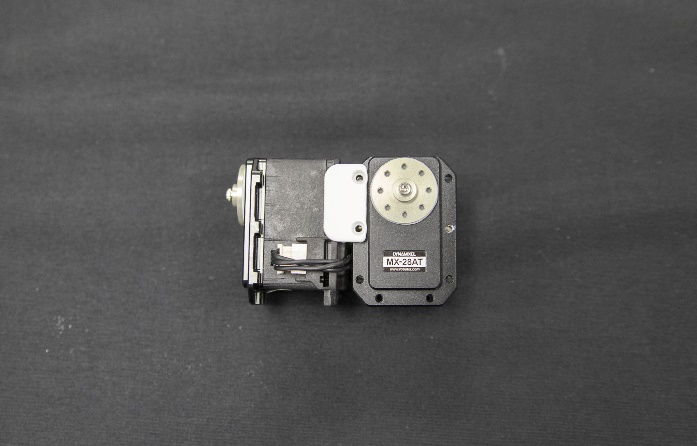

<!-- From there, Torso differs from the Humanoid -->
<!-- Spine sub-assembly and Spine assembly have been merged here -->
## 6.3. Spine sub-assembly
### Bill of Material for the Spine

3D printed parts:
* Spine
* Tabletop support

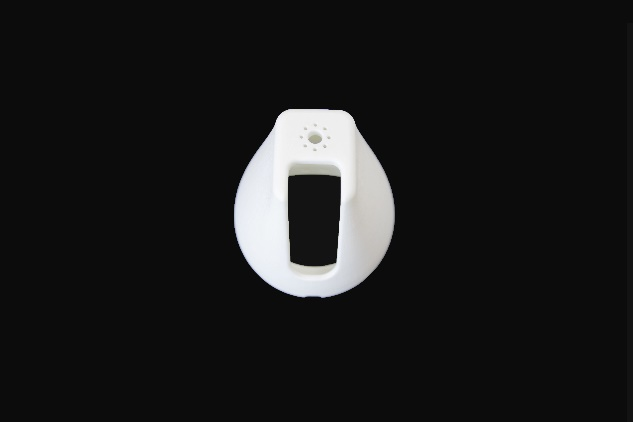

Actuators :
* 1x Robotis Dynamixel MX28-AT

Cables :
* 2x 3P 200mm

Robotis parts :
* 4x Nuts M2.5
* 8x Bolts M2.5
* 1x HN07-N101
* 40x Bolts M2x3
* 4x Bolts M2.5x4

### Spine sub-assembly instructions
Prepare and configure this motor with its active horn:

| Sub-assembly name |   Motor name   |   Type  | ID |  Free horn |
|-------------------|:--------------:|:-------:|:--:|:----------:|
| Spine             |     abs\_z     | MX-28AT | 33 | No         |

Insert 4 nuts in the top face of abs_z.

Plug it to a 200mm cable and slide the motor into its slot in the spine. Fix it with the 8 M2.5 Bolts.

Link the double MX-28 sub-assembly to the spine with 16 M2 Bolts and pass the 200mm cable between the 2 parts. Connect the motors.

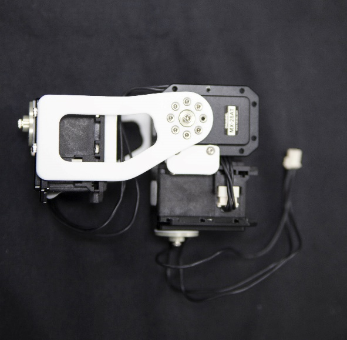

Put two M2.5 nuts on bust_x motor and fix the i101-Set_to_MX28_link at the same location with 4 M2.5 Bolts.

Assemble the the chest with the double rotation MX28 with 16 Bolts M2. Be careful of the part orientations: poppy logo faces front ; spine curvature faces rear.

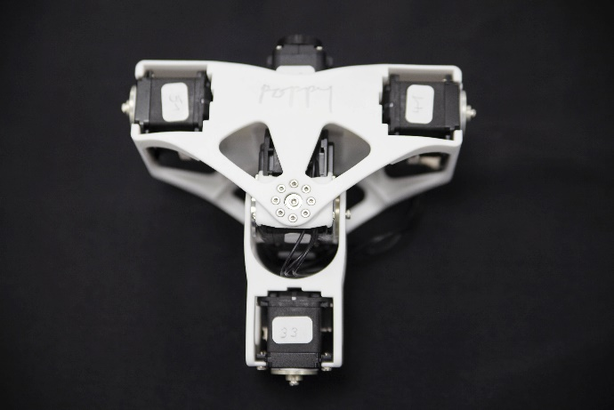

Plug bust_x to the 3P PCB HUB with the 200mm cable, and glue the hub with hot glue right above the chest axis.

Than assemble the trunk on top of the tabletop support with 8 M2 bolts.

### Spine sub-assembly videos
* [Spine sub-assembly](https://www.youtube.com/watch?v=LXktU4MTITE&list=PL8wg9_Kkof8wwqgfFu0iCij73C-4gt95x&index=11)
* [Final torso assembly](https://www.youtube.com/watch?v=uDhLIS3vxM4&list=PL8wg9_Kkof8wwqgfFu0iCij73C-4gt95x&index=14) **Be careful**: this video showcase the torso of a Poppy Humanoid. As a consequence, the bottom spine is not to be mounted in your robot, use the tabletop support instead.

## 6.4. Assembly of both arms

Plug the SMPS2Dynamixel on the last pin of the 3P PCB HUB with the 60mm wire.
Fix the shoulders on their side with 16 M2x3 bolts.
Fix the right arm on the right shoulder with 32 M2x3 bolts. Repeat on the other side

> **Note** **IMPORTANT**: When you assemble the arm, it must be perpendicular to the body, so that the 3 dots match as usual

[**Next: 7. Head assembly >>**](head_assembly.md)

[**<< Back to menu**](README.md)

