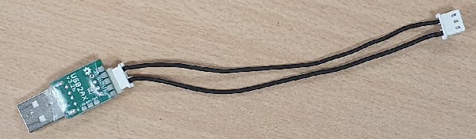

# Primordial warnings to assemble a Torso
## Ignoring these warnings will necessarily lead to a non-working robot and broken hardware

It is primordial that **your read and understand these warnings below** before doing anything with your hardware.

## PRIMORDIAL warning #1 : Align the horn with the motor axis

When a Dynamixel motor is sold, its horns (the metallic wheels) are shipped separately from the motor iself. It is your role to assemble them on the axis. The active horn has to be assembled **by respecting precisely the alignment thanks to the marking** as in the pictures below. 

With MX-28 and MX-28AT motors, the horn is assembled by forcing on it. Hence, if you make a mistake, **you will not be able to come back**. Be sure of the alignement before forcing with the central screw.

## PRIMORDIAL warning #2: Don't use too much thread locker
Thread locker is included in your kit. Place some thread locker at the tip of all screws to prevent vibrations from untying the screws. However, dipping the extremity of the screw on the thread locker is enough (a drop for each screw hole is too much). **Otherwise disassembling your robot can be very hard or impossible**! If you're unsure, don't use the thread locker in a first step, it will always be possible to put it later when you know your robot better.

## PRIMORIDAL warning #3: Align the horn with 3D-printed parts
Notice that horna all have 3 dots and that the 3D-printed parts also have them close to motor axes. Generally, the opposite axis of the motor axis is a free wheel and 3D-printed parts do not have any point in that side ; except for symmetrical parts such as the legs, that have 3 points on both sides. According to the 3D printing technique, the 3 dots might not been easily visible. Some parts, such as the feet, only have 1 visible point because the parts are hollowed the other side.

You must align the horn with the 3D-printed parts by matching the 3 points as the picture below.

## Warning #4: All parts have an unique orientation
It is very easy to get trapped by inserting a motor or a part the wrong way. If you do not pay attention you might find that your assembly is correct because holes align well with pieces but they might be incorrect. Don't worry, except for the first and second primordial warnings, your robot can always be disassembled.

In order to minimize the risk of mistakes, compare scrupulously your sub-assembly with pictures and videos at each assembly step. These prominent visual elements should help:

* The position of motor axis vs the position of the free wheel
* The position of the motor's sticker
* The position of the motor's electrical connector
* The curvature of 3D-printed parts

## Warning #5: Your robot is sensitive to interferences

If you meet sporadic communication issues with motors such as `DxlError` or `timeout`, it is possible that interferences perturbate your robot. Here are fixes to attempt:
* Change the motor cables: Motor cables heat and their conductive properties are getting worse over time. A typical example is when you feel that the cable is more rigid than a brand new cable
* It may be useful to cut the central wire of the cable directly connected to the USB2AX (and only that one). Indeed, it is known that it can create interferences and this wire (+12V) is unused at this location. 

[**Next >> 2. Bill Of Material (BOM)**](bom.md)

[**<< Back to menu**](README.md)
