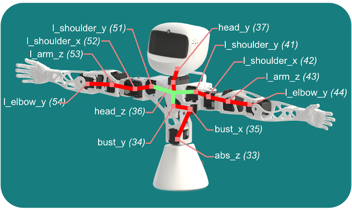

# 8. Poppy Torso: wiring arrangement

## 8.1. Data and power buses
Before you can startup your robot, let's have a look at the cables. Your motors are all connected on a data bus, 
The drawing below shows the data bus: cables connecting motors are in red, they all connect to the Dynamixel PCB hub in green, including the SMPS power injection and cable of the USB2AX adapter. 

The USB side of the USB2AX adapter has to be plugged to the USB socket of the Raspi3 at the bottom of the head.

## 8.2. Power supplies for Poppy Torso
The robot requires 2 power supply cables:
* 12V power supply for the SMPS2Dynamixel of the motors
* 5V micro USB power supply for the Raspberry Pi 3

For now you can plug both cables to the robot but wait a bit before connecting them to the wall socket. Indeed, there's a few things we need to setup before we can start the software.

## 8.3. Connect to the robot
Let's getting started with software! Please checkout the dedicated section: [Getting started with Poppy software](../../getting-started/connect.md). Psst, before you leave: don't forget to fasten the last screws to fix your head face after you got it working from software.

[**Next: 9. Getting started with Poppy software >>**](../../getting-started/connect.md)

[**<< Back to the assembly guide**](README.md)