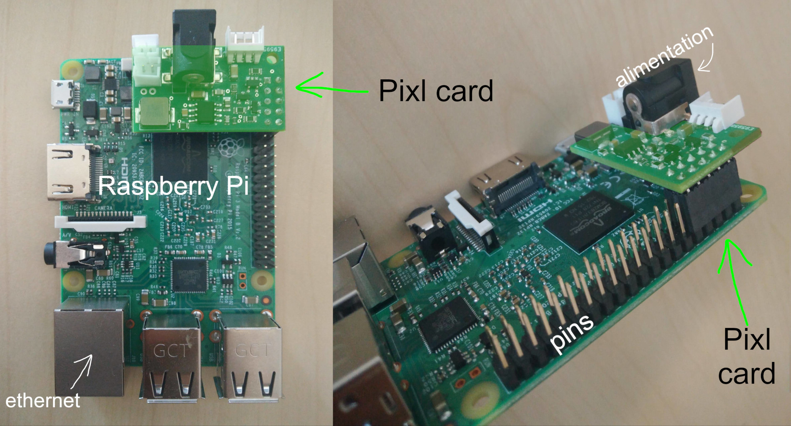

# Assembly guide for the Dragster mini

Poppy Dragster mini is a small inexpensive educational robot based on the Ergo Jr that is a combination of a small robotic arm with 3 degrees of freedom mounted on a platform with two wheels. It is made of simple shapes that can be printed in 3D. They are assembled by small plastic screws which can be put or removed very quickly with the OLLO tool.

Its tip can be easily changed. You can choose from several tools: * a lamp shade, * a clip, * or a pen holder.

Thanks to the screws the tools can be quickly and easily exchanged. This makes it possible to adapt the tool according to your use of the robot and to assemble / disassemble your robot easily.

The XL-320 motors have the same features as those used on other Poppy robots, but are slightly less powerful and less accurate. The advantage is that they are also much cheaper.

The electronic board is visible next to the robot, which is interesting for understanding, manipulating and connecting additional sensors. No soldering is necessary, just add the pixl expansion board to the pins of the Raspberry Pi to connect the XL-320 motors.

<!-- Should be updated from https://github.com/poppy-project/poppy-ergo-jr/blob/master/doc/bom.md -->

## Instructions

This chapter will guide you through all the steps necessary to fully assemble a mini Poppy Dragster. It will cover:

- [the configuration of the motors](motor-configuration.md)
- [electronic assembly](electronic-assembly.md)
- [assembly of mechanical parts](mechanical-construction.md)

**Complete assembly should take an hour or two** the first time you build one. With more practice, half an hour is enough.

At the end of the tutorial, you should have a functional Poppy Dragster Mini, ready to be runned !

We recommend that you follow the instructions carefully. Even if the Dragster is easily removable, it is always disappointing to have to restart a part of the assembly because we forgot to configure the engines, or a motor is reversed.

## Dragster mini material list

- 1 x [Pixl expansion board](https://github.com/poppy-project/pixl) *(XL320 engine control board from a Raspberry Pi)*
- les pièces imprimées en 3D [au format STL ici](https://github.com/tgll/poppy-dragster-mini/tree/master/doc/stl) 
  - 1 x [dragster-base.stl](https://github.com/tgll/poppy-dragster-mini/tree/master/doc/stl/dragster-base.stl)
  - 1 x [dragster-basefront.stl](https://github.com/tgll/poppy-dragster-mini/tree/master/doc/stl/dragster-basefront.stl)
  - 2 x [dragster-wheel.stl](https://github.com/tgll/poppy-dragster-mini/tree/master/doc/stl/dragster-wheel.stl)
  - 1 x [base.stl](https://github.com/poppy-project/poppy-ergo-jr/raw/master/hardware/STL/base.stl)  
  - 2 x [4dofs-horn2horn-5holes.stl](https://github.com/tgll/poppy-dragster-mini/tree/master/doc/stl/4dofs-horn2horn-5holes.stl)
  - 2 x [4dofs-side2side.stl](https://github.com/tgll/poppy-dragster-mini/tree/master/doc/stl/4dofs-side2side.stl)
  - 1 x [long_U.stl](https://github.com/poppy-project/poppy-ergo-jr/blob/master/hardware/STL/long_U.stl)
  - the tools (optional) 
    - 1 x [lamp.stl](https://github.com/poppy-project/poppy-ergo-jr/blob/master/hardware/STL/tools/lamp.stl)
    - 1 x [gripper-fixation.stl](https://github.com/poppy-project/poppy-ergo-jr/blob/master/hardware/STL/tools/gripper-fixation.stl)
    - 1 x [gripper-fixed_part.stl](https://github.com/poppy-project/poppy-ergo-jr/blob/master/hardware/STL/tools/gripper-fixed_part.stl)
    - 1 x [gripper-rotative_part.stl](https://github.com/poppy-project/poppy-ergo-jr/blob/master/hardware/STL/tools/gripper-rotative_part.stl)
    - 1 x [pen-holder.stl](https://github.com/poppy-project/poppy-ergo-jr/blob/master/hardware/STL/tools/pen-holder.stl)
    - 1 x [pen-screw.stl](https://github.com/poppy-project/poppy-ergo-jr/blob/master/hardware/STL/tools/pen-screw.stl)

## Parts made by Robotis

- 6 x dynamixel XL-320 servomotors
- 1 x set of OLLO rivets (you will need about 70 colored rivets screws and 1 gray rivet screw)
- 1 x OLLO tool

## Miscellaneous Electronics

- 1x Raspberry Pi 2 or 3
- 1x micro SD 8GB (or more)
- 1x Raspberry Pi camera
- 1 x 7.5V 2A power supply with a 2.1 x 5.5 x 9.5 connector ([this one](http://fr.rs-online.com/web/p/alimentations-enficables/7262814/?searchTerm=ECP-15-7.5E&relevancy-636F3D3226696E3D4931384E4B6E6F776E41734D504E266C753D6672266D6D3D6D61746368616C6C7061727469616C26706D3D5E5B5C707B4C7D5C707B4E647D2D2C2F255C2E5D2B2426706F3D313326736E3D592673743D4D414E5F504152545F4E554D4245522677633D424F5448267573743D4543502D31352D372E354526data=&p=sRA) for instance).
- Ethernet cable

<!--
TODO: assembly web interface
## Assembly web interface

Directly, from the web interface (see Chapter [Setup your Raspberry-Pi](#TODO) if you have not seen how to access it) you have access to a notebook presenting the assembly steps. It also allows the configuration of motors at the indicated steps.

It is the best way to easily assemble your robot as it will integrate all steps described in the following sections and moreover allows you to directly configure your motor so they are ready to use.
 -->