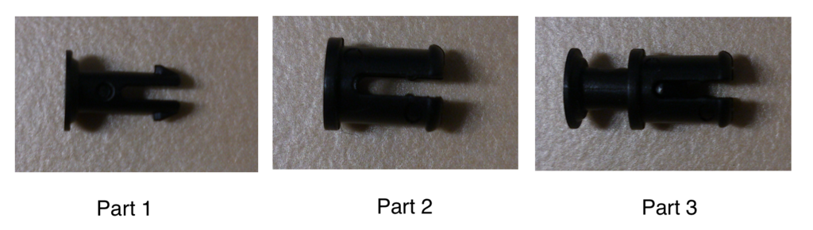
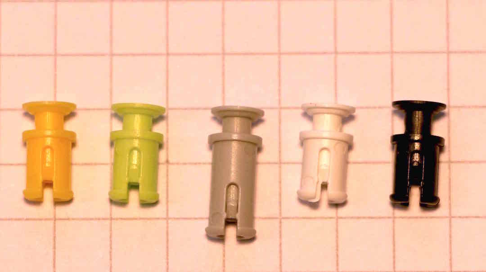
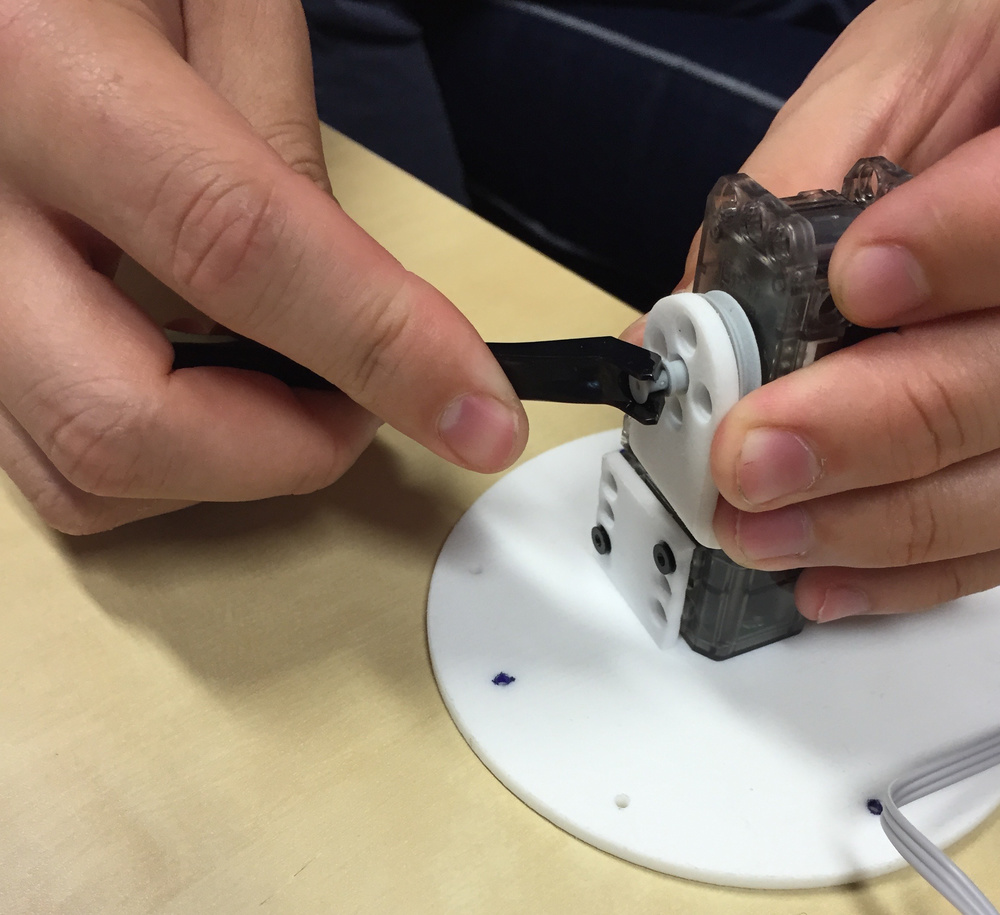
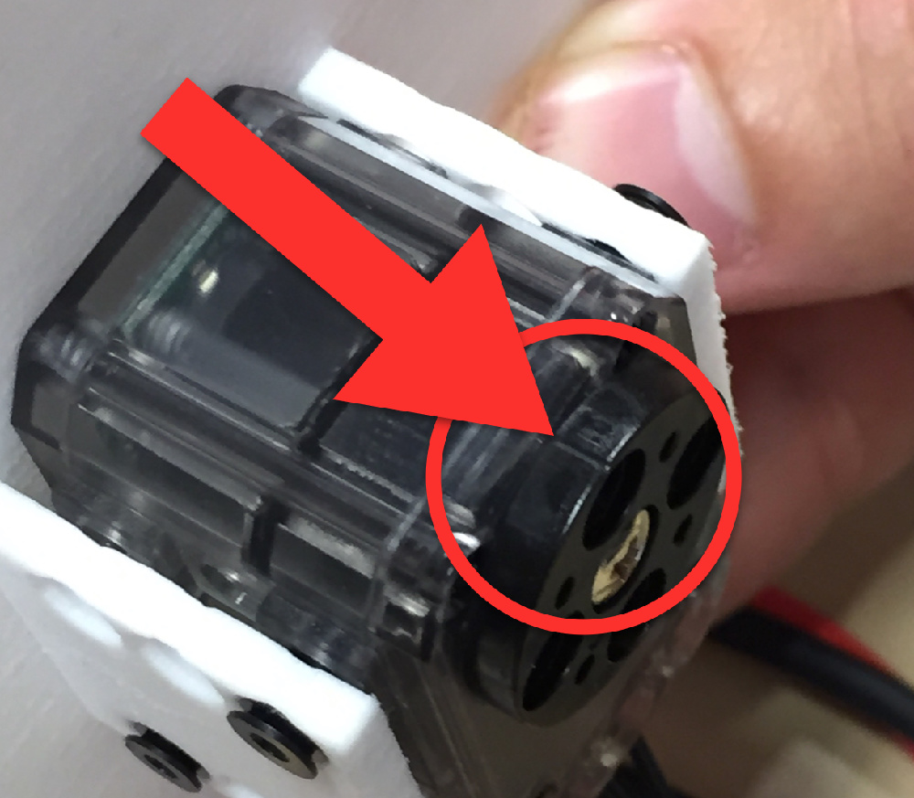
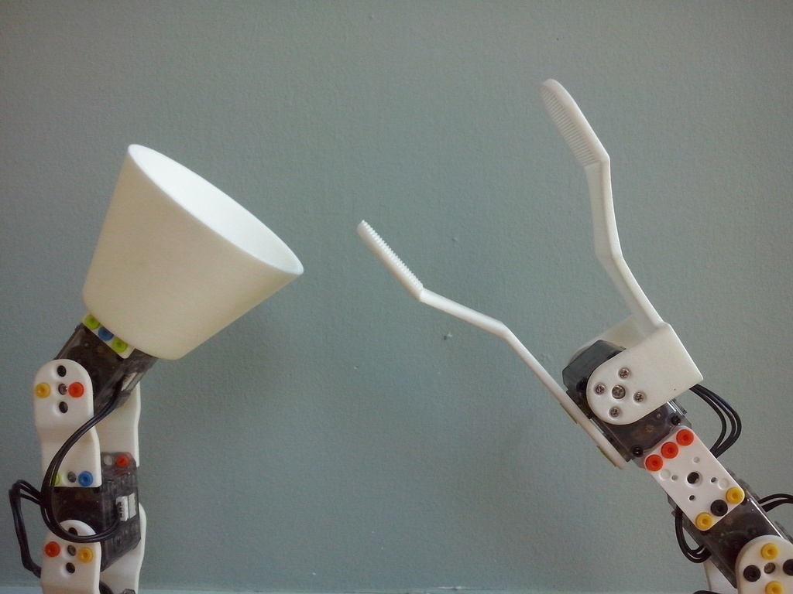

# Mechanical assembly

## General notices and warnings

* You can assemble all the rivets before the construction of the robot. **Orientation is important**, you must align the notches of the first part (part 1) with the slots of the second part (part 2). It will be easier to remove them as well.



* There are two types of rivets: the gray ones, and the others. The gray ones are longer and are made to fix the engines in the "U long" type parts (you will need only one gray for the Dragster). The color of other small rivets does not matter, you can choose the ones you want.



* Use the OLLO tool to easily assemble and disassemble rivets.



* Do not forget to put the cables between the motors during the construction of the robot! All engines except the last have two cables to connect them to the front engines (or Raspberry) and after (the connection side have no influence as long as they are correctly connected in series).

* ** Always align the spreader (the black drive wheel) with the motor before assembling! ** Otherwise your robot may not move as you wish since it will be shifted at startup.



## Guide step by step

### Engine configuration (for all steps)

You can configure the engines before, during or after assembly. **It is nevertheless easier to configure them one by one in the order of assembly**: * configure the motor m1 * assemble the motor at the base * configure the motor m2 * ...

> **Warning** To configure the motors, you must connect them separately one by one to the Raspberry Pi. If you try to configure a new motor while it is connected with the previous engine, it will not work.

For more information, see [engine configuration section](motor-configuration.md).

### Step 1 - w1 and w2 wheels

Motor configuration reminder:
```bash
poppy-configure ergo-jr w1
```
First mount the front stud with 4 small rivets, then [configure an XL-320 engine](motor-configuration.md) as "w1", it will be connected to the raspberry, and another as "w2". These two engines will be the wheels of the Dragster. Attach the wheels to these motors with 4 small rivets for each wheel. Check that the pallets are aligned.

Mount the motors on the 3D printed base by fixing them with rivets.


### Step 2 - m1 engine and camera

Place the camera in its notch and connect it to the Raspberry.
Configure the second engine, its name is "m1", with the following command in a terminal of the robot:

```bash
poppy-configure ergo-jr m1
```
Check that the crane is well aligned.
Connect the cables from w2 to m1 and from m1 to m2 that you will mount right after, then fix it with 4 small rivets on each side (the circular part of the side of the camera)
Once attached, mount the *long_U* part on the circular part of the motor.


### Step 3 - m2 engine and 3

Configure the "m2" and "m3" motors. Check that the pallets are aligned.
Mount the two-piece *4dofs-side2side.stl* parts on the engine with 16 rivets, then fix m4 on the *long_U* part with 1 gray rivet to be fixed on the non-moving side. 4 small rivets are to fix on the circular part of the other side of *long_U*.


### Step 4 - m4 engine

Configure the sixth (and last!) Engine: "m4".

Mount the two-piece parts *4dofs-horn2horn-5holes.stl* on the m4 engine with 4 rivets on one side (on the circular part) and one on the other side.
Fix by the same process, the motor m3 at the other end of the room *4dofs-horn2horn-5holes.stl*
You can then add a tip of your choice.


> **Note** The tips are tools that can be easily and quickly changed, allowing you to adapt your robot to different activities.
Find some activities with the Poppy Ergo Jr:

#### The lampshade or the pen

Mount the *horn2horn* and *horn2side* parts on the "m5" engine and mount "m6" on top of the construction. 

You can mount the pen holder or shade on the "m4" motor. [bis from step 6](img/assembly/steps/step_18-19.jpg)

In the same way of the shade, it is possible to mount the pen holder. 

#### The clip

Mount the [*gripper-fixation*](https://github.com/poppy-project/poppy-ergo-jr/blob/master/hardware/STL/tools/gripper-fixation.stl) between the "m5" engines and "m6".

Mount *gripper-fixed_part* and *gripper-rotative_part* on "m6".

There are two ways to mount the clamp: vertically! [Step gripper](img/assembly/steps/grip1.jpg)

Or horizontally 

### Step 5 - Electronic checking

If you did not fix your camera to your Raspberry during step 2 or your cables during the construction of the robot, do it now.

**Fix the camera**

To fix the camera on the Raspberry Pi with the flex cable (cable band) open the connector of the camera located on the Raspberry by pulling slightly the notch upwards. Make sure the connectors are in front of the Ethernet port. Push the notch down to catch the flex cable.


**Cables connecting the motors**

If it is not done, connect all the motors together. Each motor has two connectors to be connected to the next and the previous one.

> **Info** The motor connectors can be a bit difficult to connect, you can use the OLLO tool to help you.

### Step 6 - plug in and test your robot


Bravo !!! if your robot looks like this, you have finished assembling! You can now connect it, for that plug the power cable to the Pixl card and the ethernet cable to the Raspberry.


When you plug it in, all the motors are supposed to turn on. If this is not the case, check that you have all connected to each other.

You can now go to <http://poppy.local> (this is the homepage of your robot)

Click *Reboot the robot* to restart the engines 

Then click on *Monitor and Control* to get information about your robot and check that it works properly 

If so, you should see the little green chain logo (in the middle at the top). You can then choose from the predefined actions.


If instead of the green connection logo, you see instead **the red "broken chain" logo** is that there is a problem of configuration. You can go to *What append?* For more information. Most of the time, a cable is disconnected or a motor is not configured. 


### To explore

Explore activities with your robot or another robot like Ergo Jr for example.
You can also imagine your own robot, what shape would it have? how many engines? wheels, legs? machine-shaped, animal-shaped? What would he serve and what would his movements be? Let yourself be guided by your imagination :)
