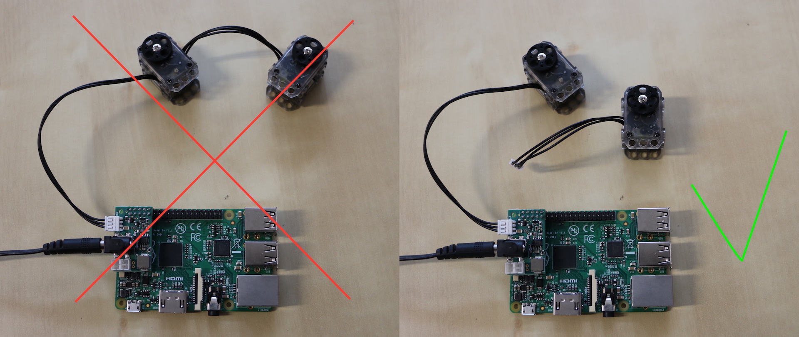

# Engine configuration

The Mini Dragster is made up of 6 XL-320 engines manufactured by [Robotis](http://support.robotis.com/en/product/dynamixel/xl-series/xl-320.htm). Each of these servomotors have an electronic card allowing it to receive different types of commands (on its position, its speed, its torque ...) and to communicate with other servos. You can chain these servomotors together and order them from one end of the chain.


However, in order to be connected and identified on the same bus (of data), they must have a unique identifier. With the initial configuration, they all have the same identifier (ID 1). In this section, we'll give you more details on how you can define a new unique identifier for each of your engines.

We recommend that you configure the motors in parallel with the assembly of the robot parts. This means that before assembling a new engine, you first configure it and then mount it on the rest of the robot. During the assembly procedure, we will indicate each time that a new motor needs to be configured.

## Turn on the robot

If you are running Windows or Linux (if you are on Mac OSX, the software is already present) you will need to install **Bonjour / Zeroconf ([download link for Windows](https://support.apple.com/kb/DL999))** to connect your robot. Learn more about [Hello / Zeroconf protocol here](../../installation/install-zeroconf.md).

Before configuring the engines, **turn on the robot**

* Connect the Ethernet cable between robot and your computer (or your router / box)
* Connect the power cable to the Pixl card

Now you can go to <http://poppy.local>.

If you have not downloaded Bonjour correctly, you will get an error message as below. If Bonjour is installed and the page still does not appear (after waiting a few seconds), try reinstalling Bonjour 

## Configure the engines

As explained above, all engines have the same ID (engine identification number), **you only need to connect the motors one to one** otherwise you will configure them with the same ID and this will prevent the proper functioning of the robot.

Your electronic setup should be this way when you set up an engine:

* a Raspberry Pi connected to the Ethernet cable
* Ethernet cable connected to the computer or router
* a Pixl card connected to the power supply
* a cable from the Pixl card to the motor you want to configure


.

### Command Line Utility

Poppy robots have a `poppy-configure` command line to configure them. To use it, you have to open a terminal on the Raspberry Pi.

First, **open the http://poppy.local page in your browser**.

If all goes well, you should see the Poppy homepage:


Click on **"Jupyter - Python"** then on the top right click on "New" then "Terminal". 

This is what the terminal looks like:


Now that the terminal is open, you can write this command inside and press enter to execute it.
```bash
poppy-configure ergo-jr m1
```

After a few seconds, a message should appear with marked "Done"


Bravo! you have configured the m1 engine!

Once configured, you can disconnect the motor from the cable and plug in another, until you have all configured them. The configuration is saved in the engine memory (eprom).

> **Info** The engines are called m1, m2, m3, m4, w1, w2.

