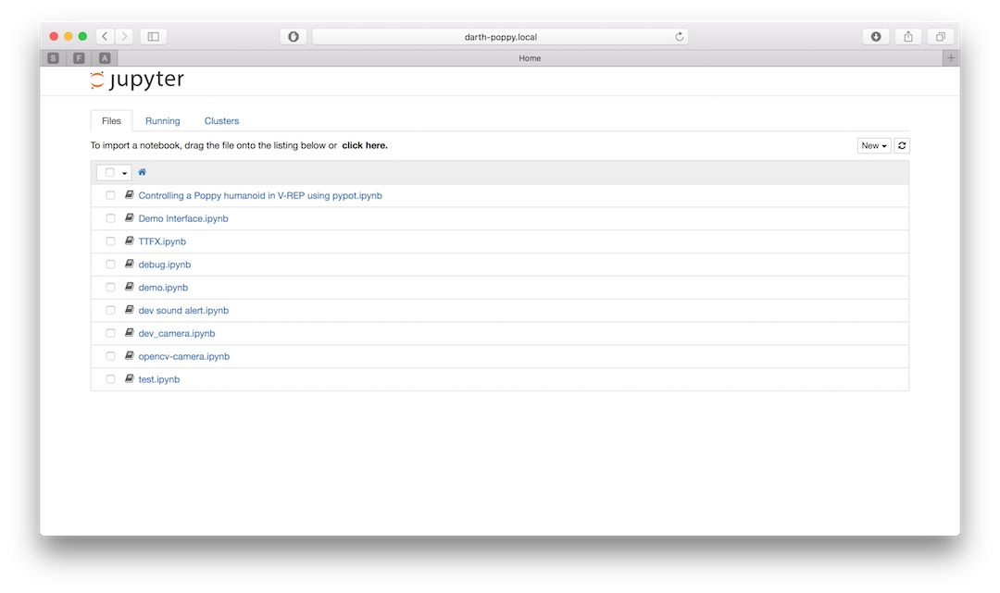
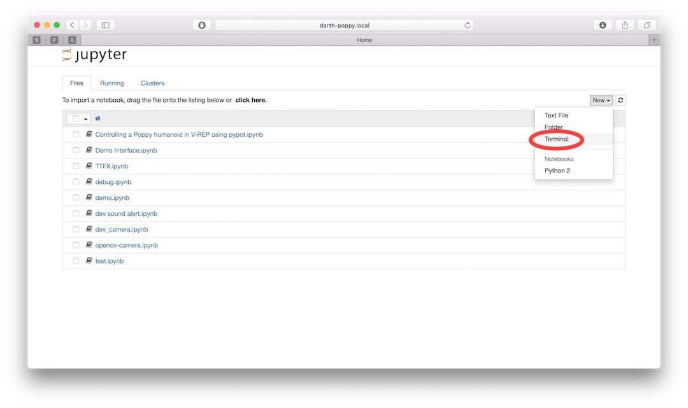
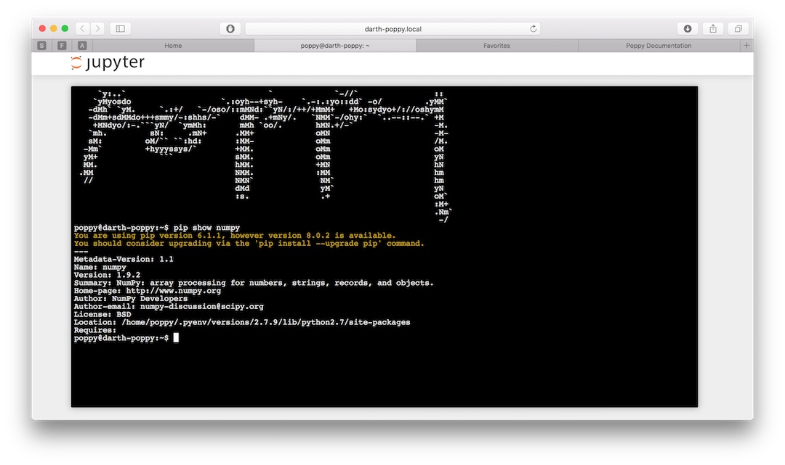

## Using Jupyter Python Notebooks

One of the advantages of working with Jupyter Notebooks is the possibility to use it as a client/server approach.  
Each Poppy robot hosts a Jupyter server accessible via the web interface (see [section quickstart](#TODO) for details).

When working in simulation, everything is run and stored locally on your computer. When working with a real robot you can program it from a web browser on your own machine but your notebooks are actually stored and run in the robot.

Thus to switch from simulation to a real robot, you need to switch from your local instance of Jupyter to the remote one hosted by the robot. The steps are described below.

### Connect to the Jupyter on the robot

Once connected to the robot web interface (we will assume here its hostname is *poppy*, just replace it by the new hostname if you changed it), you should see a **open Ipython notebook** link.


When clicked it will start Jupyter on the robot and redirect you to the Jupyter webserver. You should then see the root of the notebook folder hosted on the robot:



This is where you can put your own notebooks. Of course, you can create folder, organize them as you want, etc...

*Note: If you need finer access or more advanced configuration (such as permission for instance), you have to log directly to the robot using ssh. See [advanced section](#TODO) for details.*

### Upload a notebook

Once connected to the Jupyter server hosted by the robot, you can directly use the Jupyter interface for uploading new notebooks.


The circled button let you *upload* your local notebook, so stored on your own machine, to the robot. They can then be directly run on the robot.

*Be aware that at the moment, we do not deal with sessions or permissions (as [JupyterHub](https://github.com/jupyter/jupyterhub) does for instance), and thus anyone with access to the robot can use or delete all notebooks stored in the robot.*

### Adapt your code

There is few places where you should actually modify your code so it works with a real robot. We try to minimize the effort needed as much as possible, yet some steps are still required.

#### Instantiation

When creating the robot, you actually need to specify if you are willing to work with a real or a simulated robot. This is simply done via a parameter. For instance:

When working with V-REP:
```python
from poppy.creatures import PoppyHumanoid

poppy = PoppyHumanoid(simulator='vrep')
```

Will become for a real robot:

```python
from poppy.creatures import PoppyHumanoid

poppy = PoppyHumanoid()
```

Of course, this works for all existing Poppy creatures: Humanoid, Torso and ErgoJr.

This is most of the changes that you should do.

#### Specific APIs

Some part of the API are platform specific. For instance, when using V-REP you have access to *tracking* features that let you retrieve any object 3D position. Of course, such method do not have a real world equivalent and thus are not available when working with a real robot.

A good practice if you want to write code compatible for both cases is to use the *simulated* property. It is automatically set to the correct value depending on how your instantiate your robot. For instance,

```python
poppy = PoppyHumanoid(simulator='vrep')

def reset_position():
    if poppy.simulated:
        poppy.reset_simulation()
    else:
        print('Ask one internship student to put the robot back in its origin position.')
        time.sleep(10)
```


### Version and 3rd party libraries

The main drawback of this client/server way of working is that your locally installed software versions may differ from the one installed on the robot.

The Python installed on the robot is Python 2.7 and comes with most of the scientific main libraries (numpy, scipy, matplotlib, opencv). An exhaustive list of the installed Python packages will be available soon (TODO!). At the moment, the easier way to get it is to used a *terminal notebook* which can be directly run from the Jupyter interface.






Using the same technique, you can install 3rd party libraries directly on the robot. The [pip](https://pip.readthedocs.org) and [conda](http://conda.pydata.org/docs/) utility tools are installed and should be used when possible.

*Note that the embedded board are based on armv7 and thus some libraries may be hard to compile. We are maintaining a list of conda recipes specifically built for this platform [here](https://anaconda.org/poppy-project).  
Contributions are more than welcomed! *
