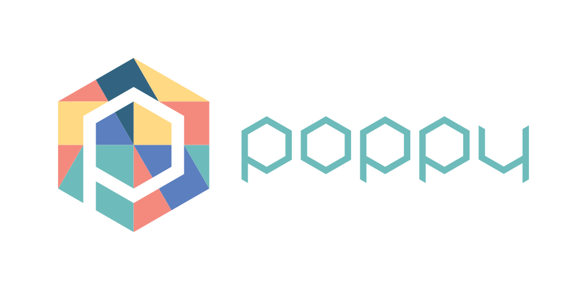
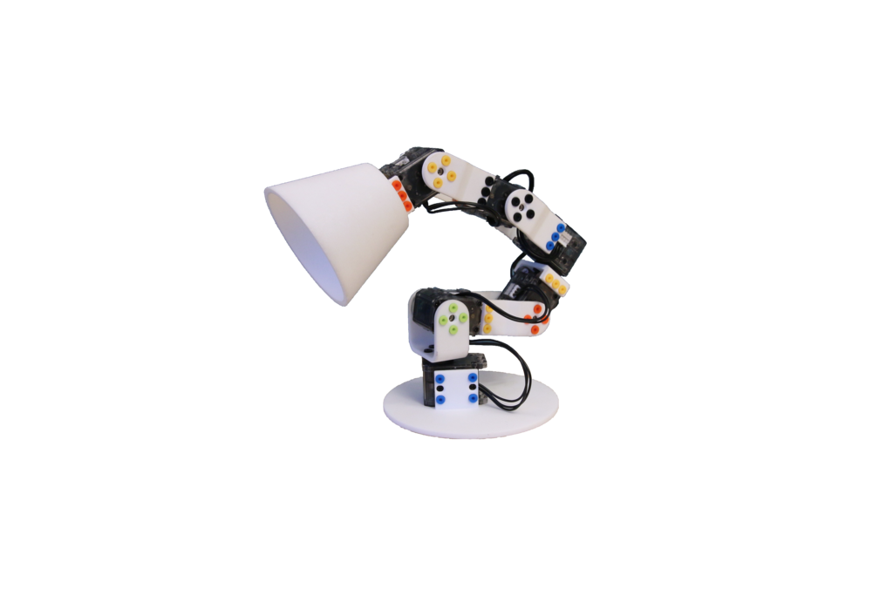
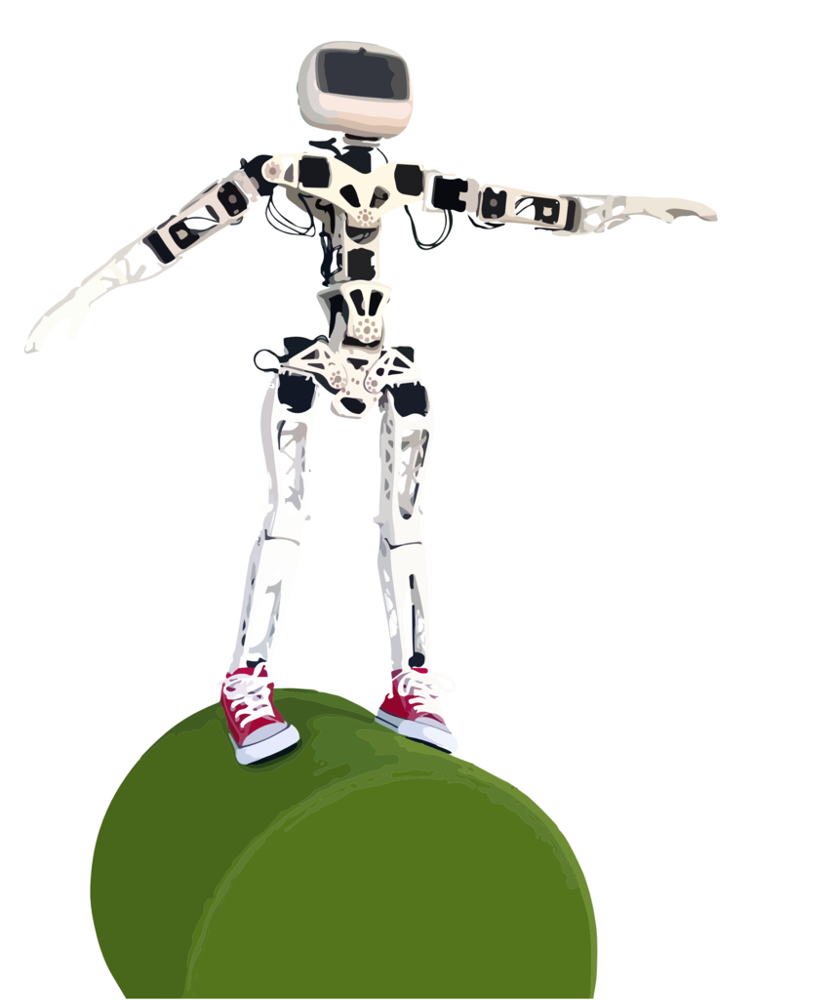

# Getting Started

[Poppy Project](https://www.poppy-project.org/) is an open-source platform for the creation, use and sharing of interactive 3D printed robots. It gathers an interdisciplinary community of beginners and experts, scientists, educators, developers and artists, who all share a vision: robots are powerful tools to learn and be creative.

The [Poppy community](https://forum.poppy-project.org/) develops robotic creations that are easy to build, customize, deploy, and share. We promote open-source by sharing hardware, software, and web tools.

The Poppy project has been originally released by [Inria Flowers](http://www.inria.fr/equipes/flowers/).

This project aims at developing a robotic open-source and open-hardware kits, for the conception and programming of robotic creatures. These kits also contain an integrated software environment, easy to install, dedicated to the use of the robot, and associated with a web platform enabling the community to share experiences and to contribute to its improvement.

Recently, Poppy robots have been used as a educational and motivational tool to learn engineering and digital sciences.

The Poppy project also consists of a very active and diverse community. People of different horizons collaborate to improve the project; they add features to the core libraries, release advanced behaviors, create pedagogical contents, design artistic performances, or even new robots.

To ease these exchanges two supports are available:

- [The poppy-project forum](https://forum.poppy-project.org/) for help, discussions and sharing ideas.
- [GitHub](https://github.com/poppy-project) to submit your contributions.

All sources of the Poppy Project (software and hardware) are available on [GitHub](https://github.com/poppy-project).

## The Poppy creatures

Poppy creatures are open-source robots, available for download and modification ([Creative Commons Attribution-ShareAlike](http://creativecommons.org/licenses/by-sa/4.0/) for the hardware and [GPLv3](http://www.gnu.org/licenses/gpl-3.0.en.html) for software). They were designed with the same principles in mind.

All Poppy creatures:

- are made from pieces of printable 3D and Dynamixel motors,
- use an embedded board for control (a Raspberry Pi 2 or Odroid for older versions),
- are based on a Python library, [pypot](#TODO), allowing to control Dynamixel servomotors in an easy way,
- have a simulated version available (based on V-REP),
- can be controlled using a visual programming language ([Snap!](http://snap.berkeley.edu) a variation of Scratch) and a textual language [Python](https://www.python.org). They are also programmable through a REST API, which enables the control with other programming language (connection for Matlab and Processing already exists) - see Chapter #TODO for details,
- come with associated documentation, tutorials, examples, pedagogical activities.

They can be used as it is, or hacked to explore the shape of novel legs, arms, hands...

You can buy a full Poppy Creature robot from our [official retailer](http://www.generationrobots.com/en/279-poppy-opensource-robotics-platform).

You can also get all the parts yourself by following the bill of materials (see below).

### Poppy Ergo Jr

The Poppy Ergo Jr robot is a small and low cost 6-degrees-of-freedom robot arm. It is made of 6 cheap motors (XL-320 Dynamixel servos) with 3D-printed parts simple to design.

The 3D parts were made so they can be easily printed on a basic 3D printer and the motors are only 20 € each. Its electronic card access is simple. It makes it easy to connect extra sensors and is perfect for pedagogical purposes.

You can choose among several tools to use for the end of its arm:

* A lamp.
* A gripper.
* A pen holder...

Rivets make them easy to change, depending on the type of activities you are planning.

The Ergo Poppy Jr is ideal to start manipulating robots and learn robotic without difficulties.

Its low price, simple assembly, and easy control make it suited for educational purpose.

You can get all the parts yourself following the [bill of materials](https://github.com/poppy-project/poppy-ergo-jr/blob/master/doc/bom.md) (BOM) and printing the [3D files](https://github.com/poppy-project/poppy-ergo-jr/releases/) available in the STL format.

### Poppy Humanoid

It is a 25-degrees of freedom humanoid robot with a fully actuated torso. Used for education, research (walk, human-robot interaction) or art (dance, performances). From a single arm to the complete humanoid, this platform is actively used in labs, engineering schools, FabLabs, and artistic projects.

You can get all the parts yourself following the [bill of materials](https://github.com/poppy-project/poppy-humanoid/blob/master/hardware/doc/BOM.md) (BOM) and printing the [3D files](https://github.com/poppy-project/poppy-humanoid/releases/tag/hardware_1.0.1/) available as STL, STEP and Solidworks 2014 format.

### Poppy Torso

It is the upper part of Poppy Humanoid (13 degrees of freedom). Poppy Torso is more affordable than the complete Poppy Humanoid, which makes it more suitable to uses in an educational, associative and makers context. Poppy Torso can be a good medium to learn science, technology, engineering and mathematics (STEM).

You can get all the parts yourself following the [bill of material](https://github.com/poppy-project/poppy-torso/blob/master/hardware/doc/BOM.md). The [3D models](https://github.com/poppy-project/poppy-humanoid/releases/tag/hardware_1.0.1/) for the parts are the same as Poppy Humanoid, without the legs and with an extra [suction cup support](https://github.com/poppy-project/robot-support-toolbox/).

### Other interesting Poppy Creatures

A key aspect of the Poppy Project is to stimulate creativity and experimentation around robotics. We try to provide all the tools needed to design new robots based on the same technological bricks. Some new creatures are in development within the community. Some of them are presented in this section below.

#### Poppy right arm (work in progress)

Poppy right arm is a Poppy creature based on a right arm of Poppy Humanoid, with 3 additional XL-320 motors at the end to improve the reach and agility of the arm. It used the same gripper tool used in the Ergo Jr, designed to grab simple objects.

<!-- TODO: belle photo de Poppy Right Arm -->

The project was realized during an internship at Inria Flowers by [Joel Ortiz Sosa](https://github.com/joelortizsosa). Find more info and the sources in its [repository](https://github.com/poppy-project/poppy-6dof-right-arm).

#### Small and low-cost humanoids

##### Heol

Heol - meaning "sun" in Breton - is a humanoid robot 34 cm tall made by association [Heol robotics](http://heol.io/). 23 motors compose it, all other parts are 3D printed. It also uses the Pypot library for its movements.

Heol's purpose is to put a smile on ill children's faces. It has the ability to be an educational tool by becoming a learning support materials such as programming and mechanical design.

Its participation in the RoboCup (World Cup football for robot) is also envisaged.

##### Poppyrate

[Website](http://www.poppyrate.com/) - [Twitter](https://twitter.com/poppyratproject) - [Facebook](https://www.facebook.com/Poppyrate/)
