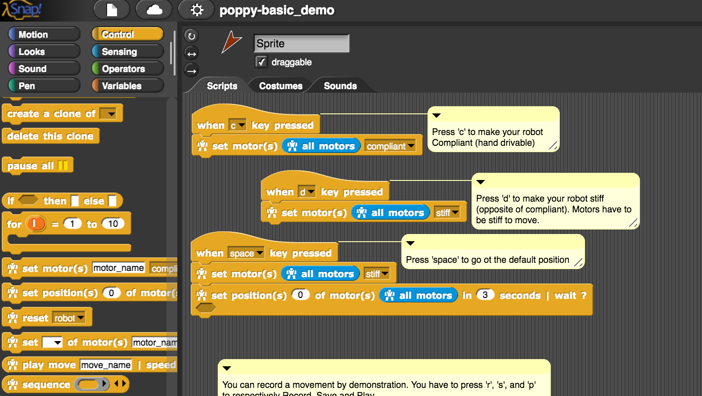

# Program the robot

Poppy robots are designed to be easily programmed. They are three main options presented here:
* using [Snap!](#using-snap), a variant of Scratch the visual programming language,
* using [Python](#using-python) and leveraging the power of the whole API,
* through the [REST API](#through-the-rest-api) which let you  interface Poppy robots with other devices or any programming language.

>**Info** Info: As for the rest of the project, all our software libraries are open source (GPLv3 License) and available on [GitHub](https://github.com/poppy-project).


## Using Snap_!_


Snap_!_ is a visual programming language - a variant of the very famous Scratch language. It is a block based drag-and-drop programming language that allows for a thorough introduction of IT. It runs in your browser as it is implemented in JavaScript. You do not need to install anything to start using it. It is open sourced and actively maintained.



We developed a set of custom blocks for Poppy robots that let you send motor commands and read values from the sensors of your robot. This let you to directly jump into controlling and programming your robot without any syntax/compilation issue. Thanks to Snap_!_ live interaction loop you simply have to click on a block to send its associated command to the robot. Snap_!_ also naturally scales to more complex projects.

A [dedicated chapter](../programming/snap.md) will guide you in what you can do with Snap_!_ and Poppy robots.

## Using Python

<p style="text-align:center">

</p>

Poppy libraries have been written in Python, to allow for fast development and extensibility and to benefit from all existing scientific libraries. Python is also a well-known language and widely used in education or artistic fields. By programming Poppy in Python, you will have access from the very low-level API to the higher levels.

The API has been designed to allow for very fast prototyping. Creating a robot and starting to move motors should not take more than a few lines:

```python
from poppy.creatures import PoppyErgoJr

jr = PoppyErgoJr()
jr.m3.goal_position = 30
```

<!-- Note: "Notebook documents" or “notebooks”, all lower case -->
We are also big fan of the [Jupyter Project](http://jupyter.org) and notebooks. Notebooks are documents which contain both Python code and rich text elements like equations, pictures, videos. They can be edited from the Jupyter Web interface which allow users to program Poppy robots directly from a website hosted on the robot computer. We think that this is a powerful tool permitting the creation and sharing of live code, results visualizations and explanatory text combined in a single document.


Most of the tutorials, experiments or pedagogical activities that we and the community develop are available as notebooks.


> **Info** An updated gallery of notebooks can be found [here](../programming/notebooks.md). Contributions welcomed!

## Through the REST API

On top of the Snap_!_ and Python options, we wanted to provide another way of accessing and controlling your robot from any device or language. Poppy robots are providing a REST API. The most important features of the robot can be access through HTTP GET/POST requests.

From a more practical point of view, this allows you to:

* **Write bridges to control Poppy robot in any language** (awesome contributors have already written [Matlab](https://github.com/joelortizsosa/Connection-Poppy-Matlab) and [Ruby](https://github.com/poppy-project/pypot/tree/master/samples/REST/ruby) wrappers).
* **Design web apps** connected to your robot, such as the [monitor interface](https://github.com/poppy-project/poppy-monitor) (also a contribution!).
* Make your **robot interact with other connected devices** such as a smartphone, intelligent sensors, or even your twitter account...

> **Warning** The REST API is still a work in progress, will change and is clearly ill documented! For more information you can have a look [here](https://github.com/poppy-project/pypot/blob/master/REST-APIs.md) our on the [forum](https://forum.poppy-project.org). A well designed, stable and well documented REST API is expected for the next major software release.
