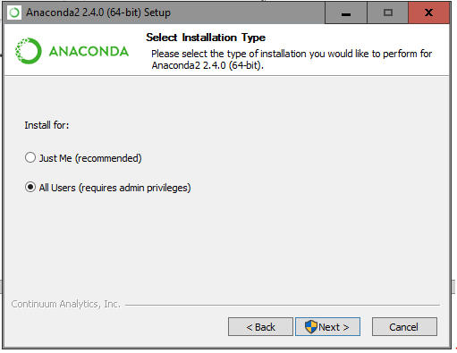
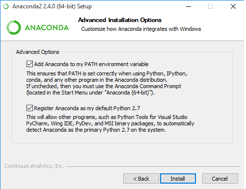
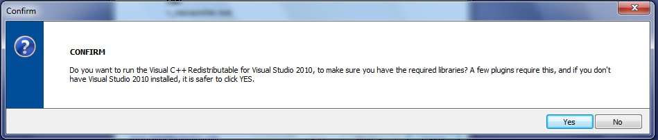
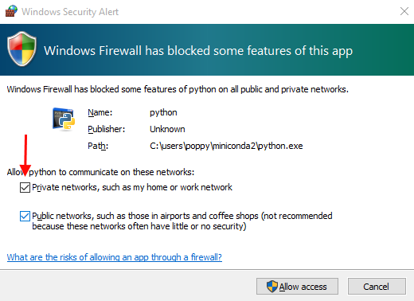

# Installation for advanced users

You may want to install Poppy software only if you are in one of these situations:

1. You want to control a simulated robot.
2. [special case for advanced users] You want to install yourself the operating system of your robot instead of using a [pre-made ISO image](../installing-images/README.md).
3. [special case for advanced users] You want to control a Poppy creature from your computer **without** using the Raspberry Pi board.

**Note: Though first situation is a "standard case", the second and third ones are affordable only by advanced users who have a good comprehension of the global system.**

## Install the Python Interpreter and Poppy software

Poppy is run by Python computer code. Depending on your operating system you will have to install Python and in any case you'll have to install the required software libraries.

Whatever your operating system if you are getting started with Python and want to install a full Python environment for scientific computing, **we suggest you to use [Anaconda Python distribution](https://www.continuum.io/why-anaconda)**.

### Install everything needed for a Poppy Board

The easiest way to setup the control board of your Poppy Creature is to use one of the ready-made SD-card images.  
They come with everything installed and ready, you just need to copy it on a SD-card and you are good to go. For that, you will need a free 8Go (or more) SD-card, and download the image corresponding to your board and write it to your SD-card.  
The [startup section](../startup/README.md) describes this procedure.

Download the image of your system:

* [Raspbian Jessie](https://www.raspberrypi.org/downloads/raspbian/) if you are using a **Raspberry Pi 2**.
* [A special Ubuntu 14.04](http://com.odroid.com/sigong/nf_file_board/nfile_board_view.php?keyword=&tag=ODROID-U3&bid=243) if you are using a Odroid U3.

Write the image to the SD-card with you favourite disk writer tool as explained in the [startup section](../startup/README.md).

Connect to your board in SSH:

* For the Raspberry Pi: `ssh pi@raspberrypi.local`, password=raspberry.
* For the Odroid U3: `ssh odroid@odroid.local`, password=odroid.


Download the install script:

```bash
wget https://raw.githubusercontent.com/poppy-project/poppy-installer/master/poppy-configure.sh
```

This script takes two parameters:

* The board name {odroid, rpi}.
* The creature name {poppy-humanoid, poppy-torso, poppy-ergo-jr}.

To build the system for a Poppy Ergo Jr on a Raspberry Pi, one would run:

```bash
poppy-configure.sh rpi poppy-ergo-jr
```

Reboot after the end of the installation.  
The hostname, default user and password will be all set to "poppy" (ssh poppy @poppy.local password=poppy).  
You can test your installation with the web interface in your web browser http://poppy.local.

If there is any issue don't hesitate to post a message on the [issue tracker on GitHub](https://github.com/poppy-project/poppy-installer/issues) or in the dedicated section of [the forum](https://forum.poppy-project.org/c/support).


### Install Python and Poppy software on Windows

<!-- TODO ajouter Schéma installation Thibault -->
If you want a step by step screencast of the installation of Anaconda and V-REP on Windows, you can see [these videos](lientodo).

#### Install Python

We encourage the use of the Anaconda Python distribution.  
However, if you already installed a Python distribution like Canopy (shipped with scientific packages), you can directly [install Poppy software](#install-poppy-software).

##### Anaconda

Download Anaconda Python distribution (400 MB) [here for 64-bit](https://repo.continuum.io/archive/Anaconda3-2.4.0-Windows-x86_64.exe) computer or [here for 32-bit](https://repo.continuum.io/archive/Anaconda3-2.4.0-Windows-x86_64.exe).


Install it by clicking on "next" at each step. If you intend to install Anaconda for all users of your computer, be sure to select "all users".

.

It is also very important that the two check-boxes of the PATH and the default Python are checked.




Now you have a Python distribution ready to [install Poppy software](#install-poppy-software).


##### Miniconda (alternative to Anaconda)

Miniconda is a "light" version of Anaconda which contain only Python and the conda package manager. You can install it **instead of Anaconda** and save a lot of disk space (25 Mo vs 400 Mo), but you will have to do another step in the install process.  
Download miniconda [here for 64-bit](https://repo.continuum.io/miniconda/Miniconda-latest-Windows-x86_64.exe) computer or [here for 32-bit](https://repo.continuum.io/miniconda/Miniconda-latest-Windows-x86.exe) computer.

Install it and be sure that the two check-boxes of the PATH and the default Python are checked.

Open the Command Prompt (press the windows key and type "Command Prompt"), type and press Enter to execute the command below:

`conda install numpy scipy ipython-notebook matplotlib`

Now you have a Python distribution ready to [install Poppy software](#install-poppy-software).

#### Install Poppy software

Open the prompt of your Python Distribution (called *Anaconda Prompt* for Anaconda) or the *Command Prompt* of Windows, type and press Enter to execute the command below:
.

`pip install poppy-torso --user -U --no-deps`

This will install everything necessary to control a Poppy Humanoid.
Substitute "poppy-torso" with "poppy-humanoid" or "poppy-ergojr" to install respectively a Poppy Humanoid or a Poppy Ergo Jr.

In case of update, it is advised to upgrade Pypot (the motor library control) and the creature package separately:

```bash
pip install pypot --user -U --no-deps
pip install poppy-torso --user -U --no-deps
```


### Install Python and Poppy software on Mac OSX

Mac OSX has a Python distribution installed by default. Before installing Poppy software, you need to install the Python package manager pip.  
Open a terminal and execute the command below:
`curl --silent --show-error --retry 5 https://bootstrap.pypa.io/get-pip.py | sudo python`

You can now install Poppy software for the creature of your choice:
`pip install poppy-torso --user -U --no-deps`

Substitute "poppy-torso" with "poppy-humanoid" or "poppy-ergojr" to install respectively a Poppy Humanoid or a Poppy Ergo Jr.

### Install Python and Poppy software on GNU/Linux

Most of GNU/Linux distributions, have already a Python distribution installed by default.

#### Using the default Python distribution

Pypot, the main library of the robot is depending (amongst some other) on two big scientific libraries *Numpy* and *Scipy* which are themselves depending on C and Fortran code. These libraries may be installed with the Python package system (pip), but because of the huge number and differences between GNU/Linux distributions pip is not able to distribute binaries for Linux so all dependencies must be compiled... The solution to avoid the compilation of numpy and scipy is to install them with your distribution package manager.

On Ubuntu & Debian:

```bash
curl --silent --show-error --retry 5 https://bootstrap.pypa.io/get-pip.py | sudo python
sudo apt-get install python-numpy python-scipy python-matplotlib python-dev
```

On Fedora:

```bash
curl --silent --show-error --retry 5 https://bootstrap.pypa.io/get-pip.py | sudo python
sudo yum install numpy scipy python-matplotlib
```

On Arch Linux:

```bash
curl --silent --show-error --retry 5 https://bootstrap.pypa.io/get-pip.py | sudo python
sudo pacman -S python2-scipy python2-numpy python2-matplotlib
```
You can now [install Poppy software](#install-poppy-software).

**Note: The downside is the Python libraries from you distribution system are very often out of date.**

#### Using Anaconda (or miniconda)

If you want to have up to date numpy, scipy and ipython without having to compile them, we suggest you to install Anaconda or at least the conda package manager distributed with miniconda.
Download miniconda (64-bit) with these command below in your terminal:
`curl -o miniconda.sh http://repo.continuum.io/miniconda/Miniconda-latest-Linux-x86_64.sh`
If you have a 32-bit computer
` curl -o miniconda.sh http://repo.continuum.io/miniconda/Miniconda-latest-Linux-x86.sh`

Execute commands below and follow the instructions to install miniconda:

```
chmod +x miniconda.sh
./miniconda.sh
```

You can now install some required and other useful dependencies for Poppy software with conda:
`conda install numpy scipy ipython-notebook matplotlib`

You can now [install Poppy software](#install-poppy-software).

## Install the robotic simulator V-REP

[V-REP](http://www.coppeliarobotics.com/downloads.html) is an efficient robotic simulator mainly open source (GNU GPL), which is distributed under a free licence for educational entities and have a commercial licence for other purposes.  
There is also an *PRO EVAL* version which limit the right to backup. As you don't need to backup the scene to use V-REP with Pypot (the Python library made for Poppy creatures), we suggest you to install this version to not worry about copyright infringement.  
If you want to modify the V-REP scene for adding or customizing a Poppy creature, you will have to use the PRO or the EDU version (look at the [educational licence](http://www.coppeliarobotics.com/licensing-plugin-edu.html)).

### Install on Windows

[Download V-REP](http://www.coppeliarobotics.com/downloads.html) PRO EVAL or EDU (if you are an educational entity).  
As V-REP is not signed, you will have to pass the Windows SmartScreen (on Windows 10) popup to begin the installation.


During the installation, make sure to install *Visual C++ Redistributable 2010* and *Visual C++ Redistributable 2012*.



Even if you already have *Visual C++ Redistributable 2010* or *Visual C++ Redistributable 2012*, it is advised to "repair" them (it is a re-installation process).


**After the installation you can [test if V-REP works well](#test-your-installation)**.

<!-- TODO ### Install on MAC OSX
### Install on GNU/Linux -->

### Test your installation

Open V-REP with a double click on the desktop icon.  
Open the prompt of your Python Distribution (called *Anaconda Prompt* for Anaconda) or the *Command Prompt* of Windows, type and press Enter to execute the command below:
`poppy-services --snap --vrep --no-browser poppy-torso`

After a few seconds, you will have an error like the picture below in your Command prompt.


If you switch to the V-REP window, a popup appeared to inform you that the simulation use custom parameters. This popup block the communication to the Python API of V-REP. **You have to check the check-box "Do not show this message again" and press "Ok".**


Switch the the command prompt window. You'll have to type the last command (poppy-services --snap --vrep --no-browser poppy-torso) and click to the vrep popup (with the checkbox checked) *three times* to make it works well!

**Note: to avoid retyping the same command again and again, you can simply press the up arrow key to call the last typed line**.

Now type the last command without the "--no-browser" part.
`poppy-services --snap --vrep poppy-torso`

If you see a firewall popup like the picture below, be sure to check the "private network" checkbox.


If everything works, a new tab have been opened on your default web-browser.
<!-- TODO: lien doc -->
You can program you robot in Snap_!_ or in Python.


## Install drivers

**Note: this chapter is only for people who want to control a tangible robot without an embedded board (Raspberry Pi or Odroid). It is a special case for advanced users**

If you intend to control tangible robots from your computer **without** a Raspberry Pi or a Odroid, and you use a computer with Windows (vs GNU/Linux or MAC OSX), you may need to install manually drivers for the USB2AX or the USB2Dynamixel.

### If you use a [USB2AX](http://www.xevelabs.com/doku.php?id=product:usb2ax:usb2ax)

If the USB2AX is not recognized out of the box (its LED stay red after having been plugged) on your computer, you probably need to install manually its drivers.  
The installation process and the files to download can be found on the [USB2AX documentation](http://www.xevelabs.com/doku.php?id=product:usb2ax:quickstart).
You don't need drivers for GNU/Linux or MAC OSX, but note that it doesn't works very well with MAC OSX.

### If you use a [USB2Dynamixel](http://support.robotis.com/en/product/auxdevice/interface/usb2dxl_manual.htm)

You need to install FTDI drivers on your computer. You have to low the "Latency Timer Value" from 16ms to 1ms (minimum allowed value) as explained in the [FTDI documentation](http://www.ftdichip.com/Support/Knowledgebase/index.html?settingacustomdefaultlaten.htm) to avoid pypot timeouts.
