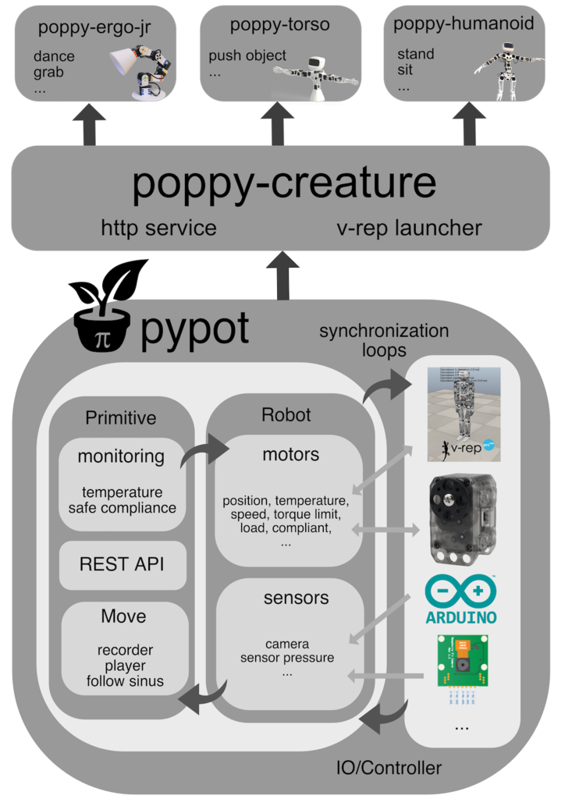

# Programming Poppy robots in Python


This chapter will guide you through how to control Poppy robots in Python. As it is actually the language used for writing Poppy core libraries, you will see how to access all the different levels of control, from the higher to the lower.

We will detail everything you need to know to directly program you robot using the Python embedded in the Poppy robot or to install everything locally. Note that this chapter does not intend to teach you Python or programming from scratch and thus if you are completely new to Python it may be good to start with a Python tutorial. Yet, we try to keep the tutorials as simple as possible and we will always warn you when some parts are targeting more advanced users.

We will try to provide as many examples as possible and point to the complete API so you can find and use the least famous features. Most of the examples and tutorials are available as a collection of [Jupyter notebooks](http://jupyter.org). The next chapter, [Jupyter Notebooks Gallery](notebooks.md), presents a list describing each notebook, what they will teach, what they can be used for, for which robot, etc.

All Poppy libraries are open source and are released under the [GPL v3](http://www.gnu.org/licenses/gpl.html) license. So you can freely access the source code on [github](https://github.com/poppy-project). Do not hesitate to fork them, send pull request and contribute!

## Why Python and Anaconda?


The libraries developed for the Poppy project were designed with the aim to make it easy and fast to write code for controlling various robots based on - originally - robotis dynamixel motors. The idea was to provide access from the lower level - raw serial communication with a specific motor for instance - to higher levels such as starting and stoping primitives/behaviors (e.g. face tracking, postures, ...) or directly recording motions through learning by demonstration.

We decided to write most of them in Python as its flexibility allows for fast and modular development. It was also meant to be accessible by a large audience, from developers and roboticists in general, to hobbyists, researchers, artists... Python was also chosen for the tremendous pools of existing libraries (scientific, computer vision, IO, web...) so if one is interested in adding a new feature, such as support for a new motor/sensor, it should be as easy and fast as possible.

Finally, support for multi-platforms and ease of installation were also key aspects.


We also strongly advise to use the [Anaconda Python distribution](https://www.continuum.io/why-anaconda) as it already includes most of the libraries needed by the Poppy libraries. We also provide all poppy libraries as conda recipes so they can be easily install using Anaconda (see the [install section](#TODO)).

## Overview of the different libraries

Before jumping into the code, we will briefly introduce the different existing Poppy libraries and how they interact with each other.

They are three main library levels:

* [pypot:](https://github.com/poppy-project/pypot) This is the core of the Poppy software architecture. Pypot handles all the low level communication with the hardware (both sensors and motors), defines synchronization loops so your command are always up to date. It also provides the primitives mechanism which allows the definition of simple behavior that can be - more of less - automatically combined.

* [poppy-creature:](https://github.com/poppy-project/poppy-creature) This library defines the common tools shared by all Poppy robots, for instance how to automatically launch the simulator or start the HTTP API attached to any robot.

* [poppy-ergo-jr](https://github.com/poppy-project/poppy-ergo-jr), [poppy-torso](https://github.com/poppy-project/poppy-torso), and [poppy-humanoid:](https://github.com/poppy-project/poppy-humanoid) Those libraries are specific to their respective Poppy robot. They define the particular configuration of the robot, the sensors it uses, which motors are connected to which buses... This is also were behaviors specific to a creature are defined (the stand primitive for the humanoid for instance).

This is summarized in the diagram below:



## Installation

**First, note that if you are only planning to use real robots, they already come with Python and all Poppy libraries installed. You can directly connect to the Jupyter notebook server via the [web interface](#TODO) and have nothing to install on your machine!**

What you need to install is summarized in the diagram below:


Yet, if you are planning to either

* Use a simulator (e.g. V-REP, or web simulator),
* or want to directly plug the robot to your computer

You will have to install Poppy libraries locally. They work on Windows, Mac OS, Linux, and have been tested on:

* Python >= 2.7
* Python >= 3.4

Also note that if you are planning to directly plug your robot to your USB port, specific drivers should be installed.

All steps are detailed in the chapter [Manual installation](#TODO).

## Quickstart: Hello Poppy world!

To give you a rapid overview of what you can do using Python to program Poppy robots, this section will show you how to:

* Create and connect your robot
* Retrieve values from the sensor and send motor commands
* Start playing with primitive by recording motions by demonstration

This section does not intend to cover everything that can be done in Python with Poppy but to give you sneak peaks of the most common features. For more advanced use, you should refer to the next section where we present a list of Jupyter notebooks each detailing a specific aspect or feature.

In the following examples, we assume that you have a working environment meaning that you either:

* are using the Python embedded in your robot: through the Jupyter Notebook server,
* or you have installed everything locally to work with a simulator.


### Create and connect to a Poppy robot

#### Import the library

The very first step you have to do to start programming Poppy robots in Python is to import the library. In Python they are called [module or package](https://docs.python.org/2/tutorial/modules.html).

To do that, you write something similar to:

```python
from poppy.creatures import *
```

This will actually import all Poppy robots installed on the Python distribution you are using. If you want to use a specific robot, you can replace the *\** (which means all here) by the name of the robot you want.

For the ErgoJr:

```python
from poppy.creatures import PoppyErgoJr
```

For the Torso:

```python
from poppy.creatures import PoppyTorso
```

For the Humanoid:

```python
from poppy.creatures import PoppyHumanoid
```


> Note: If you see an error similar to the one below when executing the previous line, this means that the libraries are not correctly installed. See the section TODO.

```python
In [1]: from poppy.creatures import PoppyHumanoid
---------------------------------------------------------------------------
ImportError                               Traceback (most recent call last)
<ipython-input-1-18e4c5a36525> in <module>()
----> 1 from poppy.creatures import PoppyHumanoid

ImportError: cannot import name PoppyHumanoid
```

#### Create the Robot object - with a real robot

Then, you can actually create the Python object that will represent your robot. Depending on the Poppy robot you are using:

```python
# if you are using an Ergo Jr
poppy = PoppyErgoJr()
```

or

```python
# if you are using a Torso
poppy = PoppyTorso()
```

or

```python
# if you are using a Humanoid
poppy = PoppyHumanoid()
```

And that's it, if you did not see any error message it means that you are connected to your robot. If you see an exception like the one shown below, you should check the wire connection and try again:

```python
IOError: Connection to the robot failed! No suitable port found for ids [3, 5, 7, 11, 13, 17]. These ids are missing [3, 5, 7, 11, 13, 17] !
```

#### Create the Robot object - with V-REP

To use a simulated robot instead of a real one, you only have to specify it when creating the Robot object. For instance, if you want to create a simulated Poppy Torso, you simply have to execute the following line:

```python
poppy = PoppyTorso(simulated='vrep')
```

All three Poppy robots - Humanoid, Torso, and Ergo Jr - can be used with V-REP.

If you see an error message like this, check that you have launched V-REP and that you have close the popup in V-REP (see #TODO for details).

```python
IOError: Connection to V-REP failed!
```

#### Create the Robot object - with web simulator

Currently only the Ergo Jr is usable within the web simulator.  
It also requires specific versions of libraries to be used properly.

To make sure you meet these requirements, you can type this command from your shell:

```pash
pip install pypot>=2.12 poppy-creature>=1.8 poppy-ergo-jr>=1.6 --upgrade
```

You can then instantiate the poppy-ergo-jr creature:

```bash
poppy-services --poppy-simu --snap --no-browser poppy-ergo-jr
```

This will create a server for Snap_!_ on port 6969, and a server for the visualizer on port 8080.

You can then head to the [visualizer page](http://poppy-project.github.io/poppy-simu/poppy-ergo-jr/).

### Access the sensors and motors

The robot object you just created contains two main groups of objects:

* motors
* sensors

that can be easily access using *poppy.motors* and *poppy.sensors*. As soon as the robot object is created it automatically starts synchronization loops which will ensure that the last available value are received/sent to the robot.

> **Note**  Servomotors that are used in Poppy robots can be seen as both motors and sensors. Indeed, on top of being "simple" motors, they also provide multiple sensing information: their current position, speed and load but also their temperature, the current used... Yet, for simplification they are only available under the motor category.

#### Get data from your robot

<!-- TODO: connecter un ergo et ajouter les res. des differentes lignes -->


Now that you have created your robot object, you can directly use Python to discover which motors are attached.

> **Note** In all examples below the results are shown for an ErgoJr. If you are using a Torso or a Humanoid you will see more motors with different names.

For instance, to know how many motors your robot have you can execute:

```python
print(len(poppy.motors))
```

*poppy.motors* is actually a list of all motors connected to your robot. Thus, if you want to get the present position of all motors, you can do:

```python
for m in poppy.motors:
    print(m.present_position)
```

Of course, you can also access a specific motor. To do that, you need to know the name for the motor you want to access. You can find this list in the assembly documentation of your robot.

You can also obtain a list of all motors name directly from python:
```python
for m in poppy.motors:
    print(m.name)
```
or using a motor pythonic expression:
```python
print([m.name for m in poppy.motors])
```

Then you can directly access the desired motor by its name:

```python
m = poppy.m3
```
or get its position:
```python
print(poppy.m3.present_position)
```
The most common values for motors are:
* present_position
* present_speed
* present_load

Similarly, you can get data from your sensors. Depending on the Poppy robot you have different sensors available. You can get the list of all sensors in the exact same way you did for motors:

```python
print([s.name for s in poppy.sensors])
```

And then access a specific sensors by its name. For instance, to get an image from the camera of the Ergo Jr:

```python
img = poppy.camera.frame
```

> **Note** This section just presented some of the available values that you can get from your motors/sensors. They are many other - some are specific to a particular robot - we will present them through the different notebooks.

#### Send motor commands

Now that we have shown you how to read values from your robot, it is time to learn how to make it move!

This is actually really similar to what you have just seen. Instead of getting the *present_position* of a motor you simply have to set its *goal_position*.

But first, you have to make sure your motor is stiff, meaning that you cannot move it by hand. To do that we will turn off its compliancy. Assuming you have an Ergo Jr and want to make the motor *m3* moves - feel free to use any other motor but make sure the motor can freely move without hurting any of your finger:

```python
poppy.m3.compliant = False
```

The motor should now be stiff. And then, to make it move to its zero position:

```python
poppy.m3.goal_position = 0
```

> Note: *present_position* and *goal_position* are actually two different registers. The first refers to the current position of the motor (read only) while the second corresponds to the target position you want your robot to reach. Thus, they can have different values while the motor is still moving to reach its *goal_position*.


As a slightly more complex example we will make it go to 30 degrees then -30° three times:

```python
import time

for _ in range(3):
    poppy.m3.goal_position = 30
    time.sleep(0.5)
    poppy.m3.goal_position = -30
    time.sleep(0.5)
```

Note that after each new value set to *goal_position* we wait so the motor has enough time to actually reach this new position. Another way to do the same thing is to use the goto_position method:

```python
import time

for _ in range(3):
    poppy.m3.goto_position(30, 0.5, wait=True)
    poppy.m3.goto_position(-30, 0.5, wait=True)
```

As you can see, this method takes three arguments, the target position, the duration of the move and whether to wait or not the end of the motion.

If you want to move multiple motors at the same time, you can simply do something like:

```python
for _ in range(3):
    poppy.m1.goal_position = -20
    poppy.m3.goal_position = 30
    time.sleep(0.5)
    poppy.m1.goal_position = 20
    poppy.m3.goal_position = -30
    time.sleep(0.5)
```

or use a python dictionary storing the target position per motor you want to move, that can be given to the goto_position method:

```python
pos_1 = {'m1': -20, 'm3': 30}
pos_2 = {'m1': 20, 'm3': -30}

for _ in range(3):
    poppy.goto_position(pos_1, 0.5, wait=True)
    poppy.goto_position(pos_2, 0.5, wait=True)
```

> **Note** You can turn a motor back to its compliant mode (where you can freely move it) by setting its compliant register to True:
```python
poppy.m3.compliant = True
```

### Record and play motion by demonstration using primitives

Pypot provides you with the primitive mechanism, which are simply pre-defined behaviors that can be attached to your robot. In this section, we will show you how to use some primitives already existing for recording and playing motions. You can also define your own primitive but this is out of the scope of this section, you will find details on how to do this in dedicated notebooks.

#### Record a motion by demonstration

Designing choreographies for your robot using *goal_position* or *goto_position* can be long and kind of troublesome. Fortunately, there is a much more efficient way of doing this: recording motions by directly demonstrating the move on the robot.

This can be summarized into few steps:

* make the robot compliant so you can move it by hand
* start the recording
* actually moves the robot so it follows whatever move/choreography you can think of
* stop the recording

And now to do that in Python:

So, first we turn all motors of the robot compliants:

```python
for m in poppy.motors:
    m.compliant = True
```
> **Info** You can also record a movement with motors stiff (`compliant = False`), and moving them with goal_position or goto_position commands.  

Then, we have to include the primitive used for recording motion:

```python
from pypot.primitive.move import MoveRecorder
```

To create this primitive, you have to give the following arguments:

* on which robot you want to use this primitive (this can be useful if you are working with multiple robot at a time - for instance you can record a move on a robot and at the same time make it reproduce by another one: this [notebook](#TODO) will guide you on how to do this).
* the record frequency of the move you want to register: how many position per second will be recorded - the higher the more accurate the record will be but also more data will have to be processed - good values are usually between 10Hz and 50Hz.
* the motors that you want to record. you can record a move on a subpart of you robot, for instance only on the left arm.

Here, we will record a move on the whole robot at 50Hz:

```python
recorder = MoveRecorder(poppy, 50, poppy.motors)
```

> **Note** We used *poppy.motors* to specify that we want all motors if you only want let's say the two first motors of an Ergo Jr you could have used *[poppy.m1, poppy.m2]* instead.

Now it is time to record. As it can be hard to both move the robot and type Python command at the same time, we will make a small script, that:

* wait 5s so you can get ready to record
* start the record
* record for 10 seconds
* stop the records

```python
import time

# Give you time to get ready
print('Get ready to record a move...')
time.sleep(5)

# Start the record
record.start()
print('Now recording !')

# Wait for 10s so you can record what you want
time.sleep(10)

# Stop the record
print('The record is over!')
record.stop()
```

Now, you should have a move recorded. You can retrieve it from the recorder primitive:

```python
my_recorded_move = record.move
```

and check how many positions where recorded:

```python
print(len(my_recorded_move.positions()))
```

#### Replay recorded moves

Now to play back recorded motions you have to use another primitive: MovePlayer

```python
from pypot.primitive.move import MovePlayer

player = MovePlayer(poppy, my_recorded_move)
```

As you can see, to create it you have to specify the robot (as for the MoveRecorder) and the move you want to play.

> **Note** Automatically all recorded motors become stiff to be able to play the move. 

Then, you can simply start the replay:

```python
player.start()
```

And if you want to play it three times in a row:

```python
for _ in range(3):
    player.start()
    player.wait_to_stop()
```

We use the *wait_to_stop* method to make sure we wait for the first move to finish before we start another. By default, playing a move we will not block to allow you to play multiple move in parallel.

### Write a simple sensori-motor loop

Robotic is all about sensori-motor loops, meaning that motor commands will be more or less directly related to the sensor readings. In other terms the robot actions will be determined by what it perceives from its environment.

Poppy libraries and more particularly pypot provides you with tools to easily write sensori-motor loops. We will show here a very simple example where some motor of an Ergo Jr will be controlled by the position of other motors in order to keep the head of the Ergo Jr straight.

To do that, we will free the two first motors, so they can be moved by hand. Two other motors will try to lively compensate the motion applied on the free motors.

We need few simple steps:

1. read values from sensors (here the two free motors)
1. compute command from those readings
1. set new motor command
1. go back to step 1.

> **Note** This example is designed for the Ergo Jr. It could be adapted to other Poppy robots, by changing the motors used. Yet, it is not that obvious which one to use to have a "cool" result.

#### Demo version

Before writing the sensori-motor loop, we will first set the Ergo Jr in a base position.

```python
from poppy.creatures import PoppyErgoJr

jr = PoppyErgoJr()

jr.goto_position({'m1': 0.,
                  'm2': -60.,
                  'm3': 55.,
                  'm4': 0.,
                  'm5': -55.,
                  'm6': 60.}, 2., wait=True)
```

Then, we make sure the *moving speed* of the motors are not too high to prevent shaky motions:

```python
for m in jr.motors:
    m.moving_speed = 250
```

Finally, we free the two first motors:

```python
jr.m1.compliant = True
jr.m2.compliant = True
```

Now, that everything is setup we write our very simple sensori-motor loop like this:

```python
import time

while True:
    # Step 1
    p1 = jr.m1.present_position
    p2 = jr.m2.present_position

    # Step 2
    g1 = -p1
    g2 = -p2

    # Step 3
    jr.m4.goal_position = g1
    jr.m6.goal_position = g2

    time.sleep(.02)
```

* **Step 1:** As you can see, here our readings step is simply to retrieve the *present_position* of the motors *m1* and *m2*.
* **Step 2:** Here, we defined the base position so the motors *m1*/*m4* and *m2*/*m6* are parallel. Thus, to compensate the head position, we simply have to define the new motor goal position as the opposite of the read present position.
* **Step 3:** We simply set the goal position as the just computed command

Those steps are included inside an infinite loop - with a `time.sleep` to avoid CPU overhead.

> **Note** To stop this *while True* loop, you will have to use the classical Ctrl-c, or use the stop button if you are running it through Jupyter.

#### Now with a primitive

But what about if you want to make this behavior an independent "brick" that you can start/stop on demand combine with other behaviors. Well, primitives are meant to do just that.

There is two main types of primitive: *Primitive* and *LoopPrimitive*. The first one basically gives you access to just a *run* method where you can do everything you want on a robot. The second one as the name indicates is an infinite loop which calls an *update* method at a pre-defined frequency. In our case it is the more suited one.

Here is the entire definition of this primitive:

```python
class KeepYourHeadStraight(LoopPrimitive):
    def setup(self):
        for m in self.robot.motors:
            m.compliant = False

        self.robot.goto_position({'m1': 0.,
                                  'm2': -60.,
                                  'm3': 55.,
                                  'm4': 0.,
                                  'm5': -55.,
                                  'm6': 60.}, 2., wait=True)

        for m in self.robot.motors:
            m.moving_speed = 250

        self.robot.m1.compliant = True
        self.robot.m2.compliant = True

    def update(self):
        self.robot.m4.goal_position = -self.robot.m1.present_position
        self.robot.m6.goal_position = -self.robot.m2.present_position
```

As you can see, there is two main parts. The __*setup*__ method which defines what needs to be done to prepare the robot before starting the behavior - here simply puts it in its base position and turn on the compliance for the two first motors.

And the __*update*__ method which will be regularly called: here is where we put the actual code for the sensori-motor loop: reading sensor - computing the new command - and sending the new command to the motors.

Now that we have defined our primitive, we can instantiate it and start it:

```python
# we specify we want the primitive to apply on the jr robot instance
# and that the update method should be called at 50Hz
head_straight = KeepYourHeadStraight(jr, 50.0)

head_straight.start()
```

You can stop it whenever you want:

```python
head_straight.stop()
```

And re-starting it again...

```python
head_straight.start()
```

The huge advantage of using a primitive in this case is that after starting it, you can still easily run any other codes that you want. The primitive starts its own thread and thus runs in background without blocking the execution of the rest of the code.
