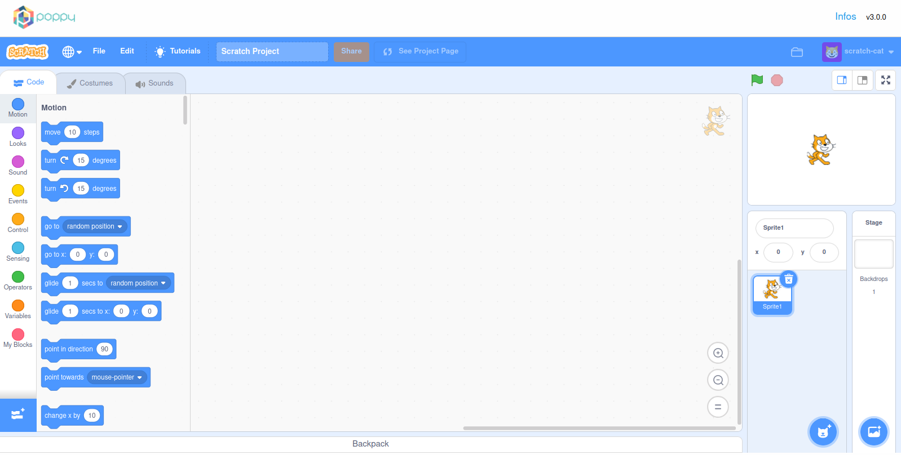
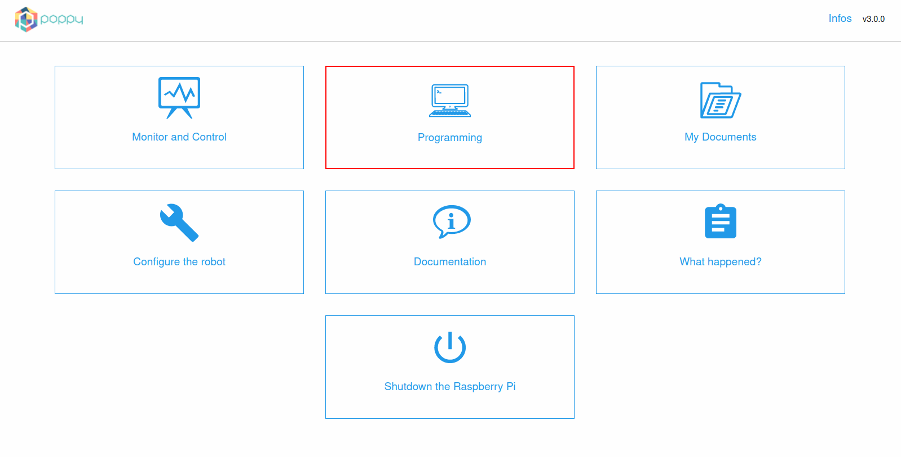
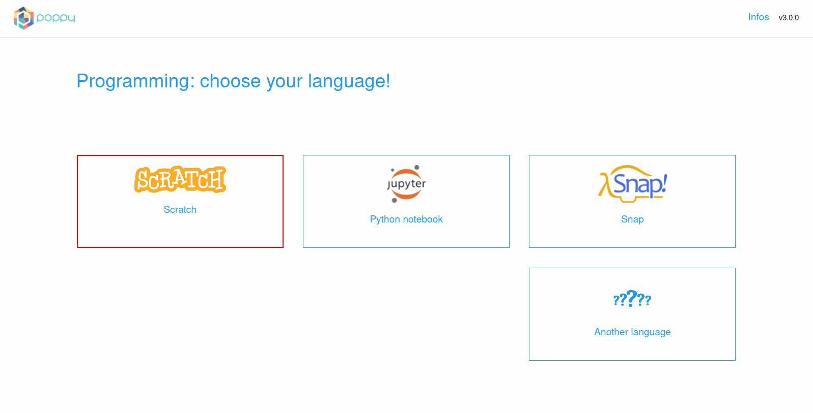
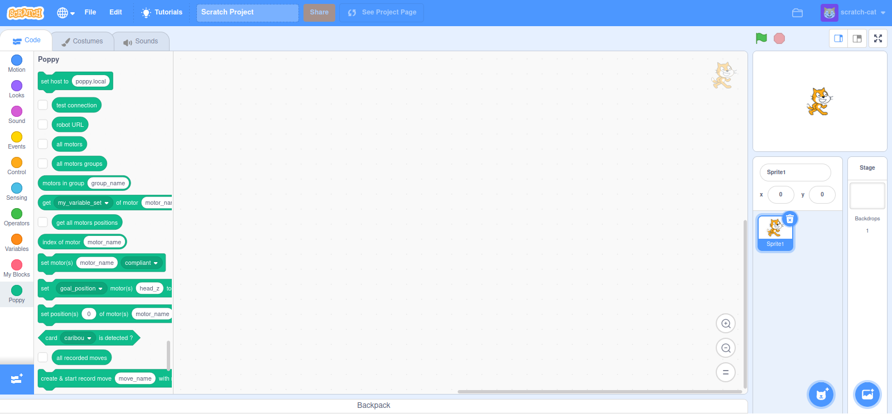
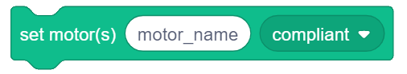
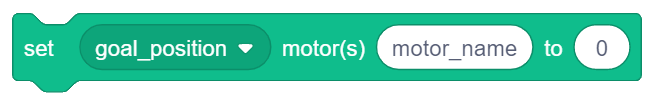
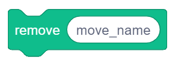
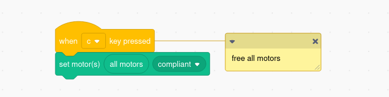
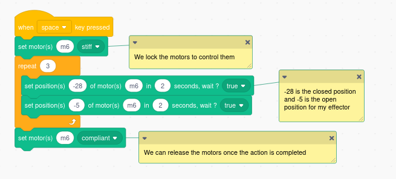
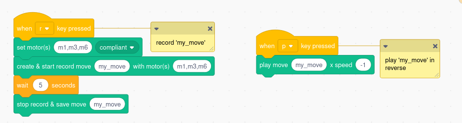

# Programming Poppy robots using Scratch

Scratch is a block-based visual and [open source](https://github.com/LLK) programming language, targeted primarily at children 8-16 as an educational tool for coding.



> **Info**  You can find a lot of programming ideas and tutorials on [Scratch website](https://scratch.mit.edu/ideas)

## Introduction to Scratch programming

This chapter will focus on things necessary to understand in Scratch for using Poppy creatures.

### Connect your robot to Scratch

#### 🤖 If you have a tangible robot

First, you must be connected to the same network LAN area than your robot (e.g. on the same router or Wifi).

> **Info** Be careful, wifi is not enabled by default on Poppy robots, you may need to connect your poppy with ethernet to configure wifi.

You have to go on the web homepage of your robot with its URL. You can use its IP address (for example http://192.168.1.42) if you have a way to know it or its hostname like http://poppy.local. To find its IP address look at [the zeroconf chapter](../installation/install-zeroconf.md#alternatives-to-find-the-ip-address-of-a-computer-on-your-local-network). To use directly its hostname http://poppy.local you must have a Zeroconf software installed on your computer (aka ["Bonjour print services for Windows"](https://support.apple.com/kb/DL999?locale=en_US) if you are running Windows). It is also possible not to use a Raspberry Pi by connecting an USB2AX adapter directly in a USB port of your computer, in that case run [Poppy Services](../software-libraries/poppy-creature.html#poppy-services) with parameter `--scratch` to program your robot with Scratch.

The home page of your poppy creature should look like the snapshot below:


Click on the "Programming" link and then on **Scratch** to open the Scratch interface at start the connection with the Poppy robot.



Next step: [Install Poppy Extension](#install-poppy-extension)

#### 💻 If you use a simulated robot on CoppeliaSim (v4.2.0)
> **Info** You need to have installed Poppy software libraries and CoppeliaSim simulator on your computer. If it is not done, go to the [install poppy software section](../installation/install-poppy-softwares.md)

- First open CoppeliaSim.

- The quickest way is to use the command line utility [poppy-service](../software-libraries/poppy-creature.md#poppy-services). Copy and press enter to execute the command below in your command prompt (windows) or terminal (OSX and Linux):
```bash
poppy-services --scratch --vrep poppy-ergo-jr
```
It will open a Scratch tab in your web browser for a simulated poppy-ergo-jr.

*Substitute 'poppy-ergo-jr' with 'poppy-humanoid' or 'poppy-torso' to launch respectively a Poppy Humanoid or a Poppy Torso*.

### Install Poppy Extension

Click on  (in the lower left corner) and then select the Poppy Extension:


A new set of blocks will appear on the left panel.



## Description of Poppy blocks

|   | Description |
| - | ----------- |
|  | This block allows you to connect Scratch to your robot. The host input can be: `poppy.local` byt default, or `your_name.local` if you have changed its name, or the IP address of the robot (e.g. 123.124.145.146), or `localhost` if you are directly connected to the robot in USB using [Poppy Services](../software-libraries/poppy-creature.html#poppy-services) without Raspberry Pi |
|  | Click on this block to verify that you are connected to your robot. |
|  | Gives the URL of the robot. |
|  | Returns a list with the name of every motors in the robot, separated by commas. |
|  | Gives all existing motors groups. |
|  | Gives motors which are in a given group. You can know groups name with the block “all motors groups”. |
|  | Gives the value of a register (position, speed, load, ... ) of a motor. |
|  | Gives the position of every motors. It is useful to make a snapshot of pose of the robot. |
|  | Returns the index of a motor name in the "all motors" block list. |
|  | Puts one or many motors in compliant or stiff mode. Motors are hand-drivable in compliant mode but must be in stiff mode to be controlled with Scratch. The "motor_name" input can accept: a string of a motor name (e.g. m1); string of many motors separated with commas (e.g. m1,m2,m4); a Scratch list of motors like the reporter block "all motors" |
|  | Sets the value to one register (position, speed, max torque, ...) of a motor. |
|  | Sets a motor's "position", in "duration" seconds and if wait is set to true, it will only exectute next block after the move is complete. Motors should be given as a list of motor names. Position should be given as a list of float values (it corresponds to the angle values to reach for each motor). Duration should be given as float, in seconds.
|  | Return a boolean (true/false) depending if the selected card is detected by the camera of the robot. |
|  | Lists all recorded movements |
|  | If your motors are compliant, you will be able to move your robot motors and record some moves. Motors should be given as a list of names separated by commas (e.g. m1,m3,m4) or with a Scratch list of motors like the reporter block "all motors". If a move of the same name has already been defined, it will be overwritten ! |
|  | Stop a record and save the recorded move in the robot. Be careful, you must have previously defined a move record with the "create & start record move ..." block. |
|  | Replays a recorded move. The "speed" parameter is a float value. It can be negative to play the move backwards (e.g. `-1`). `1.0` is the speed to give to replay the move at the same speed as it was recorded. |
|  | Stops the replay of a recorded move. |
|  | Removes a recorded move. |
|  | Give the list of all attached/running behaviours. |
|  | Starts/Stops/Pauses/Resumes an integrated behaviour of the robot. It can be a position, a movement, a sensorimotor loop, high level camera feature... |
|  | Get all methods or functions which are runnable in a behaviour. |
|  | Makes a GET request to the robot API. All API endpoints are availble on the page [REST API](rest.md) |
|  | Makes a POST request to the robot API. All API endpoints are availble on the page [REST API](rest.md) |

## Some examples

### Turn all motors compliant

This program will turn all your motors in compliant mode as soon as you press your **c** key.


> **info** The opposite of compliant is stiff. The motors will be locked in their current position, but they can receive commands such as goto.

### Open and close your effector.

This program will open and then close its effector 3 times before releasing all motors back. You can get the value of each position with the block *get present_position of motor motor_name*.



### Record and replay a move

This program will record the moves of motors `m1`, `m3` and `m6` for 5 seconds and save the record as `my_move`. You can launch the record by pressing **r**, recorded motors will be turned compliant. If you press **p**, the move will be played back in reverse (speed is set to `-1`).



### Add your own blocks

You can create your own blocks.

Here's a short Youtube video on how to build your own block in Scratch :

[https://www.youtube.com/watch?v=2gBf-hU89Y8](https://www.youtube.com/watch?v=2gBf-hU89Y8)
