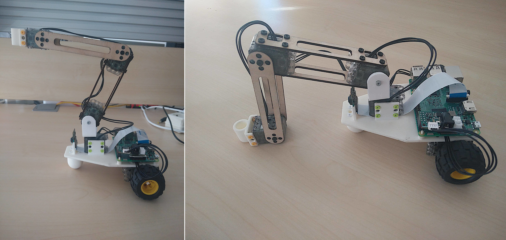
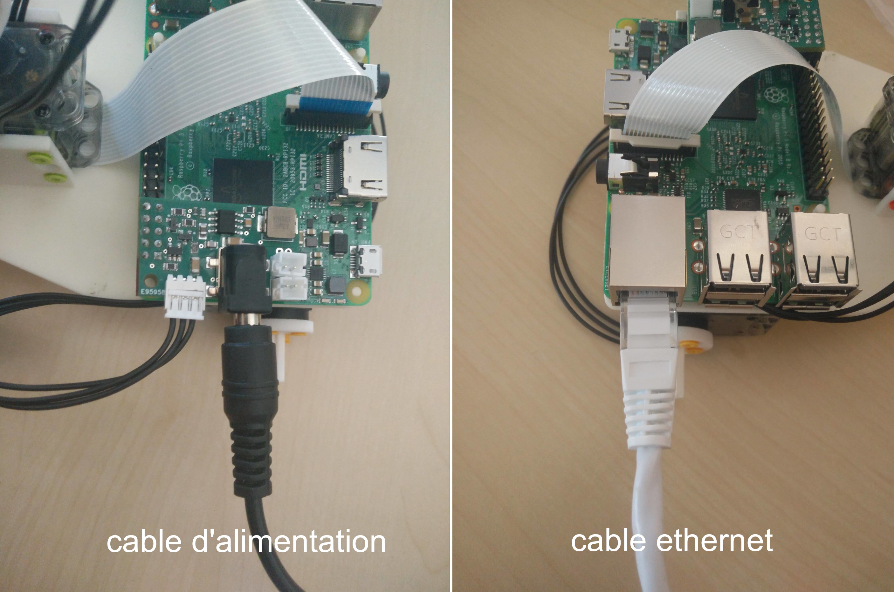

# Assemblage mécanique

## Avis et avertissements d'ordre général

* Vous pouvez assembler tous les rivets avant la construction du robot. **Orientation est importante**, vous devez aligner les encoches de la première pièce (part 1) avec les fentes de la deuxième pièce (part 2). Il sera plus facile de les enlever ainsi.


* Il y a deux types de rives: les gris, et les autres. Les gris sont plus longs et sont fait pour fixer les moteurs dans les pièces de type "U long" (vous n'aurez besoin que d'un seul gris pour le Dragster). La couleur des autres petits rivets n'est pas importante, vous pouvez choisir ceux que vous voulez.


* Utilisez l'outil OLLO pour pouvoir monter et démonter les rivets facilement.


* N'oubliez pas de mettre les câbles entre les moteurs pendant la construction du robot! Tous les moteurs sauf le dernier ont deux cables pour les connecter aux moteurs d'avant (ou Raspberry) et d'apres (le coté de branchement n'as pas d'influence tant qu'ils sont correctement branchés en série).

* Alignez toujours le palonnier (la roue d'entrainement noire) avec le moteur avant de les assembler ! Sinon votre robot risque de ne pas bouger comme vous le souhaitez puisqu'il sera décalé au démarrage.


## Guide pas à pas

### Configuration des moteurs (pour toutes les étapes)

Vous pouvez configurer les moteurs avant, pendant ou après l'assemblage. **Il est néanmoins plus facile de les configurer un par un dans l'ordre de l'assemblage**: * configurer le moteur m1 * assembler le moteur à la base * configurer le moteur m2 * ...

> **Attention** Pour configurer les moteurs, vous devez les connecter séparément un par un à la Raspberry Pi. Si vous essayez de configurer un nouveau moteur pendant qu'il est connecté au moteur précédent, cela ne fonctionnera pas.

Pour plus d'informations, voir [section de configuration du moteur](motor-configuration.md).

### Étape 1 - roues w1 et w2

Rappel de configuration des moteurs :

```bash
poppy-configure ergo-jr w1
```

Tout d’abord montez le plot avant avc 4 petits rivets, puis [configurez un moteur XL-320](motor-configuration.md) comme « w1 », il sera relié à la raspberry, et un autre comme « w2 ». Ces deux moteurs seront les roues du Dragster. Fixez les roues sur ces moteurs avec 4 petits rivets pour chaque roue. Vérifiez que les palonniers sont bien alignés.

Monter les moteurs sur la base imprimée 3D en les fixant avec des rivets.


### Etape 2 - moteur m1 et caméra

Placez la camera dans son encoche et branchez la à la Raspberry. Configurez le second moteur, son nom est « m1 », avec la commande suivante dans un terminal du robot :

```bash
poppy-configure ergo-jr m1
```

Vérifiez que les palonniers sont bien alignés. Connectez les câbles de w2 à m1 et de m1 à m2 que vous monterez juste après, puis fixez-le avec 4 rives de chaque côté (la partie circulaire du côté de la caméra) Une fois attachée, montez la partie *long_U* sur la partie circulaire du moteur.


### Etape 3 - moteur m2 et caméra

Configurez les moteurs "m2" et "m3". Vérifiez que les palonniers sont bien alignés. Montez les parties *4dofs-side2side.stl* sur le moteur avec 16 rivets, puis fixez m4 sur la partie *long_U* avec 1 rivet gris à régler sur le côté non-mobile. 4 petits rivets doivent fixer sur la partie circulaire de l'autre côté du *long_U*.


### Étape 4 - moteur m4 

Configurez le sixième (et dernier!) moteur: "m4".

Montez les pièces à deux pièces *4dofs-horn2horn-5holes.stl* sur le moteur m4 avec 4 rivets d'un coté (sur la partie circulaire) et un de l'autre coté. Fixez par le même procédé, le moteur m3 à l'autre extrémité de la pièce *4dofs-horn2horn-5holes.stl* Vous pouvez ajouter un embout de votre choix.

> **Note** Les les embouts sont des outils qui peuvent être facilement et rapidement changés, ce qui vous permet d'adapter votre robot aux différentes activités. Retrouvez quelques activités avec le Poppy Ergo Jr :

#### L'abat-jour ou le stylo

Monter les pièces *horn2horn* et *horn2side* sur moteur « m5 » et monter « m6 » sur le sommet de la construction. 

Vous pouvez monter le support de stylo ou de l’abat jour sur le moteur « m4 ». [bis de l'étape 6](img/assembly/steps/step_18-19.jpg)

De la même façon que l'ombre, il est possible de monter le porte-stylo. 

#### La pince

Monter la pièce [*gripper-fixation*](https://github.com/poppy-project/poppy-ergo-jr/blob/master/hardware/STL/tools/gripper-fixation.stl) entre les moteurs « m5 » et « m6 ».

Monter la pièce *gripper-fixed_part* et *gripper-rotative_part* sur moteur « m6 ».

Il y a deux façon de monter la pince, verticalement! [Step gripper](img/assembly/steps/grip1.jpg)

Ou horizontalement 

### Étape 5 - Vérification électronique

Si vous n'avez pas fixé votre camera à votre Raspberry lors de l'étape 2 ou vos cables lors de la construction du robot, faites le maintenant.

**Fixer la camera**

Pour fixer la camera sur la Raspberry Pi avec le cable flex (bande de cable) ouvrez le connecteur de la camera situé sur la Raspberry en tirant legerement l'encoche vers le haut. Assurez-vous que les connecteurs sont en face du port Ethernet. Repoussez l'encoche vers le bas pour coincer le cable flex. 

**Câbles reliant les moteurs**

Si ce n'est pas fait, connectez tous les moteurs entre eux. Chaque moteur a deux connecteurs pour être relié au suivant et au précédent.

> **Info** Les connecteurs de moteur peuvent être un peu difficiles à connecter, vous pouvez utiliser l'outil OLLO pour vous aider.

### Étape 6 - branchez et testez votre robot

 Bravo !!! si votre robot ressemble à cela, vous avez fini de l'assemblage ! Vous pouvez maintenant le brancher, pour cela branchez le cables d'alimentation à la carte Pixl et le cable ethernet à la Raspberry.



Lorsque vous le branchez, tous les moteurs sont sensés s'allumer. Si ce n'est pas le cas, vérifiez que vous les avez bien tous branchés les uns aux autres.

Vous pouvez maintenant aller à <http://poppy.local> (c'est la page d'accueil de votre robot)

Cliquez *Reboot the robot* pour redémarrer les moteurs 

Cliquez ensuite sur *Monitor and controle* pour obtenir des informations sur votre robot et vérifier qu'il fonctionne correctement 

Si c'est le cas, vous devriez voir le petit logo de chaine verte (au milieu en haut). Vous pouvez ensuite choisir parmi les actions prédéfinies. 

Si au lieu du logo de connexion verte, vous voyez à la place **le logo rouge "brisé" ** est qu'il y a un problème de configuration. Vous pouvez aller voir dans *What Happened ?* pour plus d'informations. La plupart du temps, un câble est déconnecté ou un moteur n'est pas configuré. 

### Explorer

Explorez les activités avec votre robot ou un autre robot comme Ergo Jr par exemple. Vous pouvez aussi imaginer votre propre robot, quelle forme aurait il ? combien de moteurs? roues, jambes? en forme de machine, en forme d'animal? A quoi servirait il et quels seraient ses mouvements ? Laissez-vous guider par votre imagination :) 