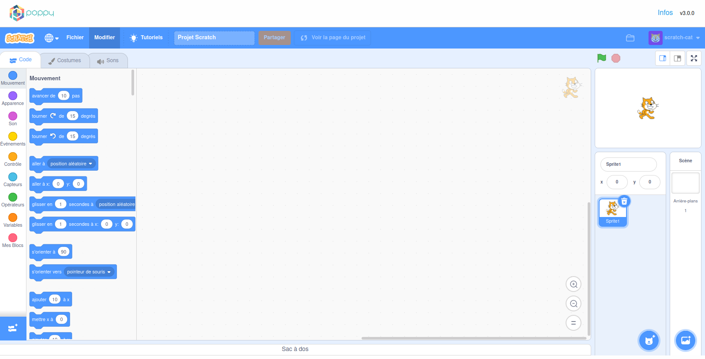
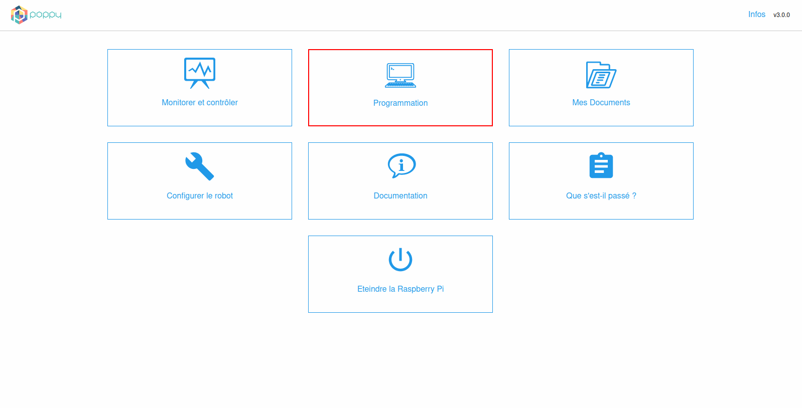
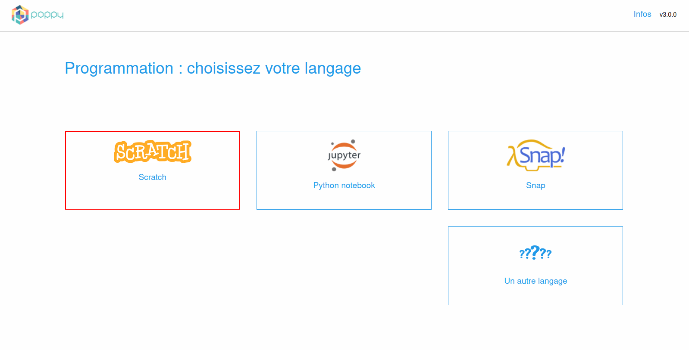
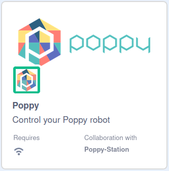
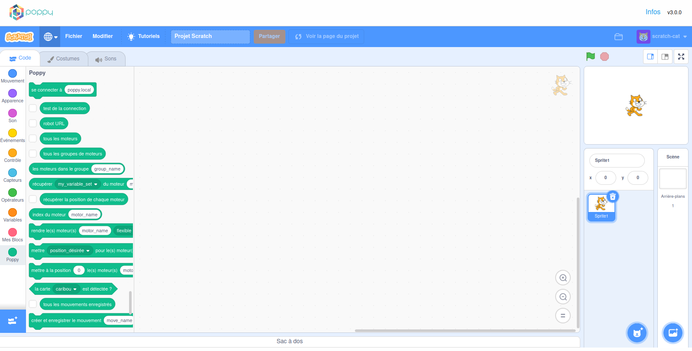
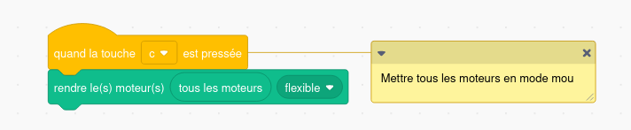
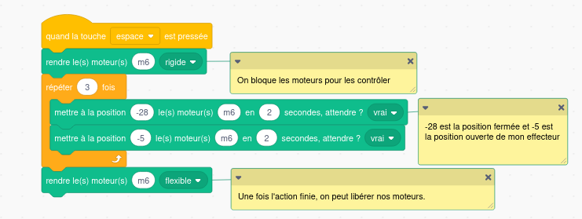
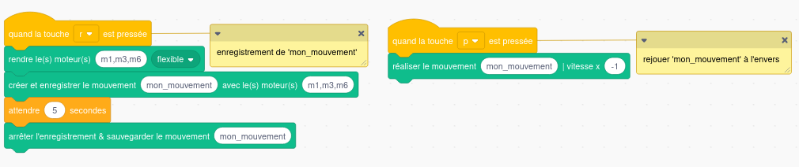

# Programmation des robots Poppy avec Scratch

Scratch est un langage de programmation visuel et [open source](https://github.com/LLK) basé sur des blocs, destiné principalement aux enfants de 8 à 16 ans en tant qu'outil éducatif pour la programmation.



> **Info** Vous pouvez trouver quelques idées de programmation ou de tutoriels sur le [site Web de Scratch](https://scratch.mit.edu/ideas)

## Introduction à la programmation Scratch

Ce chapitre se concentrera sur les choses nécessaires à comprendre pour pouvoir contrôler vos robots avec Scratch.

### Connectez votre robot à Scratch

#### 🤖 Si vous avez un robot Poppy

Tout d'abord, vous devez être connecté au même réseau LAN que votre robot (par exemple sur le même routeur ou Wifi).

> **Info** Attention, le wifi n'est pas activé par défaut sur les robots Poppy, vous devrez peut-être connecter votre poppy en ethernet pour configurer le wifi.

Vous devez vous rendre sur la page d'accueil web de votre robot avec son URL. Vous pouvez utiliser son adresse IP (par exemple http://192.168.1.42) si vous avez un moyen de la connaître ou son nom d'hôte comme http://poppy.local. Pour trouver son adresse IP, regardez [le chapitre zeroconf](../installation/install-zeroconf.md#alternatives-pour-trouver-ladresse-ip-dun-ordinateur-sur-votre-réseau-local) . Pour utiliser directement son nom d'hôte http://poppy.local vous devez avoir un logiciel Zeroconf installé sur votre ordinateur (alias ["Bonjour print services for Windows"](https://support.apple.com/kb/DL999?locale=en_US) si vous utilisez Windows).

La page d'accueil de votre Poppy devrait ressembler à l'image ci-dessous:


Cliquez sur le lien "Programmation" puis sur **Scratch** pour ouvrir l'interface Scratch au démarrage de la connexion avec le robot Poppy.



Étape suivante: [Installer l'extension Poppy](#installer-lextension-poppy)

#### 💻 Si vous utilisez un robot simulé sur CoppeliaSim (v4.2.0)
> **Info** Vous devez avoir installé les bibliothèques logicielles Poppy et le simulateur CoppeliaSim sur votre ordinateur. Si ce n'est pas fait, allez dans la [section installer le logiciel poppy](../installation/install-poppy-softwares.md)

- Commencez par ouvrir CoppeliaSim.

- Le moyen le plus rapide est d'utiliser l'utilitaire de ligne de commande [poppy-service](../software-libraries/poppy-creature.md#poppy-services). Copiez-collez et appuyez sur Entrée pour exécuter la commande ci-dessous dans votre invite de commande (Windows) ou votre terminal (OSX et Linux):
```bash
poppy-services --scratch --vrep poppy-ergo-jr
```
Il ouvrira un onglet Scratch dans votre navigateur Web pour un poppy-ergo-jr simulé.

*Remplacez 'poppy-ergo-jr' par 'poppy-humanoid' ou 'poppy-torso' pour lancer respectivement un Poppy Humanoid ou un Poppy Torso*.

### Installer l'extension Poppy

Cliquez sur  (dans le coin inférieur gauche) puis sélectionnez l'extension Poppy:



De nouveaux blocs apparaîtront sur le panneau de gauche.



## Description des blocs Poppy

| | Descriptif |
| - | ----------- |
|  | Ce bloc vous permet de connecter Scratch à votre robot. Les valeurs acceptées peuvent être : - nom_du_robot.local (ex. poppy.local si le nom de votre robot est poppy)- l'adresse IP (ex. 123.124.145.176) |
|  | Cliquez sur ce bloc pour vérifier que vous êtes connecté à votre robot. |
|  | Donne l'URL du robot. |
|  | Renvoie une liste avec le nom de tous les moteurs du robot, séparés par des virgules. |
|  | Donne tous les groupes de moteurs existants. |
|  | Donne les moteurs qui sont dans un groupe donné. Vous pouvez connaître le nom des groupes avec le bloc "groupes de moteurs". |
|  | Donne la valeur d'un registre (position, vitesse, charge, ...) d'un moteur. |
|  | Donne la position de tous les moteurs. Il peut servir à enregister la pose du robot et la réutiliser plus tard. |
|  | Renvoie l'index d'un nom de moteur dans la liste de blocs "tous les moteurs". |
|  | Met un ou plusieurs moteurs en mode flexible ou rigide. Les moteurs peuvent être déplacés à la main en mode flexible mais doivent être en mode rigide pour être contrôlés avec Scratch. L'entrée "motor_name" peut accepter : un nom de moteur (par exemple m1); une liste de plusieurs moteurs séparés par des virgules (par exemple: m1,m2,m4); une liste Scratch de moteurs comme le bloc reporter "tous les moteurs" |
|  | Définit la valeur d'un registre (position, vitesse, couple max, ...) d'un moteur. |
|  | Définit la "position" d'un moteur en secondes "durée" et si "attendre" est défini sur vrai, il n'exécutera le bloc suivant qu'une fois le déplacement terminé. Les moteurs doivent être indiqués sous forme de liste de noms de moteurs. La position doit être donnée sous forme de liste de valeurs flottantes (elle correspond aux valeurs d'angle à atteindre pour chaque moteur). La durée doit être donnée sous forme de flottant, en secondes.
|  | Renvoie un booléen (vrai/faux) selon si la carte sélectionnée est détectée par la caméra du robot. |
|  | Donne la liste de tous les mouvements enregistrés |
|  | Si vos moteurs sont mous, vous pourrez déplacer les moteurs de votre robot et enregistrer certains mouvements. Les moteurs doivent être donnés sous la forme d'une liste de noms séparés par des virgules (par exemple: m1,m3,m4) ou avec une liste Scratch de moteurs comme le bloc "tous les moteurs". Si un mouvement du même nom a déjà été défini, il sera écrasé ! |
|  | Arrêtez l'enregistrement et sauvegardez-le. Attention, vous devez avoir préalablement défini un enregistrement de mouvement avec le bloc "créer & démarrer un enregistrement de mouvement...". |
|  | Rejoue un mouvement enregistré. Le paramètre "vitesse" est une valeur flottante. Il peut être négatif pour jouer le mouvement à l'envers (par exemple '-1'). `1.0` est la vitesse à donner pour rejouer le mouvement à la même vitesse qu'il a été enregistré. |
|  | Arrête la relecture d'un mouvement enregistré. |
|  | Supprime un mouvement enregistré. |
|  | Donnez la liste de tous les comportements associés au robot. |
|  | Démarre/Arrête/Met en pause/Continue un comportement intégré du robot. Ces comportements peuvent s'agir d'une position, d'un mouvement, d'une boucle sensorimotrice, d'une fonction caméra de haut niveau... |
|  | Obtenez toutes les méthodes ou fonctions exécutables dans un comportement. |
|  | Fait une requête GET à l'API du robot. Tous les points de terminaison de l'API sont disponibles sur la page [REST API](rest.md) |
|  | Fait une requête POST à l'API du robot. Tous les points de terminaison de l'API sont disponibles sur la page [REST API](rest.md) |


## Quelques exemples

### Mettez tous les moteurs en mode mou

Ce programme mettra tous vos moteurs en mode flexible dès que vous appuierez sur votre touche **c**.


> **info** L'opposé du mode flexible est le mode rigide. Les moteurs seront verrouillés dans leur position actuelle, mais ils peuvent recevoir des commandes telles que goto.

### Ouvrez et fermez votre effecteur.

Ce programme ouvrira puis fermera son effecteur 3 fois avant de libérer tous les moteurs. Vous pouvez obtenir la valeur de chaque position avec le bloc *récupérer position_actuelle du moteur motor_name*.



### Enregistrer et rejouer un mouvement

Ce programme enregistrera les mouvements des moteurs `m1`, `m3` et `m6` pendant 5 secondes et sauvegardera l'enregistrement sous `mon_mouvement`. Vous pouvez lancer l'enregistrement en appuyant sur **r**, les moteurs enregistrés seront mis en mode mous. Si vous appuyez sur **p**, le mouvement sera lu à l'envers (la vitesse est réglée sur -1).



### Ajoutez vos propres blocs

Vous pouvez créer vos propres blocs.

Voici une courte vidéo Youtube sur la façon de créer votre propre bloc dans Scratch :

[https://www.youtube.com/watch?v=2gBf-hU89Y8](https://www.youtube.com/watch?v=2gBf-hU89Y8)