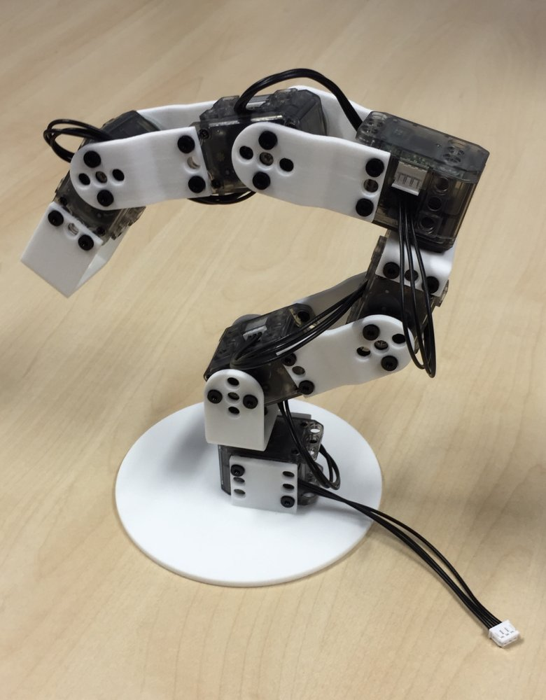
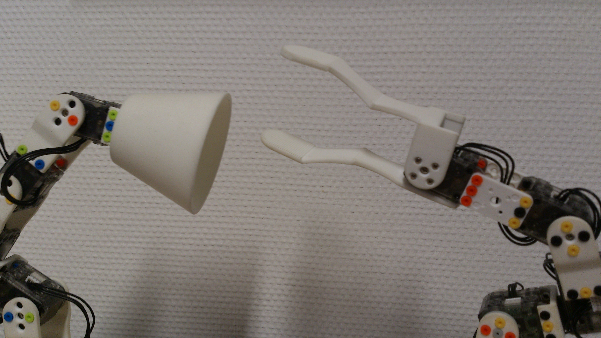
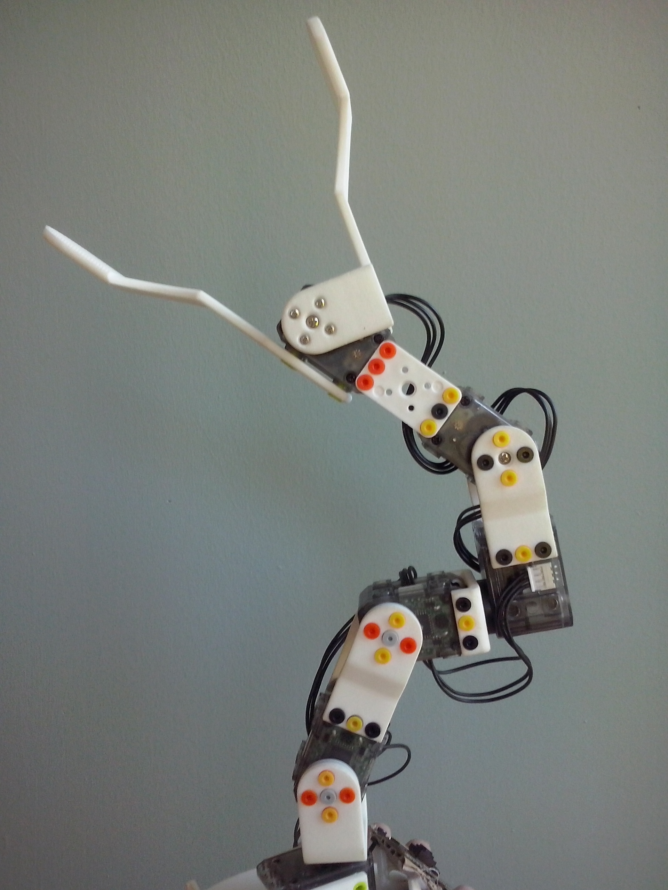
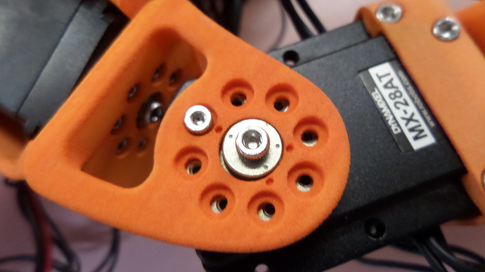

# Build your own robot

## Poppy Ergo Jr

The Poppy Ergo Jr robot was thought to be a simple little robot, cheap and easy to use.
The 3D parts were made so they can be easily printed on a basic 3D printer and the motors (6 XL-320 Dynamixel servos) are only 20$ each.
It is possible to program the robot but also to record the exact position of the motors or memorize a sequence of positions, it's called programming by demonstration.
Unlike others Poppy creatures, the electronic card is not integrated, which is very advantageous to manipulate.

It is very easy to build and its end effector can be easily modified (At the end of its arm, you can choose among several tools: a lamp, a hand gripper, ...) thanks to OLLO rivets they are very simple to remove. These rivets can be removed and added very quickly with the OLLO tool, which allows great design freedom.

This Ergo Poppy Jr is ideal for start manipulating robots and for learning robotic without difficulties.

This robot was designed to be assembled as soon as possible (within one hour): in fact, only a few steps are necessary.

* You need to collect all the necessary parts to build the robot (6 motors, 6 wires, the 3D printed parts, many OLLO rivets, etc...), you can find the complete list in the assembly section.

* You assemble all the rivets

* Once assembled, you use rivets to put the motors on 3D printed parts. For this, you have the OLLO tools, it's really convenient. This tool allows you to put and remove the rivets easily.

*Start assembling from below, remembering to connect wires.
The cables between motors have two purposes:
- distribute alimentation to each motor
- convey messages to each motor (ordering them to move or asking them for sensors' values)

*Put motors one after the other...

* ... until the end !

* You can add the tool of your choice !

* A small bit of electronic hacking is required for now. You need to power the Xl320 motors with 7.5V.

* It's finished, you have a Poppy Ergo Jr!

 

## Poppy Torso

Building a PoppyTorso is more complex than Poppy ErgorJr but is no more complicated than a Meccano or some Swedish furniture.

Patience and precision are your allies, but in case of error not panic: Poppy is a robot intended to be assembled and disassembled and even modify.

*Warning 1: put the dot on the horn at the same point than the dot on the servo axis*

*Warning 2: adjusts the three dots of the motors with three dots of structural parts.*

**That building is divided into seven major steps:**

* Trunk [(Text instruction)](https://github.com/poppy-project/Poppy-multiarticulated-torso/blob/master/doc/fr/5_DoFs_humanoid_spine.md)  [(Video demonstration)](http://youtu.be/LEHLdoBEr4Q)
  * Double MX28 [Text instruction)](https://github.com/poppy-project/Robotis-library/blob/master/doc/fr/double_MX28_assembly.md) [(Video demonstration)](http://youtu.be/9oNGV9ggHaE)
  * Double MX64 (only for Humanoid version) [Text instruction)](https://github.com/poppy-project/Robotis-library/blob/master/doc/fr/double_MX64_assembly.md) [(Video demonstration)](http://youtu.be/83lrhXVNHYE)

* Chess [(Text instruction)](https://github.com/poppy-project/Poppy-multiarticulated-torso/blob/master/doc/fr/subassembly/chest_assembly_instructions.md) [(Video demonstration)](http://youtu.be/qwrgV6tKTO8)
  * Spine [(Text instruction)](https://github.com/poppy-project/Poppy-multiarticulated-torso/blob/master/doc/fr/subassembly/spine_assembly_instructions.md) [(Video demonstration)](http://youtu.be/LXktU4MTITE)

* Right Arm [(Text instruction)](https://github.com/poppy-project/Poppy-basic-arms/blob/master/doc/right_arm_assembly_instructions.md) [(Video demonstration)](http://youtu.be/Oe5v21sTst8)
  * Right Forearm [(Text instruction)](https://github.com/poppy-project/Poppy-basic-arms/blob/master/doc/subassemblies/right_forearm_assembly_instructions.md) [(Video demonstration)](http://youtu.be/SUlM_mE3plc)
  * Right upper arm [(Text instruction)](https://github.com/poppy-project/Poppy-basic-arms/blob/master/doc/subassemblies/right_upper_arm_assembly.md) [(Video demonstration)](http://youtu.be/cYhGwD6r6NQ)
  * Right upper-arm/shoulder [(Text instruction)](https://github.com/poppy-project/Poppy-basic-arms/blob/master/doc/subassemblies/right_upper_arm_shoulder_assembly.md) [(Video demonstration)](http://youtu.be/BdQcOAwZbMY)

* Left Arm [(Text instruction)](https://github.com/poppy-project/Poppy-basic-arms/blob/master/doc/left_arm_assembly_instructions.md) [(Video demonstration)](http://youtu.be/TZb6_hVlmcA)
  * Left Forearm [(Text instruction)](https://github.com/poppy-project/Poppy-basic-arms/blob/master/doc/subassemblies/left_forearm_assembly_instructions.md) [(Video demonstration)](http://youtu.be/5FsPgEt4cfA)
  * Left upper arm [(Text instruction)](https://github.com/poppy-project/Poppy-basic-arms/blob/master/doc/subassemblies/left_upper_arm_assembly.md) [(Video demonstration)](http://youtu.be/MIjfAXShLJ4)
  * Left upper-arm/shoulder [(Text instruction)](https://github.com/poppy-project/Poppy-basic-arms/blob/master/doc/subassemblies/left_upper_arm_shoulder_assembly.md) [(Video demonstration)](http://youtu.be/qCF_8-M5k1o)

* Legs (only for Humanoid version) [(Text instruction)](https://github.com/poppy-project/Poppy-lightweight-biped-legs/blob/master/doc/legs_assembly_instructions.md)[(Video demonstration)](http://youtu.be/Am1XBYv134Y)
  * Left leg [(Text instruction)](https://github.com/poppy-project/Poppy-lightweight-biped-legs/blob/master/doc/subassemblies/left_leg_assembly_instructions.md) [(Video demonstration)](http://youtu.be/m6hKNlVGYlU)
  * Right leg [(Text instruction)](https://github.com/poppy-project/Poppy-lightweight-biped-legs/blob/master/doc/subassemblies/right_leg_assembly_instructions.md) [(Video demonstration)](http://youtu.be/_NwoFPaXKUg),
  * Pelvis [(Text instruction)](https://github.com/poppy-project/Poppy-lightweight-biped-legs/blob/master/doc/subassemblies/pelvis_assembly_instructions.md) [(Video demonstration)](http://youtu.be/zrZhuS5VkG8)

* Legs + Trunk (only for Humanoid version) [(Text instruction)](https://github.com/poppy-project/poppy-humanoid/blob/master/hardware/doc/Poppy_Humanoid_assembly_instructions.md#3--legstorso-asembly) [(Video demonstration)](http://youtu.be/5i0xVlrJc-8) 

* Head [(Text instruction)](https://github.com/poppy-project/poppy-docs/blob/master/poppy-humanoid/assembly_doc/head_assembly.md)

**After completing these steps, you must install the software part**: This tutorial describe how to install a clean poppy embedded linux environment from scratch: [poppy_install]( https://github.com/poppy-project/poppy_install/blob/master/README.md)

**Your robot is built!** you can connect to it via your web browser through [http://poppy.local](http://poppy.local) more information in the chapter [connect_your_robot / real_robot](https://github.com/poppy-project/poppy-docs/blob/master/gettingstarted/quickstarts/connect_your_robot.md).

