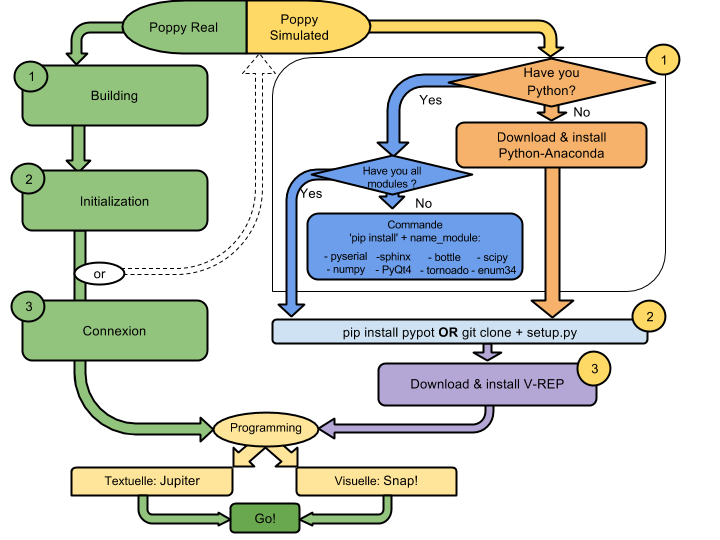

# Install the required softwares

Once you have built your Poppy Creature or if you just want to try a simulated one, the next step is to start playing with it! Poppy Creatures can be controlled using the [Python](https://www.python.org) programming language and via [Snap!](http://snap.berkeley.edu) a variant of the well-known visual programming language [Scratch](https://scratch.mit.edu) (or with other languages via the REST API, see [this section](http://poppy-project.github.io/poppy-docs/gettingstarted/quickstarts/restapi.html) for details).

Depending on what exactly you want to do - e.g. use Snap! to make your real robot moves or program in Python to interact with a simulated robot, different procedures must be followed.

Poppy Creature comes with an embedded board, all the needed softwares is already installed on their internal computer. They also comes with a webserver which allows you to directly program them - both in Python and Snap! - without needing to install anything. This method is described in the [Control the robot from your web browser](http://poppy-project.github.io/poppy-docs/gettingstarted/quickstarts/connect_your_robot.html) section. This is by far the easiest way but of course this is **only possible with a real robot and not in simulation**.

If you want to control a simulated Poppy Creature you will have to install the libraries on your own computer. The main Poppy libraries are written in Python and can thus be easily installed on any computer under Windows, Mac or Linux. The section [Using a simulated robot](http://poppy-project.github.io/poppy-docs/gettingstarted/visualize_your_robot.html) describes those steps.

A diagram summarizing these different approaches can be seen below:



*They are also other advanced approaches to directly control the robot from your own computer, but a solid knowledge of the linux and Python environments is required! Those approaches are described at the end of this page and detailed in the chapter [Control your robot using your own computer]().*

## Control a real robot from your web browser - no installation required

As explained above, Poppy Creature comes with an embedded board where Python and Poppy libraries are already installed and setup. They also comes with a server which permits a direct control of the robot from your web browser without needing to install anything on your computer.

To control your robot - either in Python or Snap! - from your computer a few steps are required:

* First, you need to make sure both your robot and your computer are on the same local network, e.g. on the same wifi or even better on the same ethernet network.

* Then, you need to either know the [IP address](https://en.wikipedia.org/wiki/IP_address) of your robot or use the [Bonjour](https://www.apple.com/fr/support/bonjour/) services to automatically discover it - this service is already installed on most MacOS and Linux but must be [installed](https://support.apple.com/downloads/Bonjour_for_Windows) on Windows.

* Finally, connect to [http://poppy.local](http://poppy.local) (replace *poppy.local* by the *IP address* if you do not use Bonjour) and you should see something similar to this:


From their you just have to follow the links and start programming your robot in Python or Snap! This is described in th next page.

## Using a simulated robot

If you want to program a simulated version of a Poppy Creature you will have to install the Poppy software on your computer. Those libraries are written in Python and should be rather easily installed on any computer (Windows, MacOS and Linux).

### Install Python and Poppy libraries

There are many ways to install Python and the needed packages, yet if you are not a Python guru we strongly recommend you to follow the process described below. You will avoid most of the common pitfalls. Of course if you are familiar with Python the classical *pip install poppy-ergo-jr* (or with any other creature name) you should be good to go.

* Install the [Anaconda](https://www.continuum.io/anaconda) Python 2.7 distribution: it exists for Windows, Mac and Linux and comes with most of the dependencies pre-packaged. We recommend using Python 2.7 as this is our test environment, yet everything should work as well with Python 3.4 (or later).
* Install the Poppy libraries. You will need three main libraries:
    * [pypot](https://github.com/poppy-project/pypot): it is the low-level library which handles all the communication with the motors and the sensors.
    * [poppy-creature](https://github.com/poppy-project/poppy-creature): it a light abstraction layer on top of the pypot library which defines everything which is common among all Poppy Creatures.
    * the library spefic for your creature such as [poppy-ergo-jr](https://github.com/poppy-project/poppy-ergo-jr), [poppy-torso](https://github.com/poppy-project/poppy-torso) or [poppy-humanoid](https://github.com/poppy-project/poppy-humanoid). This is where everything specific to the creature is defined. You can install multiple of them if you want to use different creatures.

* To install them you have to open a command line. How to do this depends on your operating system. On recent Windows you can do it by following this [guide](http://www.7tutorials.com/7-ways-launch-command-prompt-windows-7-windows-8) for instance.

* Once the command line is opened simply type:
    ```bash
    pip install pypot
    ```
* Then:
    ```bash
    pip install poppy-creature
    ```
* And finally - you can obviously replace *poppy-ergo-jr* by the name of any other creature you want to install:
    ```bash
    pip install poppy-ergo-jr
    ```

To make sure everything is installed correctly you can type in the command line (replace PoppyErgoJr by the name of the creature you have installed: PoppyTorso or PoppyHumanoid):
```bash
python -c "from poppy.creatures import PoppyErgoJr"
```

You can also install [jupyter](http://jupyter.org) so you can use the notebooks:
```bash
pip install jupyter
```

If you do not see any error, it means everything is installed and you can continue and install the simulator. This is explained in the section [Visualize your robot in a simulator](visualize_your_robot.html).

## Control it from your personal computer - the hard way

**Warning: While the rest of this page was meant to be as accessible as possible, this section presents complex techniques reserved to advance users with a strong knowledge of linux and python environments.**


The embedded board on Poppy Creature are simply tiny computer running Linux. They can be directly access via ssh or you can plug a keyboard and a screen and use it as any other computer.

You can also directly control the robot from your computer. You will need to install the same Python libraries as those needed if you use a simulated robot (pypot, poppy-creature and poppy-ergo-jr for instance).

The tricky parts concern the communication with motors. We use usb to serial communication, you will need either a USB2Dynamixel or a USB2AX. Depending on your operating system you may need a [FTDI driver](http://www.ftdichip.com/Drivers/VCP.htm). On Linux make sure you have the necessary permissions to access the serial port, see [here](http://poppy-project.github.io/pypot/installation.html#testing-your-install) for details.

*Warning: note that the ftdi driver on MacOS add a 16ms timeout which will make fast communication with motors impossible. If anyone know how to circumvent this please [let us know](https://github.com/poppy-project/pypot/issues)! We recommend using Linux or Windows in the meantime. It also works great inside a VM.*

Finally, accessing the sensors (e.g. the raspberry-pi camera) can be problematic from a computer but replacing it by any equivalent (any camera compatible with OpenCV) should do the trick.

For more details, you can refer to the exact procedure we follow for creating the image used in the embedded board to know all the details. It is described in the [Setup the internal board](http://poppy-project.github.io/poppy-docs/development_guides/index.html#setup-the-internal-board) section.
