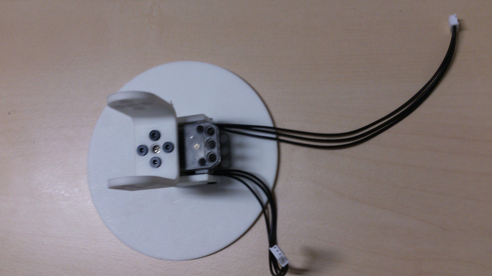

# Assembly guide for Poppy ErgoJr

## Introduction

The Poppy Ergo Jr robot is a small and low cost 6-degree-of-freedom robot arm. 
It consists of very simple forms to be able to print in 3D as easily as possible.
The engines have the same functionality as other Poppy  creatures but are slightly less powerful and less precise. The advantage being that are also less expensive.
The electronic card is not integrated, everything is visible, which is very advantageous to manipulate and change.
Its end can be easily modified (At the end of his arm, you can choose among several ends: a lamp, a hand gripper, ...) thanks to OLLO  rivets that are very simple to remove. These rivets can be removed and added very quickly with the OLLO tool, which allows great design freedom.
The software used for other creatures Poppy are the same as for the Poppy ergo, and also has a simulator.

## BOM for Poppy Ergo Jr 1.0

For building a Poppy Ergo Jr, you will need:
* 6x robotis [XL-320](http://www.generationrobots.com/en/401692-dynamixel-xl-320-servo-motor.html?search_query=OLLO&results=23)
* 6x [XL cable](http://www.generationrobots.com/en/401875-3p-160-mm-cables-for-xl-servos-x5.html) (if possible 1 longer for the base)
* 1x [USB2Dynamixel](http://www.generationrobots.com/en/400848-usb2dynamixel-robotis.html?search_query=usb2dynamixel&results=20)
* 1x [TTL cable](http://www.generationrobots.com/en/401739-3p-cable-set-bcs-3p01-for-dynamixel-servo-motors.html?search_query=mx+cable&results=336)
* 1 external power supply able to output 7.5V at least 2A for the motors (see [here](https://forum.poppy-project.org/t/birth-of-poppyergojr-and-support-for-low-cost-xl-320-motors/1052/10) for details)
* 1x small electronic board (see the [electronic section](electronic.md))
* the 3D printed parts: [[STL]](https://github.com/poppy-project/poppy-ergo-jr/releases/tag/beta3) [[BOM]](https://github.com/poppy-project/poppy-ergo-jr/blob/7a684493e02c7d1b3c9dd99e9e90fb65d717f90f/hardware/parts/BOM.md)
* many [OLLO rivets](http://www.generationrobots.com/en/401870-ollo-rivet-set-ors-10.html) (between 4 and 12 per motor)
* 4x [OLLO Pulley-L](http://www.generationrobots.com/en/401871-ollo-pulley-l-gray-5pcs.html?search_query=OLLO&results=23) and their rivets
* 1x [OLLO Tool](http://www.generationrobots.com/en/401872-ollo-tool.html)
* 1x [Raspberry Pi 2](https://www.raspberrypi.org/raspberry-pi-2-on-sale/) with its power supply

*All the links to products we provide are from our local distributor but feel free to choose your own.*

## Mechanical Assembly

### General advices

* Use the OLLO Tool for the rivets, it's really convenient.

* Do not forget to put wires between motors while building the robot!
* Always align the horn with the motor before assembling them! Otherwise your Poppy Ergo Jr will look all weird.

### Step 1

Connect the longest cable to one XL-320 motor. Connect a regular cable to the other side.

### Step 2

Mount the motor on the 3D printed base. The wires should go out from the back.

### Step 3

Mount the U_horn_to_horn part.

### Step 4

Mount another motor on top.

The OLLO Pulley is inside and you should assemble it with the bigger rivet. Bonus, you can watch this step in [slow motion](https://vimeo.com/125704291).

Do not forget the cable!

### Step 5

Mount both shift_one_sides on the motors.

### Step 6

Add another motor on top. Make sure to have the pulley on the same side.

### Step 7

Mount the U_side_to_horn on a new motor.

### Step 8

Mount it on top of the previous assembly. The nose of the motor should be on the other side of the base.

### Step 9

Mount two other shift_one_sides and a motor. Repeat this twice. All the pulley should still be on the same side.

### Step 10

#### Electronics

A small bit of electronic hacking is required for now. You need to power the Xl320 motors with 7.5V.

The cables between motors have two purposes:
- distribute alimentation to each motor
- convey messages to each motor (ordering them to move or asking them for sensors' values)

Thus the alimentation should be added between the USB2Dynamixel (that deals with communication aspects) and the motors. To this end simply create the following hack.

Then connect the USB2Dynamixel on one end and the first motor on the other end. Connect the USB2Dynamixel to your computer or Raspberry Pi. And power the board with 7.5V.

The communication with the motor is TTL, thus configure the USB2Dynamixel in TTL mode as show below.

### Step 11

Grab your [favorite drink](https://www.flickr.com/photos/poppy-project/16488256337/) and relax.
