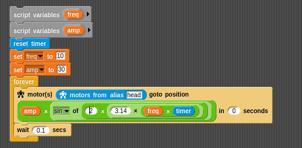

# Control a Poppy robot using Snap!

## Introducing Snap!

[snap visual programming language](http://snap.berkeley.edu) is a "very powerful visual, drag-and-drop programming
language. It is an extended reimplementation of Scratch (a project of
the Lifelong Kindergarten Group at the MIT Media Lab) that allows you to
Build Your Own Blocks". It is an extremely efficient tool to learn how
to program for kids or even college students and also a powerful
prototyping method for artists.

Snap! is open-source and it is entirely written in javascript, you only
need a browser connected to the Poppy Creature webserver. No
installation is required on your computer!

 

An introduction to this laguage can be found in the [Snap! reference manual](http://snap.berkeley.edu/SnapManual.pdf).

## Create the Snap! server

There are several ways of creating a Snap! server to control your robot.

Warning! At some point of this tutorial, you will have to import Poppy
Humanoid's specific Snap! blocks. This may take a few minutes, so keep
the script running if your browser asks what to do.

### Start the server on the robot

The easiest way of controlling your Poppy robot with Snap! is to use the
webapp TODO. This will launch the server and use the Snap! software
installed on the robot.

Then hit the folder button, select open...->example and choose
pypot-snap-block.

Alternately (if you don't have the webapp), you can use the following
command inside the robot:

    poppy-snap poppy-humanoid --no-browser

The command gives you an URL (something like [http://snap.berkeley.edu/snapsource/snap.html#open:http://-ROBOT-IP-:6969/snap-blocks.xml](http://snap.berkeley.edu/snapsource/snap.html#open:http://poppy.local:6969/snap-blocks.xml)).
Open this URL in your web browser.

### Start the server on your computer

Use this method if you use the motors directly linked to your computer:

    from poppy_humanoid import PoppyHumanoid
    poppy = PoppyHumanoid(use_snap=True)
    poppy.snap.run()

You can even use simultaneously Snap! and V-rep:

    from poppy_humanoid import PoppyHumanoid
    poppy = PoppyHumanoid(simulator='vrep', use_snap=True)
    poppy.snap.run()

Leave the Python script running. In you web browser, open the following
URL:

[http://snap.berkeley.edu/snapsource/snap.html#open:http://127.0.0.1:6969/snap-blocks.xml](http://snap.berkeley.edu/snapsource/snap.html#open:http://127.0.0.1:6969/snap-blocks.xml)

Last solution: you can even, if you don't have a reliable internet
connection when you use Snap!, download and install Snap! directly on
your computer [from here](https://github.com/jmoenig/Snap--Build-Your-Own-Blocks).

Then, open the snap.html file with your web browser and use the folder
button->import.. to import the Poppy specific blocks located in
*pypot/pypot/server/snap\_projects*.

## Controlling the robot

### Pypot Snap! blocks

The Poppy Snap! blocks are the following:

Those blocks can be used to respectively:

-   test if connection with poppy robot is working well
-   get a list of all motors name
-   get a list of all motors refered by an alias
-   get the value of a register motor (e.g. get motor "head\_z" register
    "present\_load")
-   get the index of a motor
-   get all alias avaible for the current robot

-   set a motor position in a specified time
-   turn a motor compliant or not
-   set a register of a motor (e.g. set motor "head\_z" register
    "present\_load" to 10)
-   create/attach a move to some motors (you have to create a move
    before to record or replay it)
-   stop the record of a move
-   start the record of a move
-   play a move at a defined speed
-   play a move in reverse at a defined speed
-   play concurently many moves
-   play sequentialy many moves

You can easily see all blocks relative to poppy in Snap! with the "find
blocks" feature. You have to right-click in the left part of Snap! page
and select "find blocks":

### Use a slider to move a motor

To control a motor via a slider you need to make a variable - we will
call it head position.

Then right click on it and use the slider option. Change the slider
min/max to (-50, 50).

Then, connect it to a motor: use the motor(s) goto position block and
put it inside a forever loop. Add a wait for performance issue.

### Example: playing a sinus on a motor

Having a motor position follow a sinus function is very useful to get
smooth periodic moves, as waving with the hand or saying 'no' with the
head.

Can you, from this image, program your robot to say 'yes' or 'no' with
the head?

## Record and play moves using Snap!

If you opened the Snap! server using the webapp, you can directly load
the example called pypot-snap-record-orchestration-demo instead of
poppy-snap-blocks to find a ready-to-use Snap! project dedicated to the
record and replay of moves.

Otherwise, use the folder button->import.. and select
*pypot/pypot/server/snap\_projects/pypot-snap-record-orchestration-demo.xml*

